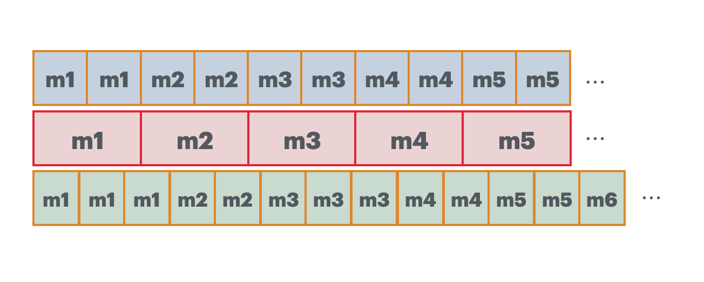

之前看过影视飓风发的一个科普，说他们放弃了 25fps 的拍摄视频。今天详细聊一下这块内容，当电影的帧率与显示器的刷新率不匹配的行为。


可以在图中看到，红框是帧率 25fps 视频的一帧帧内容，也就是 1/25 = 40ms 渲染一帧画面。

此时如果显示器的刷新率是 50HZ，相当于 20ms 刷新一次内容。于是显示器刷新两次刚好渲染一帧内容。图中红框上面的表示 50HZ 显示刷新内容。

但如果显示器刷新率是 60HZ，那问题就来了，显示器 16.67ms 刷新一次，无法跟 40ms 刷新一帧的视频匹配。 也就是红框下方的绿色内容，代表 60HZ 的刷新。


可以看到，程序将一帧画面渲染到屏幕上，延迟 40ms 后再渲染下一帧，此时刚好在屏幕的第三次刷新中，刷新还没冷却完成，所以刷新下一帧的命令只有在第三次刷新完成后才会执行渲染下一帧，也就是应该渲染 40ms 的一帧画面，结果显示了 16.67*3 = 50.01ms。但程序是不知道显示器怎么执行的，对程序而言，它就是渲染了 40ms，所以在下一个 40ms 后开始渲染第三帧，此时屏幕上第二帧画面没有渲染结束，于是就等到第二帧画面结束后再渲染下一帧。可以看到，第二帧画面在屏幕上持续了 33.34ms。然后再依次执行。

可以发现:

```
第一帧画面在屏幕上渲染了 3 个屏幕时间
第二帧画面在屏幕上渲染了 2 个屏幕时间
第三帧画面在屏幕上渲染了 3 个屏幕时间
第四帧画面在屏幕上渲染了 2 个屏幕时间
第五帧画面在屏幕上渲染了 2 个屏幕时间
...
```

于是，用户在屏幕上看到的画面就会卡，掉帧，不流畅，抖动等问题。


这个问题是我在看 [dranger 的 ffmpeg 教程](http://dranger.com/ffmpeg/tutorial05.html) 想到的，其中他的代码:

```c
double synchronize_video(VideoState *is, AVFrame *src_frame, double pts) {
  double frame_delay;
  if(pts != 0) {
    /* if we have pts, set video clock to it */
    is->video_clock = pts;
  } else {
    /* if we aren't given a pts, set it to the clock */
    pts = is->video_clock;
  }
  /* update the video clock */
  frame_delay = av_q2d(is->video_st->codec->time_base);
  /* if we are repeating a frame, adjust clock accordingly */
  frame_delay += src_frame->repeat_pict * (frame_delay * 0.5);
  is->video_clock += frame_delay;
  return pts;
}
```

这里 `frame_delay` 代表一帧画面在显示器上的时长，我纳闷为什么它会采用 `repeat_pict` 这个值来计算，官方的解释是:

> Number of fields in this frame which should be repeated, i.e.

> the total duration of this frame should be repeat_pict + 2 normal field durations.

> For interlaced frames this field may be set to 1, which signals that this frame should be presented as 3 fields: beginning with the first field (as determined by AV_FRAME_FLAG_TOP_FIELD_FIRST being set or not), followed by the second field, and then the first field again.

> For progressive frames this field may be set to a multiple of 2, which signals that this frame's duration should be (repeat_pict + 2) / 2 normal frame durations.

`repeat_pict` 代表着画面重复的次数，我找了几个视频试了下，所有的值都是 0，甚至我将一个 24fps 的视频改变成 30fps，其值还是 0。

`repeat_pict` 是一个兼容老设备的值，现在的播放器中都不会用这个值了，都是直接使用 `duration` (`pkt_duration` 已经被遗弃)。

这里稍微讲一下隔行扫描和逐行扫描。在早期的电视中，晶体管扫描的速度比较慢，如果使用逐行扫描，则扫描到最下方时候，最上方的扫描亮度就会降低，导致画面看起来变差。
于是就将所有行拆分成奇数行和偶数行，每一次扫描被称为一个场，进行隔行扫描。不过现在不用考虑隔行扫描，都已经是逐行扫描了，视频的 1080p 里面的 p 就代表逐行扫描的意思。


我在 [ffplay.c 代码](https://github.com/FFmpeg/FFmpeg/blob/master/fftools/ffplay.c#L2241)中查到它使用 `frame_rate` 来计算一帧视频的播放时长:

```c
duration = (frame_rate.num && frame_rate.den ? av_q2d((AVRational){frame_rate.den, frame_rate.num}) : 0);
```

`frame_rate` 如果是 24fps 的视频，`frame_rate.den` 则是 1，`frame_rate.num` 是 24，通过 `av_q2d` 计算出来 `duration` 是 1/24。


我不清楚为什么不直接使用 AVFrame 的 `duration` 值。很多播放器都是先取 Frame 中 `duration`, 判断为空再使用 `frame_rate` 来计算：

```c
frame.duration = avframe.pointee.duration
if frame.duration == 0, avframe.pointee.sample_rate != 0, frame.timebase.num != 0 {
  frame.duration = Int64(avframe.pointee.nb_samples) * Int64(frame.timebase.den) / (Int64(avframe.pointee.sample_rate) * Int64(frame.timebase.num))
}
```

总之，`repeat_pict` 值是为了兼容老的播放设备而用的值。比如 3:2 pulldown, 可以有效保持原始电影的帧率和运动感。

