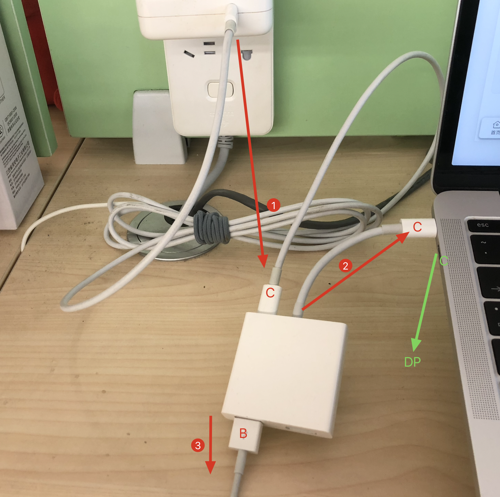

理想中的是一根线解决所有: 电源连接显示器, 显示器用一根线连接电脑, 这根线两端都是同一类型的口, 比如 Type-C, 电脑用这根线给显示器传输音视频可以达到 *4k60hz*, 双端支持 PD 协议, 可以让显示器给电脑供电. 找来找去也就苹果官网的 LG UltraFine 4k 合适, 雷电3的口, 送一根雷电3的线, 但是价格在 5k 以上.

在网上了一堆4k元以下的显示器, 4k60hz Type-C, 有很多, 便宜的显示器输出功率不足以给电脑供电. 很难找到一款合适的显示器.

于是凑合先几百块买了一个1080p显示器, 因为家里还有一个 Air, 要给它做适配. Air有雷电2口, 并且有一个雷电2转VGA的 **converter**, 也有一个雷电3转 HDMI 的 **converter**, 于是两台电脑都用上了1080p.

又从朋友那买了一个 DIY 的显示器, 4k60hz, 有 DP 口, 也有 HDMI 口.

于是买了一个小米的 C-HDMI **converter**, 糟糕的是 HDMI 是 1.4 版本, 支持到30hz.. 因为电脑只有两个 Type-C 的雷电3口, 要满足充电/连手机/连显示器, **converter** 是少不了的. 所以这个 **converter** 先留着, 小米商城也没有 Type-C 转 DP 的, 只有转 MiniDP 的, 难不成要买一根 MiniDP-DP 线吗? 但是发现 **converter** 有一个 USB-B 的口, 那么这个 **converter** 可以这么用:

电脑插上 **converter**, 电源连接 **converter** 的 C 口, 这样可以给电脑供电, **converter** 的 B 口再连接手机的数据线. 这样电脑会剩余一个 C 口, 再买一根 C-DP 的线就可以了.

2019 年搞一台显示器真的太累了.

## 转接器, 扩展坞, 集线器

#### 转接器

Cable converter, 把 USB 扩展成其他类型比如网络/音视频

> A cable converter converts one signal to the other (such as a video signal) and does not require any mains power. In principle, it is all cables with 2 different connections, such as a USB-C to HDMI cable. They can also have one or 2 male connectors and multiple female connectors, making them look like a hub with different ports. The difference with a hub is the fact that they also transmit a signal other than a USB signal.

#### 扩展坞

USB Docking Station, 需要单独供电的一个转接站, 贼贵

> A docking station is a workstation where you can click into a laptop. In addition, cable converters that require mains power are also docking stations. Docking stations have many ports that are larger than USB hubs and cable converters. They are the connecting link to connect all your equipment at your workplace.

#### 集线器

USB HUB, 把 USB 扩展出多个 USB

> A USB hub expands the number of USB ports of your laptop or PC. There are USB hubs with only USB a ports, but there are also variants with a mix of USB-A and USB-C ports. There is still variation in terms of USB versions, such as USB 2.0 or USB 3.0. In addition to USB ports, a hub can have one other port: an Ethernet port for a wired internet connection.

- [Type-C / 雷电 3 转接头踩坑记](https://sspai.com/post/54953)
- [ultrafine 4k 入手](https://www.v2ex.com/t/629977)
- [The difference between docks, converters, and USB hubs](https://www.coolblue.nl/en/advice/difference-docking-station-cable-converter-usb-hub.html)
