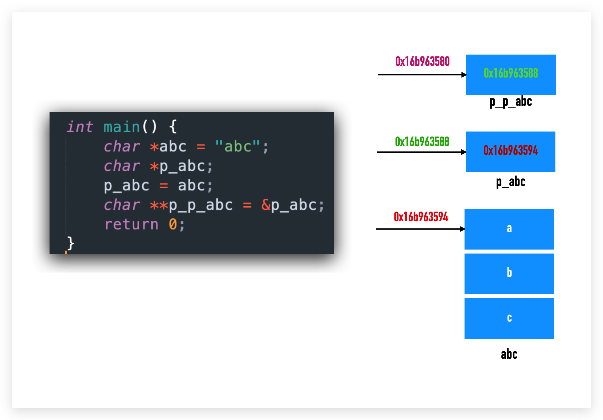
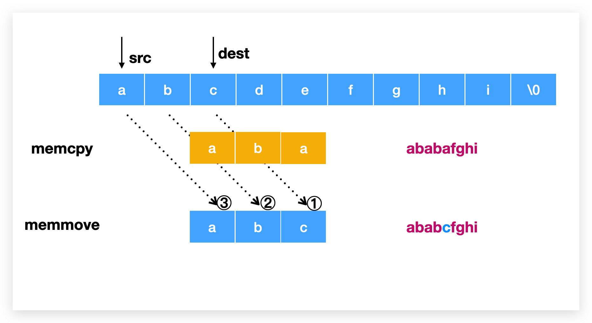
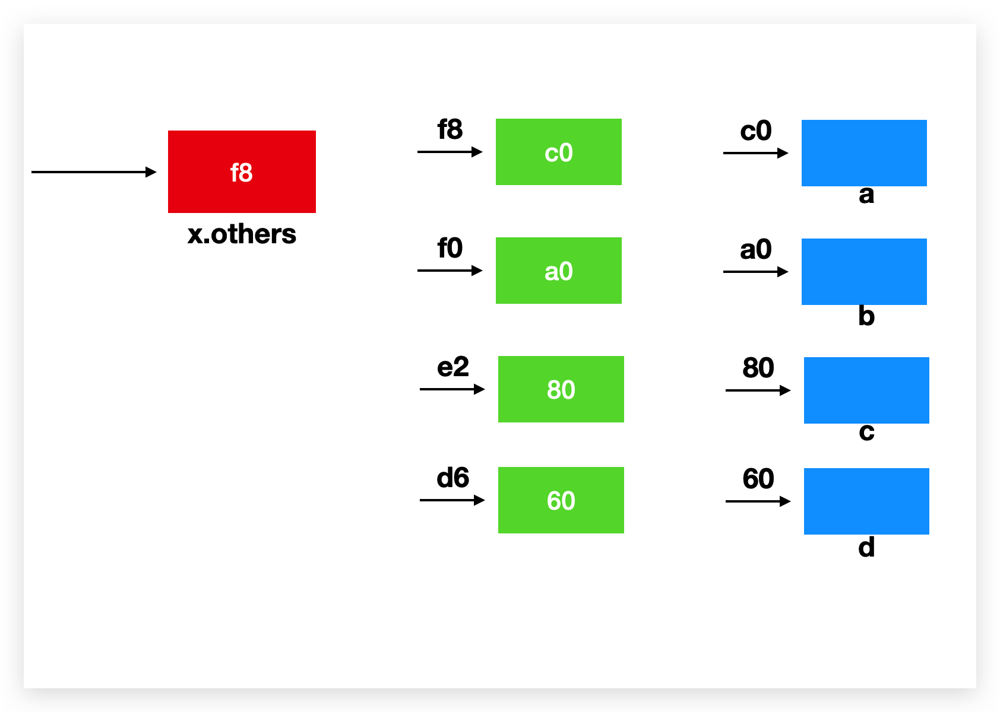
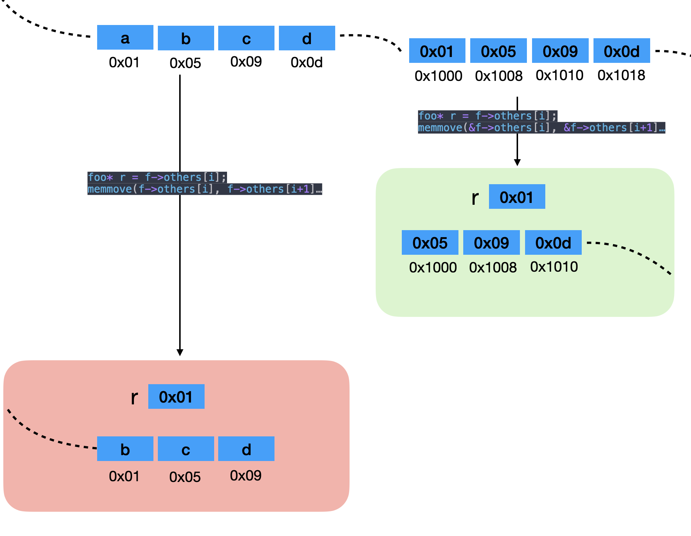

## 指针是什么?

指针就是地址. 一个 `8 bytes` (在64位电脑下)的内存数据.

## 指针的意义是什么?

> 授予，存储一个值的这个变量本身以外的代码组分，对这个值的访问，修改权。
> 传指针，逻辑上就是一个授权，传了一个权利。
> 链表的节点。靠着这个权利，存储了对左右邻居的访问和修改权。
> 函数通过传指针，获取了外面一些变量的访问和修改权。
> 如果传值，只能获取访问权，不能获得修改权。

## `char *` 指针

```c
char *s = "abc";
```

实际上是 `const char *s`, 因为 `abc` 数据是 *readonly* 的. 

`s` 是字符串 `abc` 中 `a` 的地址, 可以用 `s[1], s[2]` 这种数组形式来访问字符 `b` 和字符 `c`.

相同的, `char s[]` 这里的 s 是数组名, 也是指针, 指向数组第一个元素的地址, 也可以用指针偏移来访问数据 `*(s+1)`.

## 二级指针

它也是指针, 它的地址是另一个指针的地址:

```c
int a = 1;
int *pa = &a;
int **ppa = &pa;
```



## 为什么这段代码是不对的?

```c
#include <stdio.h>
int main() {
    char **s;
    *s = "abc";
    printf("%s\n", *s);
    return 0;
}
```

通过编译:

```bash
$ gcc -Wall -Wextra -Werror -ansi -pedantic -pedantic-errors -fsanitize=address,undefined a.c
```

可以发现警告:

```
a.c:6:6: warning: variable 's' is uninitialized when used here [-Wuninitialized]
    *s = "abc";
     ^
a.c:5:13: note: initialize the variable 's' to silence this warning
    char **s;
            ^
             = NULL
1 warnings generated.
```

指针 `s` 没有初始化就被用了.

所以正确的写法应该是:

```c
int main() {
    char **s;
    s = (char **)malloc(sizeof(char *));
    *s = "abc";
    printf("%s\n", *s);
    free(s);
    return 0;
}
```

## 数组和函数

众所周知, `int a = 1`, 这里 a 代表着整形数字 1, `char b = 'x'`, 这里 b 代表着字符类型 `x`, `int* c = &a` 中 c 代表着指针类型, 其值是 a 的地址, `int d[] = {1,2,3}` 中 d 是数组类型 `int [N]`. 而 d 在很多情况下可以变成(decay)指针, 比如 `int* p = d`. 但要明白 d 不是指针, 只是在这种情况下可以变成指针, 它和 `&d` 指向相同的地址, 也和 `&d[0]` 指向相同的地址, 而 `&d` 的类型是 `int (*)[N]`. 对于编译器来说, 数组就是数组, 很明显的一点就是通过 `sizeof` 来获取数组的大小, 在这里 `sizeof(d)` 是 12, 而 `sizeof(p)` 只是指针的大小 8.

对于函数也是一样的, 函数名就是函数所在代码的起始地址, 所以一个函数执行可以写为 `func(2)` 也可以写为 `(*func)(2)`. 当然后者写起来非常 odd.

## char **

`char **` 这种写法指的是指向指针的指针, 当然也可以算做指向一个字符串数组的指针, 比如:

```c
char *a[] = {"abc", "def"};
char **s = a;
```

如何正确初始化一个具有两个字符串的 `char **` ?

```c
char **s = malloc(sizeof(char *) * 2);
*s = (char *)malloc(sizeof(char) *5);
s[1] = malloc(sizeof(char) *5);
strncpy(s[0], "a32q", 5);
strncpy(*(s+1), "dexg", 5);
printf("%c\n", *s[0]); // print a
printf("%c\n", **s); // print a
printf("%c\n", s[0][1]); // print 3
printf("%c\n", *(*s+1)); // print 3
printf("%c\n", *(*s+2)); // print 2
printf("%c\n", *s[1]); // print d
printf("%c\n", **(s+1)); // print d
printf("%c\n", *(*(s+1)+2)); // print x
printf("%c\n", **(s+1)+2); // print f
printf("%c\n", **(s+1)+9); // print m
```

## 使用 char ** 解构 argv

```c
for (char **p; *p != NULL; p++) {
    printf("%s\n", *p);
}
```

## struct and double pointer

```c
#include <stdio.h>
#include <stdlib.h>
#include <string.h>

typedef struct tree {
  char *name;
  struct tree** children;
} tree;

int main() {
    tree x = { .name = "namea" };
    tree y = { .name = "nameb" };
    tree* list[] = {&x, &y};
    tree z = {
      .name = "namec"
      // .children = list // 1⃣️
    };

    z.children = malloc(sizeof(tree *) * 2);

    *z.children = &x;
    z.children[1] = &y;

    tree *children1 = z.children[1];
    children1->name = "namechildren1";
    
    (*z.children)->name = "namex"; // or z.children[0]->name
    // (*(z.children+1))->name = "namey";
    printf("%s %s\n", x.name, y.name);
    return 0;
}
```

> 指针只能接内存地址。内存地址哪里来？一般两个来源，1，栈数组decay得到 2，malloc得到

在 1⃣️ 的地方, 是通过数组 decay 赋值内存地址, 如果不这样, 就需要下面的 malloc 方式进行内存初始化.

再回到开头的讨论指针的意义. 如果上述结构体中, 没有 `**` 则外部传入的 children 则是内存的拷贝, 所以无法对外部的数据进行修改.

如果使用 `*` (一个星), 比如 `node->next`, 则只会有一个外部数据. 要想实现引用多个数据, 则可以用 `**` 两个星的方式.

## 关于 realloc 的讨论

```c
char* s = malloc(6);
strncpy(s, "abcd8", 5);
const char* s2  = "xyz";
memmove(s, s2, 4);
s = realloc(s, 3);
printf("s = %s, s2 = %s, s = %p \n", s, s2, s); // s = xyz, s2 = xyz, s = 0x13de06880 
printf("strlen s = %ld\n", strlen(s)); // strlen s = 3
free(s);
```

上面代码如果改成 `memmove(s, s2, 3)` 则 `s` 会是 `xyzd8`. 因为 `strlen` 只认 `'\0'`.

其实对于 string 的截断, 没必要用 relloc, 直接 `s[3] = '\0';` 即可. 因为 relloc **会偷懒**, 它发现给定的大小比原先的小, 于是就什么也不做.

## memcpy vs memmove

```c
int main() {
    char a[] = "abcdefghi";
    // memcpy(a+2, a, 3); // ababafghi
    // memmove(a+2, a, 3); // ababcfghi
    // memcpy(a, a+2, 4); // cdefefghi
    // memmove(a, a+2, 4); // cdefefghi
    printf("%s\n", a);
    return 0;
}
```



如果 `src` 的地址小于 `dest`, 那么 `memcpy` 函数可能会发生意外, 比如这个时候处理 overlap 数据部分, 复制到 `c` 的时候, `c` 其实已经被修改成 `a` 了, 所以最终结果还是 `a`.

`memmove` 进行了优化, 如果发现上述问题, 则从尾巴地方(也就是从 `e`)的位置开始复制, 避免了意外发生.

如果 `src` 的地址大于等于 `dest`, 则 `memcpy` 和 `memmove` 结果是一样的, 对 overlap 的数据进行覆盖, 也是不影响最终结果的.


## pop

```c
typedef struct foo {
    char* name;
    int count;
    struct foo** others;
} foo;
foo* foo_pop(foo* f, int i) {
    foo* r = f->others[i];
    memmove(&f->others[i], &f->others[i+1], sizeof(foo*)*(f->count-i-1));
    f->count--;
    f->others = realloc(f->others, sizeof(foo*)*f->count);
    return r;
}
int main(void) {
    foo a = { .name = "fooa" };
    foo b = { .name = "foob" };
    foo c = { .name = "fooc" };
    foo d = { .name = "food" };
    foo x = { .name = "foox", .count = 4 };
    x.others = malloc(sizeof(foo*) * 4);
    x.others[0] = &a;
    x.others[1] = &b;
    x.others[2] = &c;
    x.others[3] = &d;
    foo* y = foo_pop(&x, 0);
    printf("%s\n", y->name); // fooa
    return 0;
}
```



`malloc(sizeof(foo*) * 4);` 是开辟一块**连续的**内存数据, 每个数据块 8 个字节(因为存储的内容是指针嘛), 共 4 个.
然后对其赋值为 &a &b &c &d.

在 `foo_pop` 函数中, `foo* r = f->others[0]` 是将 `r` 设置为 `f->others[0]` 即 `c0` 地址(a所在), 而非所之前我所理解的第 0 号位置的指针. 如果想设置为第 0 号位置的指针应该写为 `r = &f->others[0]`.

所以在 `memmove` 时候是需要将*数组*第 i 号的地址进行移动, 即 `&f->others[i]`.

## 2024-02-11 update

上面的图表达的不是很清晰，又重新做了一张图:



首先要解释的是，a,b,c,d 四个变量在栈内存中，二级指针存储的是这四个变量的地址，如果是一级指针，那么无法直接设置其地址为四个变量的地址，一级指针只能重新复制内存。

`foo_pop` 函数的第一行将第 i 个地址赋值给 r 变量，因为后面会操作 others 这个二级指针，会让第 i 个地址丢失，如果不存给 r 变量，那么内存丢失后，就会造成内存泄漏。

第二行的 `memmove` 为什么是 `&f->others[i]` 而不是 `f->others[i]` 呢？上图中解释了，绿色区域是正确的用法，我们要操作的是 others 的数据，所以要传入 others 的地址，也就是 `&f-others[i]`。如果不带 `&` 那么`memmove` 操作的是 `0x01 0x05 ..` 这几个内存中的内容，所以会将原始数据给抹掉一个。
