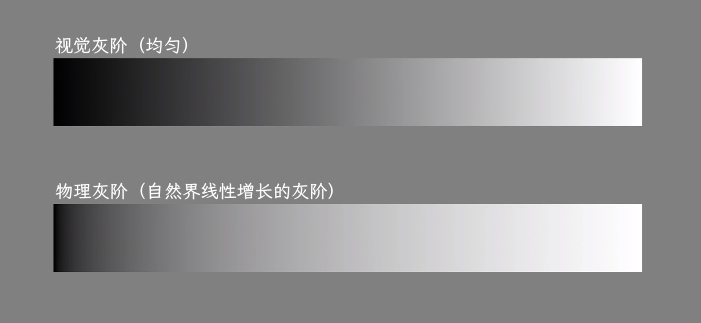

想要理解颜色，需要从物理学和生物学两个角度来看。牛顿用三棱镜将白光分解成彩虹，证明了白光是由连续波长的光谱叠加而成的。但颜色并不是光本身的属性，而是大脑对光的一种解释。

## 人眼如何感知颜色

人眼视网膜上有两种感光细胞：视锥细胞（Cone Cell）和视杆细胞（Rod Cell）。视杆细胞对光线敏感度高，但只能感知明暗，无法区分颜色，主要在暗光环境下工作。而视锥细胞负责颜色感知，有三种类型：

- S 型（Short）：对短波长敏感，峰值约 420nm，对应蓝色
- M 型（Medium）：对中波长敏感，峰值约 530nm，对应绿色
- L 型（Long）：对长波长敏感，峰值约 560nm，对应红色

需要知道，颜色不是在眼睛里混合的。当光线照射到视网膜时，三种视锥细胞分别被刺激，产生不同强度的神经信号。感光器官只知道自己被刺激了多强，它不知道光的波长是多少。大脑根据这三种细胞的刺激程度进行差分编码，最终"计算"出我们感知到的颜色。

比如一束 580nm 的黄光照到视网膜，L 和 M 细胞都会被强烈刺激，而 S 细胞几乎没有响应。大脑收到这个信号组合后，解释为"黄色"。有趣的是，如果同时用红光和绿光照射视网膜，L 和 M 细胞也会产生类似的刺激组合，大脑同样会解释为"黄色"。虽然物理上这两种光完全不同，但对人眼来说是一样的，这就是同色异谱（Metamerism）现象。

有趣的是，不同物种的视锥细胞数量差异很大。狗只有两种视锥细胞（类似人类的 M 和 S），所以它们是红绿色盲，看到的世界主要是蓝色和黄色。而鸟类拥有四种视锥细胞，除了 S、M、L 之外，还有一种对紫外线敏感的视锥细胞，这意味着鸟类能看到人类完全无法感知的颜色。螳螂虾更夸张，有 16 种感光细胞，但研究表明它们并不是用来分辨更多颜色，而是快速识别特定波长。

## RGB 与加色混合

基于人眼的三种视锥细胞，显示器使用 RGB（Red, Green, Blue）三原色来发光。这是加色混合模式，三种光叠加在一起会变亮。

```
红 + 绿 = 黄
红 + 蓝 = 品红
绿 + 蓝 = 青
红 + 绿 + 蓝 = 白
```

而传统美术用的是 RYB（Red, Yellow, Blue），印刷用的是 CMY（Cyan, Magenta, Yellow），这些都是减色混合。颜料本身不发光，它们通过反射光线来呈现颜色，吸收的波长越多，反射的越少，叠加在一起会变暗。

```
青 + 品红 = 蓝
青 + 黄 = 绿
品红 + 黄 = 红
青 + 品红 + 黄 = 黑（理论上，实际是深灰）
```

印刷上为了得到纯正的黑色，会额外加一个 K（Black），所以叫 CMYK。

## 相机如何捕获颜色

相机的 CMOS/CCD 传感器本质上只能感知光的强度，无法区分颜色。为了获取颜色信息，传感器表面覆盖了一层 Bayer 滤色阵列，每个像素只能接收红、绿、蓝中的一种颜色。常见的排列是 RGGB，绿色像素数量是红蓝的两倍，因为人眼对绿色最敏感。

从光子到最终图像的处理流程是：

```
光子 → 电荷（光电效应）→ 模拟电压 → ADC 模数转换 → RAW 数字值
```

RAW 文件保存的就是这个阶段的原始数据，每个像素只有一个颜色通道的值。要得到完整的 RGB 图像，需要经过一系列处理：

1. **去马赛克（Demosaicing）**：通过插值算法，把每个像素缺失的两个颜色通道补齐。比如一个红色像素，需要根据周围的绿色和蓝色像素来估算它的 G 和 B 值。

2. **白平衡（White Balance）**：不同光源的色温不同，日光偏蓝，钨丝灯偏黄。白平衡就是对 RGB 三个通道分别乘以不同的系数，让白色物体在图像中呈现为真正的白色。

3. **颜色校正矩阵（Color Correction Matrix）**：传感器的光谱响应曲线和人眼不完全一致，需要通过一个 3x3 矩阵将传感器的 RGB 转换到标准色彩空间（如 sRGB）。

4. **Gamma/Tone Mapping**：将线性的光强数据映射到适合显示的非线性曲线，同时可以调整动态范围。

5. **降噪与锐化**：消除高 ISO 下的噪点，增强边缘细节。

手机拍照"直出"的 JPEG 就是经过这些处理后的结果。而专业摄影师喜欢用 RAW 格式，就是为了保留原始数据，后期有更大的调整空间。

## 亮度与色度

在视觉感知中，亮度（Luminance）是视觉系统对不同波长的加权感知。人眼对绿色最敏感，其次是红色，对蓝色最不敏感。标准的亮度计算公式是：

```
Y = 0.299R + 0.587G + 0.114B
```

可以发现绿色的权重占了 58.7%，这也是为什么绿色看起来比同等亮度的蓝色要亮得多。

而色度（Chrominance）描述的是颜色的色相和饱和度，不包含亮度信息。色相（Hue）是颜色在色轮上的位置，饱和度（Saturation）是颜色的纯度。

## YCbCr 颜色空间

YCbCr 是视频和图像压缩（如 JPEG、H.264）中常用的颜色空间。Y 是亮度分量，Cb 表示蓝色色度偏移，Cr 表示红色色度偏移。

从 RGB 转换到 YCbCr：

```
Y  =  0.299R + 0.587G + 0.114B
Cb = -0.169R - 0.331G + 0.500B + 128
Cr =  0.500R - 0.419G - 0.081B + 128
```

从 YCbCr 转换回 RGB：

```
R = Y + 1.402(Cr - 128)
G = Y - 0.344(Cb - 128) - 0.714(Cr - 128)
B = Y + 1.772(Cb - 128)
```

为什么要用 YCbCr？因为人眼对亮度变化比对色度变化敏感得多。利用这个特性，视频编码可以对色度分量进行更激进的压缩。常见的采样方式有：

- 4:4:4 - 完整采样，每个像素都有完整的 Y、Cb、Cr
- 4:2:2 - 水平方向上，每两个像素共享一组 CbCr
- 4:2:0 - 每四个像素（2x2）共享一组 CbCr

4:2:0 的色度数据量只有 4:4:4 的 1/4，但视觉上几乎看不出差别。

## 视频播放的颜色处理

视频编码格式如 H.265/HEVC、AV1 解码后输出的是 YCbCr 数据（通常是 4:2:0），但显示器只认识 RGB。这个转换是谁来做的？

很多人以为是 GPU shader 在做这个转换，实际上现代系统中这个工作由专门的显示/视频硬件管线完成。这些硬件单元集成在 GPU 或显示控制器中，但和通用的 shader 单元是分开的。

硬件视频管线的处理流程：

1. **色度上采样（Chroma Upsampling）**：4:2:0 的色度分辨率只有亮度的 1/4，需要先插值到和亮度相同的分辨率。

2. **色彩空间转换（Color Matrix）**：根据视频的色彩标准（BT.601/BT.709/BT.2020）应用对应的转换矩阵，将 YCbCr 转换为 RGB。不同标准的系数不同：

```
BT.709（高清）:
R = Y + 1.5748 * Cr
G = Y - 0.1873 * Cb - 0.4681 * Cr
B = Y + 1.8556 * Cb

BT.2020（超高清）:
R = Y + 1.4746 * Cr
G = Y - 0.1646 * Cb - 0.5714 * Cr
B = Y + 1.8814 * Cb
```

3. **Gamma/Tone Mapping**：对于 HDR 视频，还需要将 PQ 或 HLG 传输曲线映射到显示器支持的范围。

4. **缩放与合成（Scaling & Compositing）**：调整分辨率以适配显示器，并与其他图层（如字幕、UI）合成。

这套硬件管线效率极高，4K 60fps 的视频解码和色彩转换几乎不占用 CPU 和 GPU 通用计算资源。播放器只需要把解码后的 YCbCr 帧提交给显示子系统，剩下的事情硬件自动完成。

### iOS 视频播放与 Metal 渲染

上面说的是系统默认的硬件管线路径，但如果你想对视频帧做自定义处理（比如加滤镜、做特效），就需要用 GPU shader 介入了。以 iOS 为例，来看看一帧视频数据是如何通过 Metal 最终显示到屏幕上的。

iOS 的视频解码使用 VideoToolbox 框架，解码后输出的是 `CVPixelBuffer`，这是一个包含 YCbCr 数据的像素缓冲区。对于 4:2:0 格式，它通常是双平面的（Bi-Planar）：

- Plane 0：Y 分量，分辨率等于视频分辨率
- Plane 1：CbCr 交错存储，分辨率是 Y 的 1/4（宽高各一半）

要在 Metal 中渲染这个 `CVPixelBuffer`，流程如下：

```
CVPixelBuffer → CVMetalTextureCache → MTLTexture × 2 → Fragment Shader → CAMetalLayer
```

首先通过 `CVMetalTextureCacheCreateTextureFromImage` 将 `CVPixelBuffer` 的两个平面分别转换为 `MTLTexture`：

```swift
// 创建 Y 纹理（luminance）
var yTexture: CVMetalTexture?
CVMetalTextureCacheCreateTextureFromImage(
    nil, textureCache, pixelBuffer, nil,
    .r8Unorm,  // Y 是单通道 8bit
    CVPixelBufferGetWidthOfPlane(pixelBuffer, 0),
    CVPixelBufferGetHeightOfPlane(pixelBuffer, 0),
    0,         // plane index
    &yTexture
)

// 创建 CbCr 纹理（chrominance）
var cbcrTexture: CVMetalTexture?
CVMetalTextureCacheCreateTextureFromImage(
    nil, textureCache, pixelBuffer, nil,
    .rg8Unorm, // CbCr 是双通道 8bit
    CVPixelBufferGetWidthOfPlane(pixelBuffer, 1),
    CVPixelBufferGetHeightOfPlane(pixelBuffer, 1),
    1,         // plane index
    &cbcrTexture
)
```

然后在 Fragment Shader 中做 YCbCr 到 RGB 的转换：

```metal
fragment float4 yuvToRgbFragment(
    VertexOut in [[stage_in]],
    texture2d<float> yTexture [[texture(0)]],
    texture2d<float> cbcrTexture [[texture(1)]]
) {
    constexpr sampler s(filter::linear);
    
    float y = yTexture.sample(s, in.texCoord).r;
    float2 cbcr = cbcrTexture.sample(s, in.texCoord).rg;
    
    // BT.709 转换矩阵
    float cb = cbcr.r - 0.5;
    float cr = cbcr.g - 0.5;
    
    float r = y + 1.5748 * cr;
    float g = y - 0.1873 * cb - 0.4681 * cr;
    float b = y + 1.8556 * cb;
    
    return float4(r, g, b, 1.0);
}
```

最后通过 `CAMetalLayer` 的 `nextDrawable()` 获取可绘制目标，将渲染结果提交到屏幕。整个流程中，数据从解码器直接进入 GPU 显存，CPU 几乎不参与像素搬运。

需要注意的是，如果不需要自定义处理，直接用 `AVPlayerLayer` 或 `AVSampleBufferDisplayLayer` 会更高效，因为它们走的是前面提到的专用硬件管线，连 shader 都不需要。只有当你需要在渲染过程中插入自己的处理逻辑时，才需要用 Metal 手动渲染。

## CIE 1931 色彩空间

1931 年，国际照明委员会（CIE）通过实验建立了一套标准化的色彩描述系统。他们让观察者调节三个原色光的强度，直到混合光与目标颜色匹配，得到了三刺激值 X、Y、Z。

为了方便在二维平面上表示颜色，CIE 对三刺激值进行归一化：

```
x = X / (X + Y + Z)
y = Y / (X + Y + Z)
z = Z / (X + Y + Z)
```

由于 x + y + z = 1，所以只需要 x 和 y 就能确定色度。这就是著名的 CIE 1931 xy 色度图，也叫马蹄图。图中的马蹄形边界是光谱轨迹，代表纯单色光。任何真实颜色都在这个马蹄形区域内。


在 CIE Yxy 系统中，Y 表示亮度（与前面的亮度公式相同），x 和 y 表示色度坐标。这样就将亮度和色度分离开来了。

## 色域 Gamut

不同的显示设备能够显示的颜色范围是有限的，这个范围就叫色域（Gamut）。在马蹄图上，色域通常用三角形表示，三个顶点是设备的三个原色。

常见的色域标准：

- sRGB：最基础的色域，覆盖马蹄图约 35%，几乎所有显示器都支持
- Display P3：苹果设备使用，比 sRGB 大约 25%，红绿色域更广
- Adobe RGB：专业图像处理，青绿色域更广
- Rec. 2020：超高清电视标准，接近人眼可见范围

一个 Display P3 的图片在 sRGB 显示器上会丢失部分颜色信息，超出色域的颜色会被裁剪到最接近的可显示颜色。

## Gamma 与白点

### Gamma 校正

显示器的输入电压和输出亮度不是线性关系，而是一个幂函数关系，这个指数就是 Gamma 值。标准 sRGB 的 Gamma 约为 2.2。

```
输出亮度 = 输入值^gamma
```

为什么会这样？早期的 CRT 显示器，电子枪的电压-亮度响应曲线天然就是非线性的，恰好接近 2.2 次幂。虽然现在 LCD/OLED 的物理特性不同，但为了兼容性，仍然模拟这个 Gamma 曲线。

如果不进行 Gamma 校正，图像会看起来过暗。整个流程是这样的：

```
相机捕获（线性光）→ Gamma 编码（1/2.2）→ 存储/传输 → Gamma 解码（2.2）→ 显示器输出
```

相机拍摄的原始数据是线性的，存储前先做 Gamma 编码（也叫 Gamma 压缩），将亮度值做 1/2.2 次幂运算，这样暗部细节被"拉伸"，编码效率更高。显示时，显示器的 2.2 Gamma 特性自然完成解码，最终还原出线性的光输出。

这个设计还有一个好处：人眼对暗部的变化比亮部更敏感（韦伯定律）。Gamma 编码后，用更多的数值范围表示暗部，正好匹配人眼的感知特性，8bit 色深就能获得不错的视觉效果。



### 白点与色温

白点（White Point）定义了"白色"的标准。但什么是"白色"？物理上不存在绝对的白色，白色是一个相对概念，取决于参考光源。

在马蹄图的中间区域，有一条曲线叫普朗克轨迹（Planckian Locus），它代表黑体在不同温度下发出的光的颜色。温度越低越偏红（如蜡烛 1800K），温度越高越偏蓝（如晴天天空 10000K+）。


常见的标准白点都在这条曲线上或附近：

| 白点 | 色温 | 用途 |
|------|------|------|
| D50 | 5000K | 印刷、摄影 |
| D55 | 5500K | 电影、摄影 |
| D65 | 6500K | sRGB、Display P3、电视 |
| D75 | 7500K | 北向天光 |

D65 是最常用的标准白点，对应正午日光的平均色温。sRGB、Display P3、Rec. 709 等色彩空间都使用 D65 作为白点。而印刷行业更喜欢 D50，因为印刷品通常在室内灯光下观看，D50 更接近室内照明环境。

当你把一张 D65 白点的图片在 D50 环境下查看时，会感觉偏蓝。这就是为什么专业修图需要在标准化的观察环境下进行，显示器校色也需要指定目标白点。

色温的概念在相机白平衡中也很重要。当你在钨丝灯下拍照，如果相机还按 D65 来处理，白纸就会呈现黄色。手动设置白平衡为 3200K（钨丝灯色温），相机就会增加蓝色通道的增益来补偿，让白纸重新变白。

## 总结

理解颜色需要同时考虑物理、生理和数学三个层面：

- 物理层面：光是电磁波，不同波长对应不同颜色
- 生理层面：人眼用三种视锥细胞采样光谱，大脑进行差分编码产生颜色感知
- 数学层面：RGB、YCbCr、CIE XYZ 等都是描述颜色的不同坐标系统

加色混合用于发光设备（显示器），减色混合用于反射材料（印刷）。色彩空间定义了颜色的数学描述方式，色域定义了设备能够显示的颜色范围。Gamma 校正处理非线性响应，白点定义了颜色的参考基准。


## 参考

- [Gamma Correction](https://learnopengl.com/Advanced-Lighting/Gamma-Correction)
- [Color Space](https://en.wikipedia.org/wiki/Color_space)
