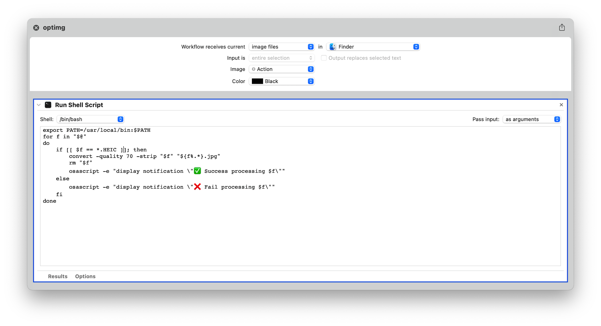

```shell
#!/bin/bash

parseimage() {
  convert -quality 70 -strip "$1".HEIC "$1".jpg
  status=$?
  #[ $status -eq 0 ] && echo "✅ $1" || echo "❌ $1"
  if [ $status -eq 0 ]; then
    rm "$1".HEIC
    echo "✅ $1"
  else
    echo "❌ $1"
  fi
}

if [ -z "$1" ]; then
  for filename in *.HEIC; do
    [ -e "$filename" ] || continue
    parseimage "${filename%.*}"
  done
else
  for var in "$@"; do
    parseimage $var
  done
fi

say yes
```

这个脚本可以这样使用:

```bash
$ optimg filename1.HEIC filename2.HEIC
# or
$ optimg # to convert all HEIC file on current directory
```

当然这样还是有点麻烦, 因为需要打开命令行去执行, 所以就想有没有更快捷的方法呢?

## 使用 Automator



这样就可以在图片右击时候选择执行它了 ~

