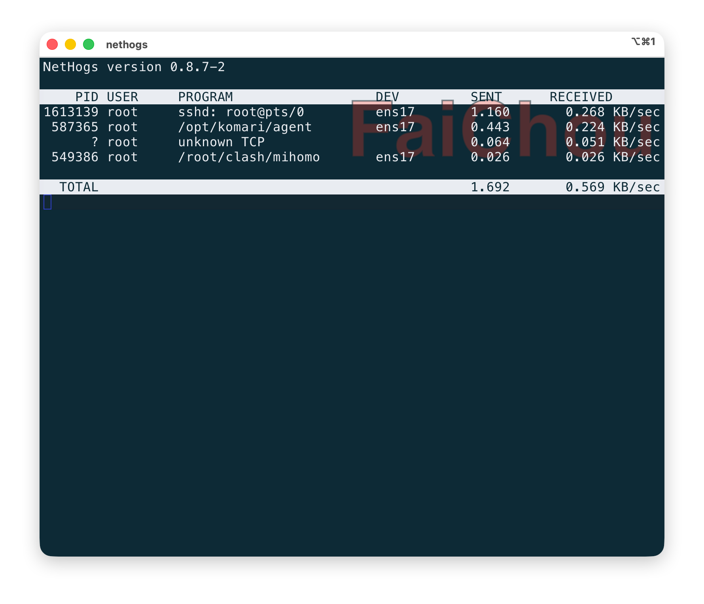
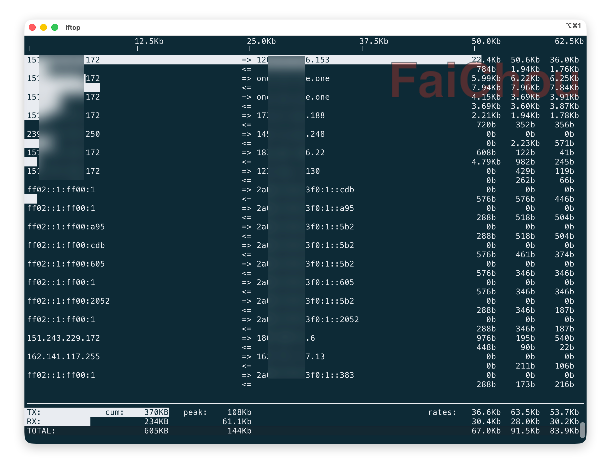

```
title: "Debug network on linux"
publishDate: "2025-11-18"
description: "Debug network on linux"
tags: ["linux", "network", "http"]
```

## nload

nload 是一个网卡级实时监控工具, 直接输入 `nload` 命令就可以实时查看网卡的 upload / download 速率以及累计传输量。通过左右键盘可以切换不同的网卡。

## vnstat

vnstat 统计的是所有经过网络接口的流量，直接从内核获取网络接口的计数器信息（如 /proc/net/dev）。

```
$ vnstat
Database updated: 2025-11-18 10:50:00

   ens17 since 2025-09-22

          rx:  17.80 GiB      tx:  9.59 GiB      total:  27.39 GiB

   monthly
                     rx      |     tx      |    total    |   avg. rate
     ------------------------+-------------+-------------+---------------
       2025-10      8.71 GiB |    4.93 GiB |   13.64 GiB |   43.74 kbit/s
       2025-11      6.23 GiB |    2.55 GiB |    8.79 GiB |   50.05 kbit/s
     ------------------------+-------------+-------------+---------------
     estimated     10.72 GiB |    4.38 GiB |   15.10 GiB |

   daily
                     rx      |     tx      |    total    |   avg. rate
     ------------------------+-------------+-------------+---------------
     yesterday    210.56 MiB |   53.32 MiB |  263.88 MiB |   25.62 kbit/s
         today     89.09 MiB |   21.22 MiB |  110.30 MiB |   23.73 kbit/s
     ------------------------+-------------+-------------+---------------
     estimated    197.36 MiB |   47.00 MiB |  244.36 MiB |
```

## nethogs

hog 在英文里指“贪婪的家伙(猪)、占资源的东西”，所以 nethogs 是找出哪些进程在疯狂吃网速。可以很直观的看到哪一个进程跑多少网速。



## iftop

实时显示每个网络连接的带宽占用，让你知道“这台机器正在和谁通信、每条连接跑多少流量”。

它在最顶部有个刻度，下面每一条连接如果有数据传输会有背景来表示，进度条越长代表占用的带宽越大。

每一个连接有左右两个箭头，代表数据传输的方向。

最右侧的三列代表2s，10s，40s 的平均带宽。

最下面 TX 代表发送，RX 代表接收。cum 代表累计，peak 代表峰值。

一般建议使用 S 和 D 来开启源端口和目标端口。



## ss

ss(Socket Statistics) 查看网络连接、路由表、接口统计信息等, 比 netstat 强大，性能更好，ss 直接从内核（netlink）读取 socket 信息。核心功能如下:

- 查看所有 TCP/UDP/UNIX socket
- 查看连接状态（ESTAB, TIME-WAIT, CLOSE-WAIT, SYN-SENT...）
- 查看局部和对端地址
- 查看进程（-p）
- 查看 socket 内核细节（-i）
- 过滤比 netstat 强太多（state, dst, src, sport, dport, addr...）

| 参数      | 含义                   |
| ------- | -------------------- |
| `-t`    | TCP                  |
| `-u`    | UDP                  |
| `-x`    | UNIX socket          |
| `-a`    | 全部（包括监听）             |
| `-l`    | 只看监听                 |
| `-p`    | 显示 PID + 进程名         |
| `-n`    | 不解析 DNS/服务名          |
| `-4/-6` | 只看 IPv4 / IPv6       |
| `-i`    | 内核 socket info（最有价值） |
| `-s`    | 统计（总概要）              |
| `-r`    | resolve host names        |

常用命令如下:

```
# 看所有 TCP + 进程名
$ ss -tp

# 看所有正在建立的连接（ESTAB）
$ ss -t state established

# 看某个端口的连接（比如 443）
$ ss -tna '( sport = :443 or dport = :443 )'

# 看所有监听的 TCP 端口
$ ss -ltn

# 显示所有目标端口是 80（HTTP）或 443（HTTPS）的连接
$ ss -t dst :80 or dst :443

# 显示所有源地址是 192.168.1.100 的连接
$ ss src 192.168.1.100

# 显示所有连接到远程 IP 8.8.8.8 的连接
$ ss dst 8.8.8.8
```

在 linxu 中 `/etc/services` 配置文件像一个电话薄，记录了端口号和服务名称的映射关系，默认情况下 ss 会去自动查找这个记录将端口号转换为服务名称，如果加上 `-n` 参数，那么它就不会去查找这个表，而是直接显示端口号。

而 `-r` 参数代表尝试解析主机名, 会将对应的 ip 地址解析为域名，比如 `192.168.1.100:56789     142.251.211.46:443` 会解析为 `my-pc.local:56789       lga34s31-in-f14.1e100.net:https`。

一个进程可能监听某个端口，那么它的状态就是 listen， 可以使用 `-l` 来过滤所有监听状态的 sockets。如果有一个远端服务对其建立了连接，那么它的状态就是 established。当使用 `-a` 参数时，就会包含所有的状态，包括 `established`, `listen`, `time-wait`, `close-wait`, `syn-sent`, `syn-recv`, `fin-wait-1`, `fin-wait-2` 等。
