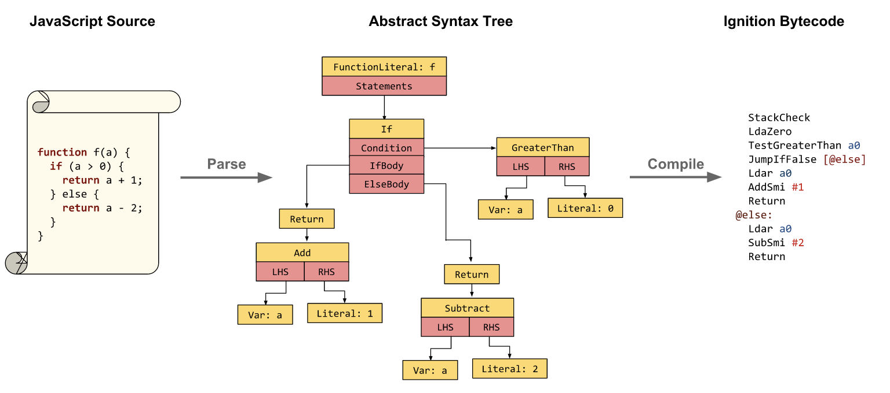
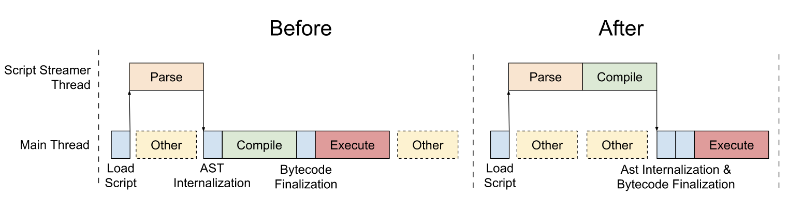
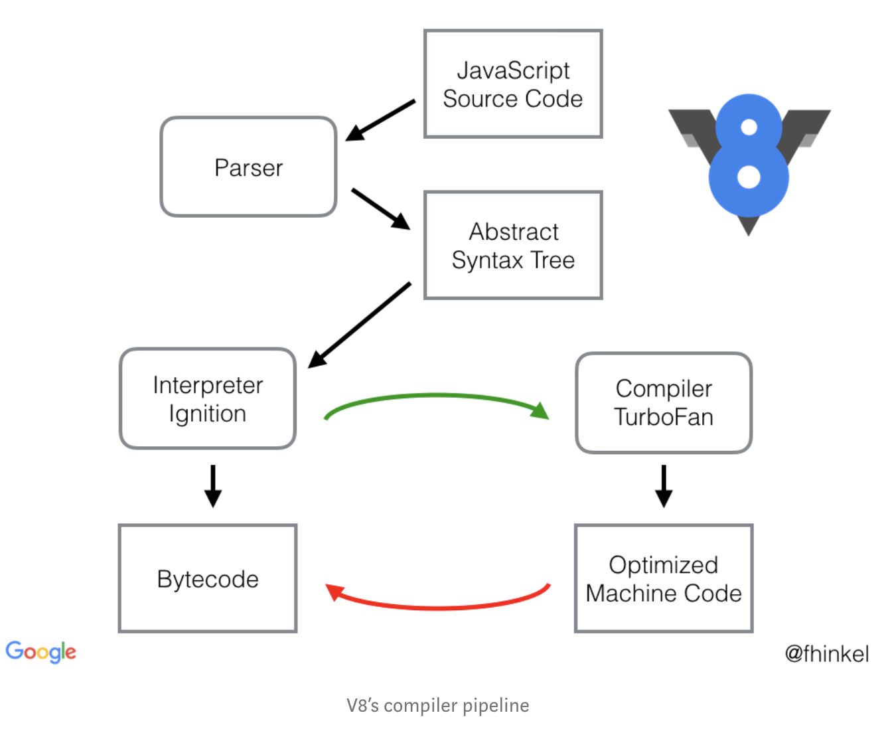

## Start

```javascript
function foo() {
  var a = 1
  return function() {
    console.log(a)
  }
}
var f = foo() // line7
console.log('hello') // line 8
f = undefined // line 9
```

以上代码片段执行时候, 内部闭包函数会捕获 `foo` 里的变量 `a`, 所以在执行到第7行和第8行变量 `a` 不会被释放, 当执行完第九行将 `f` 置空, 这才会释放掉变量 `a`.

那么闭包为何会捕获其外部变量的呢? 返回的闭包函数都还没有执行, 引擎如何知道有变量被引用了, 它的 GC 过程是什么样子的呢?

带着一堆莫名的问题进行了搜索:


## Glossary

- Lexical Environment
- Scope
- Ignition + TurboFan
- JIT
- Bytecode
- Hoist
- Lexical scope
- Interpreter
- 预编译(什么鬼)
- GC

## Closure

以上术语表是经过搜索总结出来的, 为了解决问题先从 Closure 入手, closure 在 MDN 上的定义:

> A closure is the combination of a function and the lexical environment within which that function was declared.

Closure 是由函数以及此函数词法环境组合而成, 于是引出了 `LexicalEnvironment`.

`LexicalEnvironment` 是隐藏在 closure 下的一部分, 要了解它的作用需要去查询 `ecma-262` 文档. JS 解释器会先 `parse` 和 `compile` 代码, 这一阶段只是进行预备工作, 真正执行又分为两个阶段 `creation context` 和 `execution context`.

首先解释器会创造一个全局的 `context`, 每次函数调用就会创造新的 `context` 放到栈顶, 函数返回再将 `context` 移除, 这里就是我们所熟悉的:

> JS 的运行过程就是函数压栈出栈的过程, 调用函数会入栈, 函数返回会出栈

`context` 的样子:

```
ExecutionContext = {
  ThisBinding: <this value>,
  VariableEnvironment: { ... },
  LexicalEnvironment: { ... }
}
```

再回到 `creation context`, 它一共做了三件事:

1. 初始化 `ExecutionContext.VariableEnvironment` 为 `{ record: { args: {}, ...params}, outer: <outer> }`
2. this 绑定
3. 将 `ExecutionContext.VariableEnvironment` 拷贝到 `ExecutionContext.LexicalEnvironment`

值得一提的是在第一步中将变量置为 `undefined`, 是在 JS 解释器 `parse` 阶段就已经处理好了, 比如下面这段代码:

```javascript
var a = 1
function f(b) {
  console.log(a)
  var a = 2
}
f(10)
```

执行你会发现它会打印 `undefined`, 因为在代码 `parse` 过程会将代码变化成这样(伪代码):

```javascript
var a
a = 1
function f(b) {
  var a
  console.log(a)
  a = 2
}
f(10)
```

这也就是常说的*变量提升*.

到了 `excution context` 阶段, 变量会被赋值, 比如上一步中 `VariableEnvironment`:

```
{
  record: {
    arguments: { 0: 10, length: 1, callee: f },
    b: 10,
    a: undefined,
  },
  outer: global
}
```

其中 `a` 会被赋值:

```
{
  record: {
    arguments: { 0: 10, length: 1, callee: f },
    b: 10,
    a: 2,
  },
  outer: global
}
```

如果上述例子中 `f` 函数没有定义内部变量 `a`, 那么执行会打印 1, 它的变量查询路径是:

```
f.[[LexicalEnvironment]].[[record]] -> not found
f.[[LexicalEnvironment]].[[outer]].[[LexicalEnvironment]].[[record]] -> a = 1
```

这里的 `LexicalEnvironment` 就是笼统的词法环境, 不用细节和 `VariableEnvironment` 做区分, 因为他俩特别相似.

具体的区别可以看这里: https://github.com/tc39/ecma262/issues/736

> A `LexicalEnvironment` is a local lexical scope, e.g., for `let`-defined variables. If you define a variable with `let` in a catch block, it is only visible within the catch block, and to implement that in the spec, we use a LexicalEnvironment. VariableEnvironment is the scope for things like `var`-defined variables. `var`s can be thought of as "hoisting" to the top of the function. To implement this in the spec, we give functions a new VariableEnvironment, but say that blocks inherit the enclosing VariableEnvironment.


上面的那几步都是经过查询文档总结出来的, 这里贴一下文档的查询记录:

#### [enter function code](https://www.ecma-international.org/ecma-262/5.1/#sec-10.4.3)


1. If the function code is strict code, set the ThisBinding to thisArg.
2. Else if thisArg is null or undefined, set the ThisBinding to the global object.
3. Else if Type(thisArg) is not Object, set the ThisBinding to ToObject(thisArg).
4. Else set the ThisBinding to thisArg.
5. Let localEnv be the result of calling NewDeclarativeEnvironment passing the value of the [[Scope]] internal property of F as the argument.
6. Set the LexicalEnvironment to localEnv.
7. Set the VariableEnvironment to localEnv.
8. Let code be the value of F’s [[Code]] internal property.
9. Perform Declaration Binding Instantiation using the function code code and argumentsList as described in 10.5.

这里的第五条: 调用 `NewDeclarativeEnvironment(F.[[Scope]])` 来赋值给 `LE` 和 `VE`, 于是查询什么是 `[[Scope]]` 和 `NewDeclarativeEnvironment()`

#### [Creating Function Objects](https://www.ecma-international.org/ecma-262/5.1/#sec-13.2)

Given an optional parameter list specified by FormalParameterList, a body specified by FunctionBody, a Lexical Environment specified by Scope, and a Boolean flag Strict, a Function object is constructed as follows:

1. ...
2. ...
...
9. Set the [[Scope]] internal property of F to the value of Scope.

`[[Scope]]` 是函数 `F` 的一个内部变量, 它代表词法环境

#### [NewDeclarativeEnvironment (E)](https://www.ecma-international.org/ecma-262/5.1/#sec-10.2.2.2)

1. Let env be a new Lexical Environment.
2. Let envRec be a new declarative environment record containing no bindings.
3. Set env’s environment record to be envRec.
4. Set the outer lexical environment reference of env to E.
5. Return env.

从这里可以看出返回的 `env` 长这样:

```
{
  record: { ...declaritive environment }, // no bindings
  outer: <E>
}
```

于是这里就产生了和外部绑定的 `outer` 关系.

## V8

到这里似乎还是不能解释为什么闭包没有被执行时候闭包所引用但外部变量不被释放.

于是查询 V8 看下有什么线索:




这是 V8 博客上的两张图, 第一张是解释了它先阅读 js 代码, 转成 AST 语法树, 再编译成 bytecode.

图二是优化 v8 *后台编译*之前和之后的时序图.



图三解释了 v8 解释器的工作过程, 包含 `Ignition + TurboFan pipeline`.

V8 到底还是对 `ecma` 规范的一种实现, 不止是实现, 还包括了优化.

如果从 V8 这里去寻找答案, 是非常困难的, 需要啃 c++ 源码.. 还是放弃吧.

#### bytecode

上述例子可以通过 node 命令将生成的 bytecode 打印出来:

```
$ node --print-bytecode foo.js > ~/Downloads/foo-bytecode.txt
```

内容比较长, 这里详细解释了 js 执行过程, 详尽到寄存器级别.


## interpreter

[怎样写一个解释器](http://www.yinwang.org/blog-cn/2012/08/01/interpreter)

这篇文章讲了如何写一个解释器, 跳过繁琐的过程, 直接看 **Lexical Scoping 和 Dynamic Scoping** 这一章节, 文中解释了 `Scope` 的原理, 以及 `lexical scoping` 和 `dynamic scoping` 的区别, 可以看出当初 js 采用 `lexical scope` 是非常明智的, `dynamic scoping` 总会产生莫名的 bug, 并且非常不利于人去阅读与理解.

于是我恍然大悟!

函数里的变量为什么没有被 GC, 一开始的猜想是和 `LexicalEnvironment` 相关, 于是跑去查了一堆资料, `ecma` 文档看了好一会, 但是发现 `ecma` 根本没有规定堆里变量什么时候释放, 内存管理是 js 引擎的工作, `ecma` 根本不去规定.

引擎怎么知道一个变量应不应该回收可以看下 https://developer.mozilla.org/en-US/docs/Web/JavaScript/Memory_Management , 引擎可能想去回收变量 `a`, 但是它要确保闭包里没有使用这个 `a`, 于是跑去 *evaluate* 闭包函数, 发现它有引用, 所以还是放过了变量 `a`.

再比如:

```javascript
function foo() {
 var a = 1;
}
foo();
console.log('~') // line 5
```

这个例子当中, 执行完 `foo()`, 到了第五行, 大家都知道 `a` 会被回收, 但是 js 引擎到底有没有回收它, 我不敢保证, 它回收的时机在什么时候, 我没有去研究, 能保证的是「 `a` 在第五行被回收了」这么说理论上是没有问题的, 大家都懂.

再举个例子:
chrome 的一个 bug https://bugs.chromium.org/p/chromium/issues/detail?id=315190

```javascript
var someClass = function() {
 console.log('some');
};

function getter() {
  var some = new someClass();
  if(true) {
    return function() { //I'm done with some and don't need it
      return null;
    };
  } else {
    return function() {
      return some;
    };
  }
}

window.f = getter();
```

执行完后, 通过 devtools 里 memory - [heap snapshot] 可以发现 变量 `some` 没有被 GC.

理想情况下, 函数执行完, 里面的变量如果没有闭包引用, 那么就会被释放, 但是引擎也是按照代码执行的, 有 bug 也在所难免.


## Refs

- [Lexical Environment — The hidden part to understand Closures](https://medium.com/@5066aman/lexical-environment-the-hidden-part-to-understand-closures-71d60efac0e0)
- [Javascript’s lexical scope, hoisting and closures without mystery.](https://medium.com/@nickbalestra/javascripts-lexical-scope-hoisting-and-closures-without-mystery-c2324681d4be)
- [What is Lexical Scope Anyway?](https://astronautweb.co/javascript-lexical-scope/)
- [Lexical environment and function scope](https://stackoverflow.com/questions/12599965/lexical-environment-and-function-scope)
- [Scope - Wikipedia](https://en.wikipedia.org/wiki/Scope_(computer_science))
- [JS 里闭包是如何 capture 外部变量的?](https://www.v2ex.com/t/596547)
- [JavaScript 编译/执行等问题请教](https://www.v2ex.com/t/598363)
- [怎样写一个解释器](http://www.yinwang.org/blog-cn/2012/08/01/interpreter)
- [JavaScript有预编译吗？](https://www.zhihu.com/question/29105940)
- [Entering Function Code - ecma](https://www.ecma-international.org/ecma-262/5.1/#sec-10.2)
- [Background compilation](https://v8.dev/blog/background-compilation)
- [Launching Ignition and TurboFan](https://v8.dev/blog/launching-ignition-and-turbofan)
- [Firing up the Ignition interpreter](https://v8.dev/blog/ignition-interpreter)
- [How does the JIT compiler work in JS](https://www.quora.com/How-does-the-JIT-compiler-work-in-JS)
- [Understanding V8’s Bytecode](https://medium.com/dailyjs/understanding-v8s-bytecode-317d46c94775)
