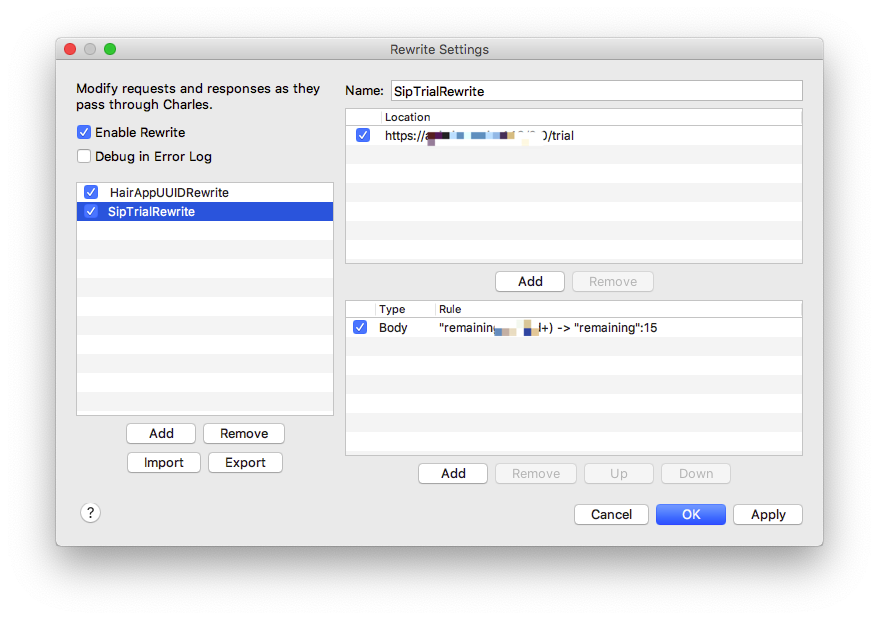

## 前言

上一篇讨论了如何使用「扛炮」来自动执行命令，并且给了一个简单的例子，破解免费试用APP的一种方法。

但大多数APP并不是使用简单的「本地存取字段」形式来判定用户是否可以免费试用，更常用更安全的做法是：

从电脑生成一个唯一 id, 用这唯一 id 来标示某一台设备，将试用日期字段保存在服务器，每次启动 APP 调用接口来检查是否可用。


## 唯一 id

经过调查发现，可以使用 UUID 和 UDID 这两种，它俩的区别：

- UUID (Universally Unique Identifier) 是系统针对某一 APP 生成的 128 bit 串，APP 重装会导致 UUID 变化
- UDID (Unique Device Identifier) 是电脑的唯一标示，使用此字段不能上架 Store

看到这里就可以知道应该使用 UDID 了，以下代码可以获取到系统的 UDID:

```Objective-C
- (NSString *)getSystemID {
    io_service_t platformExpert = IOServiceGetMatchingService(kIOMasterPortDefault,IOServiceMatching("IOPlatformExpertDevice"));
    if (!platformExpert)
        return nil;

    CFTypeRef serialNumberAsCFString = IORegistryEntryCreateCFProperty(platformExpert,CFSTR(kIOPlatformUUIDKey),kCFAllocatorDefault, 0);
    if (!serialNumberAsCFString)
        return nil;

    IOObjectRelease(platformExpert);
    return (__bridge NSString *)(serialNumberAsCFString);;
}
```

通过上面方法获取到的 id 和电脑打开系统报告里看到的 "System UUID" 是一样的，这里系统字段名为 UUID，有一点小歧义，其实 UDID 也是 UUID 的一种。

PS: 微软系的一般叫做 GUID (Globally Unique Identifier) 来代替 UUID.

## 测试

这次拿 [Sip](https://sipapp.io/) 这个软件开刀。

首先打开 Charles 抓包, 很容易就能发现有一条请求:

```
POST https://api.sipapp.io/2.0/trial
BODY:
{
 "id": "0911D5D6-6354-21F7-9E0A-xxxxxxxxxxxx",
 "pin": 6535
}
RESPONSE:
{
 "build": 200,
 "environment": "production",
 "match": "KeAe",
 "status": 200,
 "success": true,
 "trial": {
  "date": "2020-02-23",
  "days": 15,
  "id": "0911D5D6-6354-21F7-9E0A-xxxxxxxxxxxx",
  "name": "FaiChou-MBP",
  "remaining": 15
 },
 "version": "2.0"
}
```

于是拿这个 id 去和电脑的 UDID 对比，结果不一致！难道它用的是 UUID ？

#### 卸载重装

使用 AppCleaner 完全卸载 (暂时相信它能够卸载干净) Sip, 再重装，再次打开 Charles 抓包，结果发现 id 竟然没有变化！

#### keychain?

在做 iOS 开发时候用过这种策略，将 UUID 保存到 keychain 中，每次安装读取 keychain 中的数据，这样可以保证卸载重装会保持 UUID 不变。

于是去 keychain 中寻找相关的字段，结果一无所获。

#### IDFA？

又猜测是 IDFA 等字段，验证它的方法很简单，重置电脑的 IDFA，重装下 Sip，抓包再测试，发现 id 还是不变。

#### 无助

实在不懂它的原理是什么，下载了 `Hopper Disassembler` 对其逆向，进行一系列猜测与搜索，结果发现 UUID 和 keychain 这俩出现的地方很多，和刚才验证的相反。

于是在论坛/讨论群里求助，都没有能够给出合理的解释。


#### 直接问问开发者吧

写了一封邮件给开发者 Rui:

```
Hello Rui,
  I am FaiChou, from China. I am a super user of Sip app. And also I am a frontend developer.
  Recently, I want to create a macOS app with free trial. I notice that many apps save their `expiredDate` or `trialStart` to local, this is a bad idea, because any script can change that value.
  So I think using `UDID + backend` mechanism is a better option. The `expiredDate` are saved in backend and app checks the expired date by passing UDID to backend.

  When I study the Sip app, I found that Sip is not using the UDID, but when I re-install it, the same id appears. Wow, how could it happen? I think `keychain` is the only way to persist id, but when I open keychain, wow, there is nothing here. So could you please teach me how this works?
```

没想到在10分钟后就收到里开发者的回复：

```
Hey,

I can give you a light how this works

1) We use the kIOPlatformSerialNumberKey, basically this identifies a machine, the only way the user change this is by changing the board
2) We made some changes to this serial number, basically using some function in CryptoKit and some private keys
3) Then we save that transformed and some data locally and remote
4) Everytime a user open Sip, sip try validate that data, a check if the hash saved locally is different in the server, if that’s different, that means something changed in local, so we delete everything and the user need to start again, will need to enter the license, like you deleted the app
5) We have some algorithms to handle some edge cases, like what if the user dent have internet, what if sip servers are down etc

Hope this helps you
```

通过他的讲解，可以知道他是用 `kIOPlatformSerialNumberKey` 系统的序列号来生成 id, 这也是大多数的 macOS APP 采用的方法，使用 `CryptoKit` 生成的一个 128 bit 串。

为什么在逆向时候发现那么多有关 UUID 和 keychain 的方法呢？因为 Sip 用了 AppCenter, 微软这个库使用了 UUID / GUID / keychain 等方法。

## Hack

了解了使用哪种 id 对 hack 一点影响也没有，只需要知道调用哪个接口，返回信息格式是什么就足够了。需要的工具还是 Charles，使用它的 Rewrite 功能:



上图是针对 Sip 接口的重放，新建一个 rule, 使用正则匹配 body 中的关键字，并且替换掉。

重启 Sip，叮，试用还剩 15 天，完美。

Charles 这种 GUI 工具感觉比较重，每次想要 hack 需要打开这个软件，能不能更简便的方式呢？最理想的方式是在系统后台运行一个 daemon，监测到 Sip 软件开启，自动代理全局网络来进行抓包重放。

于是我找到了两个工具 AnyProxy 和 mitmproxy, 前者是对 Node 友好，后者是对 Python3 友好，这两者都可以对 HTTP/HTTPS 进行抓包重放。

下一篇会介绍如何使用这两者来完成上面的工作。


## Refs

- [NSUUID /CFUUIDRef /UIDevice -unique​Identifier /-identifier​For​Vendor](https://nshipster.com/uuid-udid-unique-identifier/)
- [AnyProxy](http://anyproxy.io/)
- [mitmproxy](https://mitmproxy.org/)
