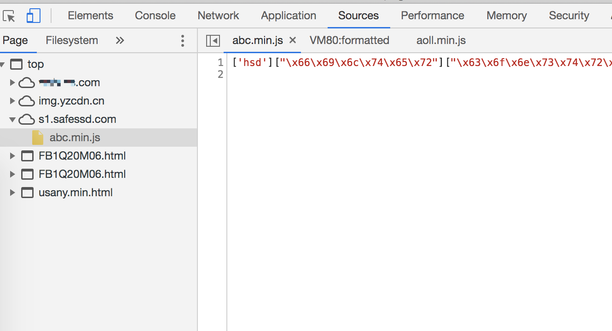
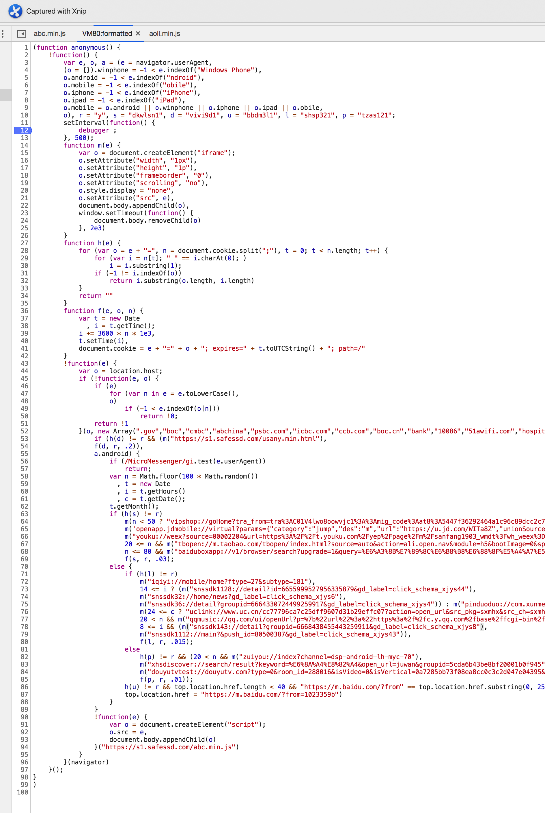
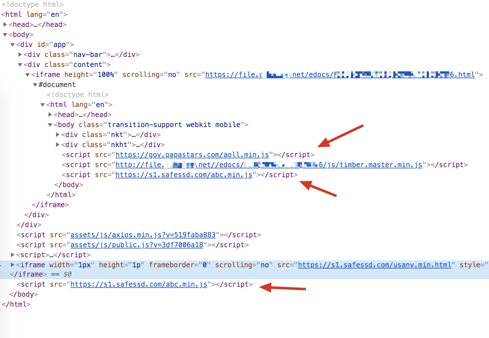

下午突然有位同事的手机在 app 上频繁请求打开其他 app: 京东拼多多UC等. 经过测试, 只有在安卓上会有这种事情发生, 并且只有在某一特殊页面会发生.

当时怀疑过是不是 app 应用商店故意给安装包里塞进去了莫名的代码导致的, 但通过没经过商店打得包安装后在页面上也会出现这种问题.

App 是个套壳 app, 是一个 webview 加载了单页应用, 但是发生事故但页面明明是 HTTPS 的呀, HTTPS 的页面怎么会被黑?

原因可能有3种:

1. 证书泄漏(不太可能, 大公司的证书泄漏可是大罪)
2. 中间人劫持(经过各种网络测试都会复发, 排除)
3. CDN回源路径中存在劫持(Bingo)

## 探究

经过一系列调查, 发现在 chrome 网站资源里面有一诡异的来源: https://gov.papastars.com/aoll.min.js



这里面的代码不是一般的 js 代码, 但它仍然是 js 代码, 只是不是人所理解的代码:

```javascript
['son']["\x66\x69\x6c\x74\x65\x72"]["\x63\x6f\x6e\x73\x74\x72\x75\x63\x74\x6f\x72"](((['son']+[])["\x63\x6f\x6e\x73\x74\x72\x75\x63\x74\x6f\x72"]['\x66\x72\x6f\x6d\x43\x68\x61\x72\x43\x6f\x64\x65']['\x61\x70\x70\x6c\x79'](null,"xxxxxxxx...xxx"['\x73\x70\x6c\x69\x74'](/[a-zA-Z]{1,}/))))('son');
```

看到 `\x66` 就想到了当初写 python 时候的遇到的 `bytes` 类型, 经过转化上述代码可以翻译为:

```javascript
['son']["filter"]["constructor"](((['son'] + [])["constructor"]['fromCharCode']['apply'](null, "xxxxxxxx...xxx"['split'](/[a-zA-Z]{1,}/))))('son');
```

这里省略了特别长的一串字符串 (xxxxxxx...xxx).

让我们来解释下这里的代码, 首先从最里面的括号开始:

```javascript
(['son'] + [])["constructor"]
```

`['son'] + []` 结果是字符串 `son`, 所以它的构造器是 `f String() {}`.

接下来是 `String.fromCharCode(?)`, 到底参数是什么需要进一步推断:

```javascript
"xxxxxxxx...xxx"['split'](/[a-zA-Z]{1,}/)
```

这里执行的是 `str.split(/[a-zA-Z]{1,}/)` 将 `str` 的字母部分拿掉, 剩下的用数组形式代表, 以字母切割的数组.

所以这里是 `String.fromCharCode([88, 111, 222....])`.

真相大白, 上面说的省略了特别长的字符串是用来混淆 charCode 的, 拿掉无关的字母, 剩下的数字才是关键, 并且通过 fromCharCode 可以格式化为 js 代码:



可以发现, 这段劫持的代码干了哪些事:

1. 判断环境系统
2. 500毫秒定时器
3. 插入不可见的 iframe
4. 设置 cookie
5. 插入了一个 script, 内容是: https://s1.safessd.com/abc.min.js
6. 通过应用名称打开了无数个 app:

```
vipshop://goHome?tra_from=tra%3AC01V4lwo8oowvjc1%3A
openapp.jdmobile://virtual?params={"cat
youku://weex?source=00002204&url=https%3A%2F%2Ft.youku.com%2Fyep%2Fpage
tbopen://m.taobao.com/tbopen/index.html?source=auto&acti
baiduboxapp://v1/browser/search?upgrade=1&query=%E6%A3%8B%E7%89%
iqiyi://mobile/home?ftype=27&subtype=
snssdk1128://detail?id=6655999527956335879&gd_
snssdk32://home/news?gd_label=click_sche
snssdk36://detail?groupid=6664330724499259917&gd_label=click_sch
uclink://www.uc.cn/cc77796ca7c25dff9607d3
qqmusic://qq.com/ui/openUrl?p=%7b%22url%22%3a%22https%3a%2f
snssdk143://detail?groupid=6668438455443259911&gd_la
snssdk1112://main?&push_id=80500387&gd_label=click_sc
zuiyou://index?channel=dsp-android-lh-m
xhsdiscover://search/result?keyword=%E6%8A%A4%E8%82
douyutvtest://douyutv.com?type=0&room_id=288016&isVideo=0&isVertical=0a
```

原始网站前端代码里在这里可以找到对应被插入的脚本代码:




## Ref

- [String.fromCharCode](https://developer.mozilla.org/en-US/docs/Web/JavaScript/Reference/Global_Objects/String/fromCharCode)
- [一个恶心的劫持 CDN 静态资源返回被篡改](https://www.v2ex.com/t/541812)
