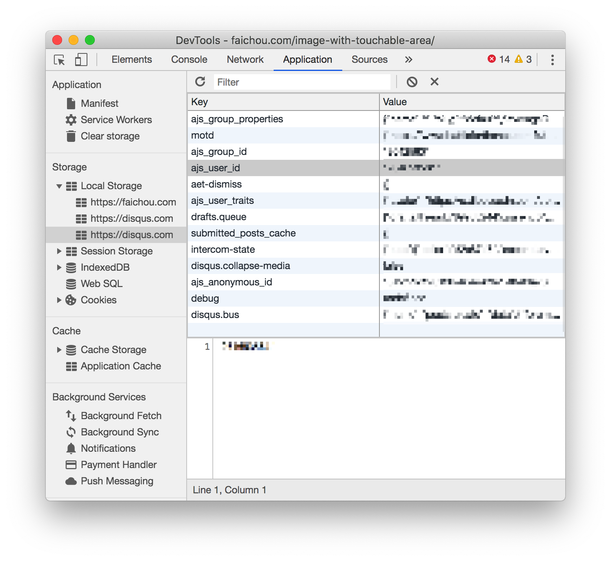

本博客评论系统用的是 [Disqus](https://disqus.com/), 它是一个比较好用的评论系统， 本篇简单介绍如何使用并且它是如何工作的。

## 使用

#### Sign up

首先在 [disqus](https://disqus.com/profile/signup/intent/) 上注册一个用户，以后在任意网站上进行评论/回复/收藏/订阅都以此用户进行操作。

#### Install

在 [create new site](https://disqus.com/admin/create/) 页面注册你的博客，需要起一个 universal shortname, shortname 是很重要的，它是 disqus 系统辨识你博客系统的标示。

#### Use

在 [installation](https://disqus.com/admin/settings/install/) 页面，选择你的博客平台，或者使用纯代码:

```html
<div id="disqus_thread"></div>
<script>

/**
*  RECOMMENDED CONFIGURATION VARIABLES: EDIT AND UNCOMMENT THE SECTION BELOW TO INSERT DYNAMIC VALUES FROM YOUR PLATFORM OR CMS.
*  LEARN WHY DEFINING THESE VARIABLES IS IMPORTANT: https://disqus.com/admin/universalcode/#configuration-variables*/
/*
var disqus_config = function () {
this.page.url = PAGE_URL;  // Replace PAGE_URL with your page's canonical URL variable
this.page.identifier = PAGE_IDENTIFIER; // Replace PAGE_IDENTIFIER with your page's unique identifier variable
};
*/
(function() { // REPLACE YOURSHORTNAME
var d = document, s = d.createElement('script');
s.src = 'https://YOURSHORTNAME.disqus.com/embed.js';
s.setAttribute('data-timestamp', +new Date());
(d.head || d.body).appendChild(s);
})();
</script>
<noscript>Please enable JavaScript to view the <a href="https://disqus.com/?ref_noscript">comments powered by Disqus.</a></noscript>
```

这样 `disqus_thread` 就会插入到你的博客中。

## 原理

使用第三方框架时候，在第三方平台注册 item, 会给你生成一个唯一不能更改的标示，在 disqus 上是 shortname, 所以 disqus 以此 shortname 来初始化该评论系统。

新建一个 index.html:

```html
<div id="disqus_thread"></div>
<script>
var disqus_config = function () {
  this.page.url = 'https://maxsky.cc/2017/03/26/MacOS-Use-KcpTun-Acc-SS/';
  this.page.identifier = '2017/03/26/MacOS-Use-KcpTun-Acc-SS/';
};
(function() { // DON'T EDIT BELOW THIS LINE
var d = document, s = d.createElement('script');
s.src = 'https://maxsky.disqus.com/embed.js';
s.setAttribute('data-timestamp', +new Date());
(d.head || d.body).appendChild(s);
})();
</script>
```

这里使用的 `maxsky` 是一个其他用户的 shortname，并且 `disqus_config` 初始化了 disqus 的页面路由和页面 id.
起一个 server，打开可以看到其他用户文章的 disqus 评论。

每次打开一个使用 disqus 的网站，都能够帮你自动登陆，这里是因为它会保存用户信息到 localstorage 中:


