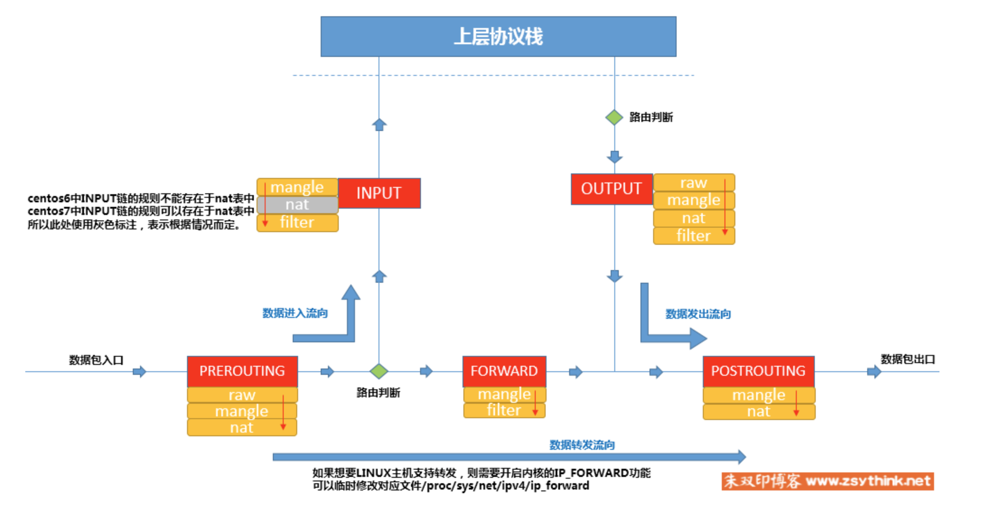

tailscale 使用 wireguard 作为底层网络协议，并使用 wireguard 的 NAT 功能来保证连通性。运行它会在本地创建一个 wireguard 的虚拟网络:

```bash
$ ip a # macOS 上使用 ifconfig
1: lo: <LOOPBACK,UP,LOWER_UP> mtu 65536 qdisc noqueue state UNKNOWN group default qlen 1000
    link/loopback 00:00:00:00:00:00 brd 00:00:00:00:00:00
    inet 127.0.0.1/8 scope host lo
       valid_lft forever preferred_lft forever
2: enp1s0: <BROADCAST,MULTICAST> mtu 1500 qdisc noop state DOWN group default qlen 1000
    link/ether 54:f6:c5:14:9e:35 brd ff:ff:ff:ff:ff:ff
3: enp2s0: <BROADCAST,MULTICAST,UP,LOWER_UP> mtu 1500 qdisc fq_codel state UP group default qlen 1000
    link/ether 54:f6:c5:14:9e:36 brd ff:ff:ff:ff:ff:ff
    inet 192.168.11.101/24 brd 192.168.11.255 scope global enp2s0
       valid_lft forever preferred_lft forever
4: tailscale0: <POINTOPOINT,MULTICAST,NOARP,UP,LOWER_UP> mtu 1280 qdisc fq_codel state UNKNOWN group default qlen 500
    link/none
    inet 100.64.0.19/32 scope global tailscale0
       valid_lft forever preferred_lft forever
```

这里的 `tailscale0` 就是一个虚拟接口。可以使用 ip route 命令来查看具体的路由情况:

```bash
$ ip route show table all # macOS 使用 netstat -rn
100.64.0.1 dev tailscale0 table 52
... 省略
default via 192.168.11.1 dev enp2s0 onlink
169.254.0.0/16 dev enp2s0 scope link metric 1000
... 省略
````

也可以直接使用 ip route get 来查看具体的路由:

```bash
$ ip route get 100.64.0.19 # macOS 使用 route -n get 100.64.0.2
100.64.0.19 dev tailscale0 src 192.168.11.101 uid 500
    cache
```

网络配置和路由基本都清楚了，接下来就来到 NAT 了。

## NAT 的基本介绍

在 Linux 操作系统中，Netfilter 是操作系统内核的防火墙框架，但我们无法直接使用它，而是需要通过 iptables 或者 nftables 来使用它。使用 iptables 配置相应的规则。

比如一条请求到达网口之后，操作系统需要根据对应的**规则**进行处理，可以根据源地址目标地址（包括端口），传输协议（TCP/UDP/ICMP等）以及服务类型（HTTP/FTP等）进行匹配，匹配完成后的操作（动作）有这些：ACCEPT, DROP, REJECT, LOG，SNAT, DNAT, MASQUERADE 和 REDIRECT。我们使用 iptables 就是在配置这些规则。这些规则需要应用到每个一个节点上，比如刚到达的请求，或者已经到达放行的请求，或者转发到其他网络接口的，所以不同的节点就需要不同的关卡，每一个关卡都有相应的规则。在 Linux 中关卡被称作 chain, 一共有 5 个 chain:

- PREROUTING: 请求到达的第一个关卡
- INPUT: 请求被本机接收
- FORWARD: 请求被转发到其他网口的关卡（比如来了一个请求后，根据规则转发到内网其他设备）
- OUTPUT: 请求被本机处理后，准备发送出去的关卡
- POSTROUTING: 请求被发送出去的最后一个关卡，被 forward 或者 output 之后的一个关卡

上面 5 个链，每一个链都有相应的规则，这些规则负责不同的功能，于是就有了相应的分类，被分成 4 个表:

- filter: 负责过滤，防火墙
- nat: 负责 NAT
- mangle: 对报文的拆解修改封装
- raw: 用的很少

大致的流程请看这张图:



具体的 iptables 命令使用方法请参考这张图:


## Tailscale 的一个打洞问题

想理解 Tailscale 的打洞问题，需要有很多基础知识，上面的 NAT 只是其中一部分。基础知识扎实对于一个开发者来讲是至关重要的，尤其是 http 这一块。能够详细的讲述*一个数据包是如何在应用层，传输层，网络层和数据接口层传输*是很基础的。很多细节问题都要研究透，比如 DNS 是基于 TCP 还是 TCP，DHCP 在 ARP 之前还是之后，它们的工作流程是什么，http 如何升级成 WebSocket 的等。以及很多名词 UPnP, NAT-PMP, STUN, CGNAT, NAT64, SNAT, DNAT 等。

假如你基础功底扎实，可以看下面这一个问题，这个问题是我在阅读 [Tailscale 这篇博客](https://tailscale.com/blog/how-nat-traversal-works) 时发现的，这篇文章比较长，在 **The benefits of birthdays** 这一章节:

> Rather than open 1 port on the hard side and have the easy side try 65,535 possibilities, let’s open, say, 256 ports on the hard side (by having 256 sockets sending to the easy side’s ip:port), and have the easy side probe target ports at random.

假如有两在不同地方的台机器，机器 A 和 机器 B，它们使用 tailscale 组网，机器 A 的内网 ip 192.168.1.2, 公网 ip 2.2.2.2。机器 B 的内网 ip 192.168.2.2, 公网 ip 3.3.3.3。并且 A 的 NAT 属于 Hard NAT(Symmetric NAT), B 的 NAT 属于 Easy NAT(Full Cone NAT)。

对于 Symmetric NAT 和 Fullcone NAT 的一点解释:

A 的某个程序使用 `192.168.1.2:1234` 向 `4.4.4.4:5678` 发出一个请求, 那么在 NAT 映射后，是 `2.2.2.2:4321` 发往 `4.4.4.4:5678` ，这样 `4.4.4.4:5678` 返回的请求，到达 NAT 也会被正常映射到设备 A 的 `1234` 端口。这是由 `iptables -A FORWARD -m state --state RELATED,ESTABLISHED -j ACCEPT` 这种防火墙规则决定的。 但是对于 Hard NAT 的 A 来讲，如果是 `5.5.5.5:5678` 向 A 的 `2.2.2.2:4321` 发起一条请求，NAT 会检查源地址不是 `4.4.4.4:5678` ，所以会 drop 掉这一条请求。

但对于 B 来讲，`192.168.2.2:1234->3.3.3.3:4321 -> 4.4.4.4:5678`, 建立了一个这样的 NAT 表，当其他的设备比如 `5.5.5.5:9876` 主动请求 `3.3.3.3:4321` 端口的时候，也会被 NAT 转发到 `192.168.2.2:1234` ，这就是 Fullcone NAT ，表现为很容易 p2p 连接成功。

再回到 **The benefits of birthdays** 的问题，假设 B 机器想要连接 A 机器，由于 A 是 Hard NAT ，无法直接选择一个合适的端口进行连接，但反过来是可以的，因为每一台运行 tailscale 程序的设备来讲，都会和 DERP 服务器进行着连接。

不管是谁连接谁，都先走一下 DERP 中继，这样起码就能获取到每一方的外部端口。理想情况下，两端都是 Easy NAT ，那它们使用连接 DERP 服务器的端口进行直连，基本上就可以 p2p 连接成功。

但 A 是 Hard NAT ，于是 DERP 服务器将 B 的 ip 和端口告诉了 A ，虽然是 B 想主动连接 A ，但 tailscale 程序的实现是两端都进行尝试连接，这样 A 直连成功了 B ，`192.168.1.2:1234->2.2.2.2:5678->3.3.3.3:8765->192.168.2.2:4321` ，这样它俩就建立了正常的直连。

文章中的举例是需要让 A 开 256 个端口连接 B ，B 通过遍历端口进行和 A 连接，当尝试了 1024 次时候，能和 A 成功连接的概率是 98%（生日悖论）。

我做了一个图来更直观的表达一下这个过程:


看上去 tailscale 的文章和我理解的不一致，因为我是在使用过程中遇到的这些问题，tailscale 经常打洞失败，明明我是 Easy NAT，我使用 STUN 工具测试的结果是:

> STUN client version 0.97 Primary: Independent Mapping, Independent Filter, preserves ports, no hairpin

但经过我的调查，发现这个 STUN 工具给的结果是有误导性的，普通的防火墙并不会让你完全表现成 Fullcone NAT, 也就是说它不是 Endpoint-Independent Filtering，而是 Port-Restricted Cone NAT。

关于这几种的区别我做了一个表：


具体使用一个例子来讲一下上面这个表格的类型:


一台设备使用 STUN 获取到自己的公网 ip 之后，同一个程序对 3.3.3.3 和 4.4.4.4 发起请求，本地程序使用 192.168.2.2:1234 向 3.3.3.3 发起请求，再向 4.4.4.4 发起请求，对于 Fullcon 和 Restricted NAT 来讲，公网的端口是同一个，都会使用 4321 端口进行连接。对于 Symmetric NAT 来讲，公网的端口是不同的，连接 3.3.3.3 使用 2345 端口，连接 4.4.4.4 换成了 2346 端口。

如果有一个设备 5.5.5.5 主动请求 2.2.2.2 的 4321 端口，那对于 Fullcone 来讲，是允许建立连接的。除此之外，其他的 NAT 都会拒绝。

## 参考链接

- [How NAT traversal works](https://tailscale.com/blog/how-nat-traversal-works)
- [朱双印 IPtables](https://www.zsythink.net/archives/category/%e8%bf%90%e7%bb%b4%e7%9b%b8%e5%85%b3/iptables)
