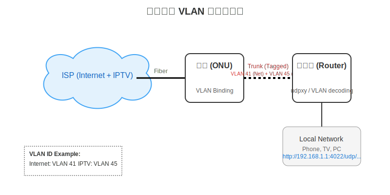
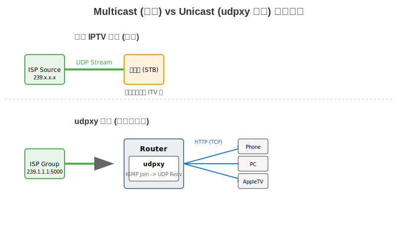
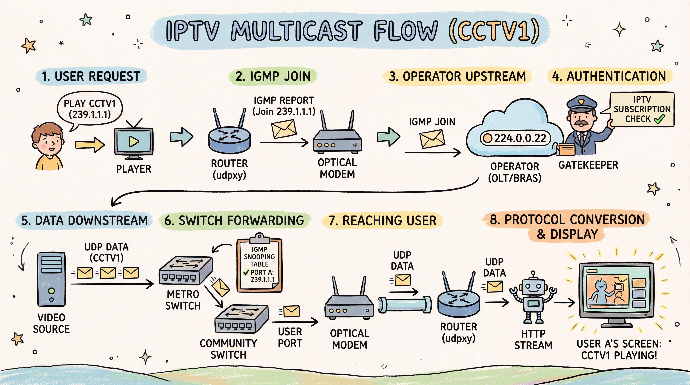
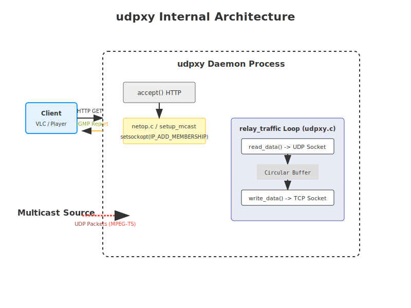

我一直在网上找免费的 IPTV 播放源，但体验通常很差。公共源经常失效，清晰度也参差不齐，尝试过 ipv6 源、开放的组播源，甚至买过一些付费服务，都不尽如人意。

后来意识到，既然家里的宽带套餐本身就包含了 IPTV 服务，为什么不直接利用这个原生的高质量信号呢？于是开始了这次折腾：**利用手中的设备，把光猫里的 IPTV 信号提取出来，实现全屋任意设备自由观看。**

本文将从最基础的 VLAN 网络配置讲起，深入到组播（Multicast）与单播（Unicast）的原理，最后硬核分析一下核心工具 `udpxy` 的源代码，看看它是如何把 UDP 组播流转换成 HTTP 视频流的。

## 网络架构：单线复用 (Single Line Multiplexing)

在传统的家庭网络布线中，师傅通常只会在弱电箱到客厅电视柜之间预埋一根网线。但这根网线通常被路由器占用做上网（Internet），如果还要接 IPTV 机顶盒，那就尴尬了——网线不够用。

这时候就需要 **单线复用** 技术。简单来说，就是利用 VLAN（虚拟局域网）技术，在这一根物理网线上同时传输“上网数据”和“IPTV数据”，互不干扰。

### 拓扑结构



如上图所示：
1. **光猫 (ONU)**: 负责将光信号转换为电信号。我们在光猫后台进行设置，将 Internet 业务绑定到 VLAN A（例如 41），IPTV 业务绑定到 VLAN B（例如 45）。并将这两个 VLAN 绑定到同一个物理网口（Trunk 模式）。
2. **网线 (Trunk)**: 这根网线承载了带着不同 VLAN 标签（Tag）的数据帧。
3. **路由器 (Router)**: 路由器接收到这些混合数据后，根据 VLAN ID 进行分离。VLAN 41 进行拨号上网，VLAN 45 则不仅可以透传给机顶盒，更重要的是通过我们安装的软件进行处理。

### 关键配置

**光猫侧设置 (以中兴光猫为例)**：
进入`网络 -> 网络设置 -> VLAN绑定`。将上网业务和 IPTV 业务都绑定到同一个网口（比如网口1）。

**路由器侧设置 (以 OpenWrt 为例)**：

我的路由刷的是 OpenWrt 固件，这里详细介绍配置过程。

假设光猫网段为 `192.168.1.0/24`，路由器网段为 `192.168.2.0/24`。
OpenWrt 默认接口：LAN (绑定 br-lan), WAN (绑定 eth1)。

1. **安装软件包**:
    ```bash
    opkg update
    opkg install omcproxy udpxy luci-app-udpxy
    ```

2. **新建接口**:
    在「网络-接口」中新建接口「IPTV」。
    - 协议：DHCP 客户端 (或静态 IP，视光猫配置而定)
    - 物理设置：选择对应的 VLAN 接口 (如 `eth1.45`)

3. **网关跃点与防火墙**:
    - **IPTV 接口**: 高级设置中「网关跃点」设为 `20`。防火墙设置分配到区域 `wan` (或者是新建一个专用区域 `iptv`，为了简单可以直接复用 wan)。
    - **WAN 接口**: 确保 WAN 接口的「网关跃点」为 `10` (保证默认流量走 Internet)。

4. **开启 IGMP 嗅探**:
    在「LAN」接口的物理设置中，勾选「开启 IGMP 嗅探」。

5. **防火墙通信规则**:
    在「网络-防火墙-通信规则」中新建规则，允许 IGMP 和 UDP 数据包进入。
    - 协议：IGMP, UDP
    - 源区域：WAN (或 IPTV)
    - 目标区域：设备 (Device)

6. **配置 udpxy**:
    进入 `luci-app-udpxy` 配置界面：
    - **Source Interface**: 填写 IPTV 接口名称 (如 `br-iptv` 或对应的物理口 `eth1.45`)
    - **Port**: 4022 (默认)
    - 勾选 Enable，保存并应用。

7. **验证**:
    访问 `http://192.168.2.1:4022/status`。如果能看到 udpxy 的状态页面，说明启动成功。
    此时，将原来的组播地址 `rtp://239.3.1.241:8000` 改为 `http://192.168.2.1:4022/rtp/239.3.1.241:8000`，放入播放器测试。

> **关于机顶盒 (STB)**:
> 其实运营商送的机顶盒，本质上也在做同样的事情。它通过内置的程序加入组播组，接收 UDP 数据流，然后解码播放。我们使用 `udpxy` 相当于把这个“接收+转码”的过程拆分了：由路由器负责“接收（转单播）”，由性能更强的手机/电视/电脑负责“解码播放”。

## 核心原理：组播转单播

配置好网络通路后，路由器已经能接触到 IPTV 的数据流了。但 IPTV 原始信号是 **组播 (Multicast)** 的。

### 为什么要转单播？

组播是一种“广播”的高效形式，ISP 发送一份数据，所有订阅了该组播组（Group）的客户端都能收到。这对于电视直播非常高效。

但是，普通的手机、电脑、Apple TV 并不像运营商送的机顶盒那样，原生支持加入特定的 VLAN 组播网络并解码 MPEG-TS 流。而且组播数据包在无线网络（Wi-Fi）中传输极其低效，容易造成广播风暴，导致 Wi-Fi 瘫痪。

所以我们需要 **组播转单播 (Multicast to Unicast)**：



我们使用 `udpxy` 这个工具来充当“中间人”：
1. **对内**: 它把转换后的 HTTP 流（单播）提供给局域网内的手机、电脑。
2. **对外**: 它像机顶盒一样，向 ISP 申请加入某个频道（组播组）。
3. **转发**: 它收到 ISP 的 UDP 组播包，去掉多余头部，封装成 TCP/HTTP 数据包发给内网设备。

### 详细的组播数据流向

来模拟一下一个完整的请求流程：

1. **用户请求**: 用户 A 想看 CCTV1 (假设组播地址 `239.1.1.1`)，在播放器打开对应链接。
2. **IGMP Join**: 路由器 (运行 `udpxy`) 向光猫发送 IGMP 报告，声明加入组播组 `239.1.1.1`。
3. **上报运营商**: 光猫将这个 IGMP 数据包 (Join `239.1.1.1`) 发送到 **224.0.0.22** (IGMPv3 report address)。
4. **权限验证**: 运营商局端设备（OLT/BRAS）检测到用户订阅了 IPTV 服务，允许该 IGMP 请求通过。
5. **数据下发**: IPTV 服务器源源不断地向城域网交换机发送视频数据流。
6. **交换机转发**: 城域网交换机将数据发送到小区的汇聚交换机。小区交换机维护着一张转发表（IGMP Snooping Table），它查表发现用户 A 所在的端口（对应 VLAN）订阅了 `239.1.1.1`，于是将 CCTV1 的 UDP 数据包精确复制一份发送到该端口。
7. **到达用户**: 数据包到达用户 A 的光猫，透传到路由器。
8. **协议转换**: `udpxy` 接收到 UDP 数据包，剥离多余头部，封装成 HTTP 响应流，最终呈现在用户 A 的屏幕上。



## 深入源码：udpxy 是怎么工作的？

`udpxy` 是一个轻量级的 C 语言守护进程，专门用于将 UDP 组播流中继为 HTTP 流量。让我们结合源代码看看它到底做了什么。



### 1. 订阅组播 (IGMP Join)

当我们在播放器里打开一个链接，例如 `http://192.168.1.1:4022/udp/239.1.1.1:5000` 时，`udpxy` 接收到 HTTP 请求，解析出目标组播地址 `239.1.1.1` 和端口 `5000`。

然后它会调用底层的 socket 接口加入组播组。核心代码在 `netop.c` 中：

```c
// netop.c: setup_mcast_listener
// 这里的 IP_ADD_MEMBERSHIP 是关键，它告诉内核：“我要通过这个网口加入这个组播组”
struct ip_mreq mreq;
mreq.imr_multiaddr.s_addr = mcast_addr; // 239.1.1.1
mreq.imr_interface.s_addr = if_addr;    // 路由器的 IPTV 接口 IP

setsockopt(sockfd, IPPROTO_IP, IP_ADD_MEMBERSHIP, &mreq, sizeof(mreq));
```

这一步之后，ISP 的路由器就会开始向你的路由器推送该频道的 UDP 数据包。

### 2. 数据中继循环 (Relay Traffic)

一旦加入成功，`udpxy` 就进入一个循环，不断地搬运数据。核心逻辑在 `udpxy.c` 的 `relay_traffic` 函数：

```c
// udpxy.c
// 伪代码简化逻辑
while(1) {
    // 1. 从 UDP socket 读取数据 (组播数据)
    nrcv = read(udp_socket, buffer, buf_len);
    
    // 2. (可选) 解析并处理数据，例如 RTP 去头
    if (is_rtp(buffer)) {
        strip_rtp_header(buffer);
    }

    // 3. 写入 HTTP 客户端的 TCP socket
    nsent = write(client_socket, buffer, nrcv);
}
```

### 3. 数据包解析与 RTP 处理

IPTV 的流媒体数据通常是 **MPEG-TS** 格式。MPEG-TS 的特征是每个包固定 188 字节，且以 `0x47` 开头。

但在某些地区，运营商为了传输质量，会在 MPEG-TS 外面再包一层 **RTP (Real-time Transport Protocol)** 协议。播放器通常不认 RTP 头，所以 `udpxy` 需要智能识别并剥离它。

在 `dpkt.c` 中有这样的逻辑：

```c
// dpkt.c: get_mstream_type
int get_mstream_type(const char* data, size_t len) {
    uint8_t sig = data[0];

    // 情况1: 直接是 MPEG-TS，以 0x47 (sync byte) 开头
    if (sig == 0x47) return UPXDT_TS;

    // 情况2: 可能是 RTP
    // 检查 RTP header 是否合法，且 payload type 是否为 MPEG 相关
    if (RTP_verify(data, len)) {
        // 进一步检查 RTP payload 内部是否包含 0x47
        if (data[RTP_HDR_SIZE] == 0x47) {
            return UPXDT_RTP_TS; // 是 RTP 封装的 TS 流
        }
    }
    return UPXDT_UNKNOWN;
}
```

如果是 `UPXDT_RTP_TS`，`udpxy` 会自动跳过前 12 字节的 RTP 头部，只把有效的视频载荷转发给播放器。

## 总结

通过这次折腾，不仅实现了 IPTV 的自由观看，还顺便复习了一遍计算机网络知识：

1. **VLAN**: 实现了物理链路复用，隔离了不同业务。
2. **Multicast**: 理解了 IGMP 协议和组播的高效性。
3. **Socket Programming**: 通过阅读 `udpxy` 源码，重温了 C 语言的网络编程模型（`setsockopt`, `bind`, `read/write`）。

现在，我可以在家里的电视、手机、iPad 上，随时随地通过 `http://192.168.1.1:4022/udp/239.x.x.x:port` 这种格式观看几十兆码率的高清直播，再也不用受垃圾源卡顿的影响了。

## 参考资料

- [udpxy Source Code](https://github.com/pcherenkov/udpxy)
- Wcb1969 的 IPTV 组播源: [GitHub](https://github.com/wcb1969/iptv)
- [udpxy+IPTV实现组播流量转单播](https://github.com/lelehub/udpxy-IPTV)
