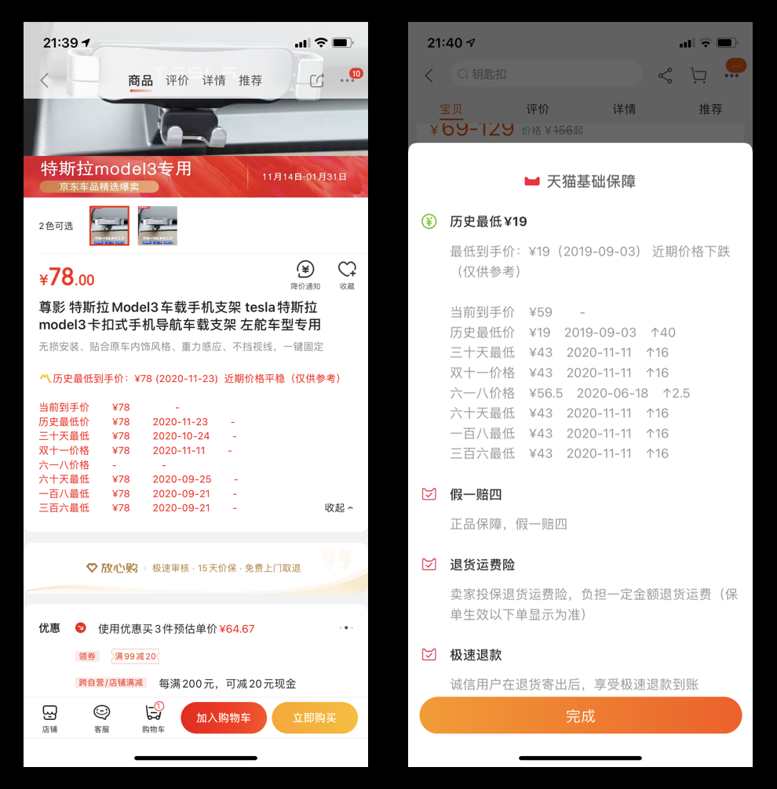
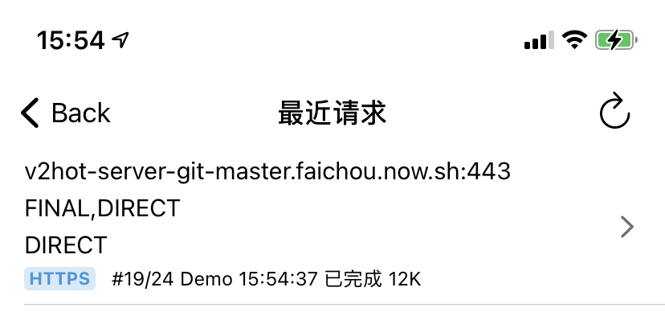
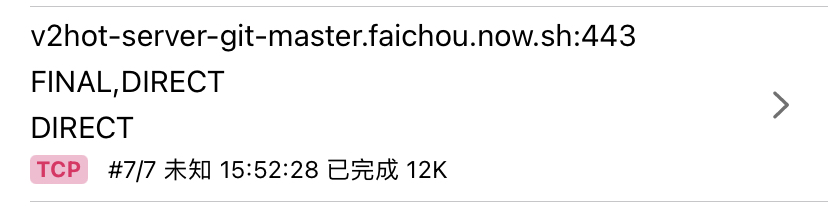
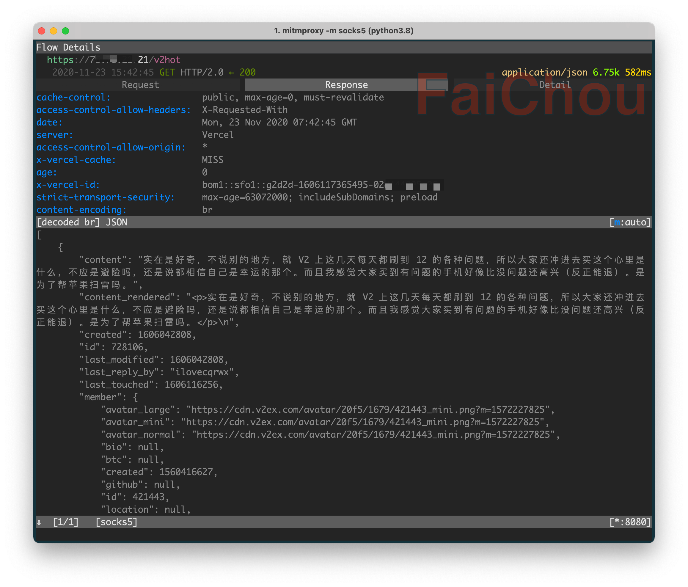

不做代码已久, 先盲写一段 HTTPS 验证过程来验证我的基本功:

1. 客户端向服务端发起 HTTPS 请求
2. 服务器向客户端回复`证书`, `证书`里包含`公钥`
3. 客户端拿到证书先去权威机构(系统)验证证书是否有效, 如果无效则终止请求
4. 证书有效, 于是将客户端自己的`钥匙(对称加密)`使用服务端的`公钥`加密发送给服务端
5. 服务端收到信息, 用自己的`私钥`解密出客户端的`钥匙`
6. 于是这两者建立起了信任


ps. 从第四步可以看出, HTTPS 是包含对称加密和非对称加密的.


在这之上还有双向认证, 多加了几个步骤, 客户端也用公钥私钥将证书发送给服务端认证, 可以, 但没啥大必要.

假如中间有个人, 它想做坏事, 在第二步获取到证书, 再将中间人自己的证书发送给客户端, 客户端去验证:

1. 验证失败, 因为它对系统来说是陌生人, 系统不认识
2. 验证成功, 可能用户手动点击信任过证书, 或者系统的证书遭遇泄漏

第二步的发生, 让一切有趣起来, MITM 就是指的它. 它使对 HTTPS 的抓包变得可能. 具体 MITM 的原理也很简单, 这里不说了.

比较有用的是在手机上, 可以使用 **圈X**, **Surge**, **Loon** 等软件执行脚本, 篡改 HTTPS 请求, 这已经非常成熟并且有很多实用工具了.

这种软件以添加 *VPN* 的形式在*应用层*工作, 它们作为系统代理, 捕获所有应用请求, 再配合 MITM, 可以直接解析 HTTPS 请求.

讲个最好用的例子:

## jd/tb 比价神器



代码在 GitHub 上可以搜得到: [tb_price.js](https://raw.githubusercontent.com/yichahucha/surge/master/tb_price.js)

代码比较简单, 整体一看可以得知, 它对两个请求进行了处理, 修改请求参数, 也更改了返回信息, 于是呈现到手机上就是它更改过的信息.

既然可以这样, 那么自己就可以做点坏事情了. 首先练个手:

## 更改微博热搜列表

经过对微博国际版的抓包可以看到, 热搜的请求是:

```
https://weibointl.api.weibo.cn/portal.php?ct=feed&a=search_topic&auth=xxx&c=weicoabroad&i=xxx&lang=en-CN&s=3f16726c&time=1606139954516&ua=iPhone12%2C1_iOS14.2_Weibo_intl._409_wifi&udid=xx-xx-xx-xx-xxx&user_id=xxx&version=409
```

对返回的结果一解析就可以写出以下这段 hack 代码:

```javascript
if ($request.url.includes('a=search_topic')) {
  const _data = $response.body
  console.log(_data)
  if (!_data) {
    console.log('no data!!!')
    console.log($request)
    console.log($response)
    $done()
  } else {
    const keywords = ['蔡徐坤', '肖战', '范丞丞']
    let body = JSON.stringify(_data)
    keywords.forEach(keyword => {
      const regex = new RegExp(keyword, "gi")
      const result = "口".repeat(keyword.length)
      body = body.replace(regex, result)
    })
    console.log(body)
    $done({body})
  }
} else {
  $done()
}
```

代码把所有的热搜列表中的*蔡徐坤肖战范丞丞*都替换为*口*.

我平时不用微博国际版, 买了 VVebo pro 版本, 用它比较多, 这些第三方微博客户端都是扒的国际版 API, 所以上面代码可以同样运行.

## 但是碰了一鼻子灰

打开抓包工具查看, 空空如也, 使用的抓包工具有: **HTTP Catcher**, **Charles**, **Stream**. 完全没有接口的请求, 测试发现抓包工具都是正常可以用的, 那为什么抓不到包呢?

首先排除 **SSL-Pinning**, 因为它的原理是软件内置证书, 进行 https 请求时对比证书, 如果 MITM 的证书是对不上的, 请求也就会失败. 因为 VVebo 客户端能够正常完成请求, 所以排除了这种可能.

会不会开发者从 tcp 层下手, 自己封装通信协议呢? 这需要客户端和服务器的配合, 工作量大.

经过搜索发现这一个[帖子](https://www.v2ex.com/t/715477#reply48). 作者表达:

> 普通的抓包工具使用设置系统代理的方式, 而有些 app 会无视系统代理, 开发者一行代码可以解决的事

于是勾起了我的好奇心, 并且购买了他的 `mitmproxy client`, 配合电脑上的 `mitmproxy` (半年前研究过它) 进行抓包. 这个工具在客户端拦截 **TCP** 和 **UDP** 请求, 发送给电脑上的 `mitmproxy`.

经过测试, bingo, 果然能抓到包, 瞬间觉得好有趣并且还有两个疑问:

1. 作者说的**一行代码**是怎么写的
2. **一行代码**可以解决, 为什么大部分应用都没有用

## 一行代码

带着问题去搜索 `ios swift bypass system proxy` 果然有效果:

[how-to-bypass-proxy-in-ios-programmatically](https://stackoverflow.com/questions/28061353/how-to-bypass-proxy-in-ios-programmatically/48261195)

半年前就卸载了 Xcode, 并且也有很几年没写 iOS 原生了, 虽然代码能看懂, 但要写个 demo 可太难了, 先下载 Xcode 吧.

经过几小时的下载安装, 终于成功可以撸代码了:

```swift
var proxyDict = [AnyHashable : Any]()
@IBAction func callAPI(_ sender: UIButton) {
  let sessionConfig = URLSessionConfiguration.default
  sessionConfig.connectionProxyDictionary = proxyDict
  let session = URLSession.init(configuration: sessionConfig, delegate: nil, delegateQueue: OperationQueue.current)
  let url = URL(string: "https://v2hot-server-git-master.faichou.now.sh/v2hot")!
  let task = session.dataTask(with: url, completionHandler: { data, response, error in
    print(error)
    print(response)
    // Check the response
    if (error == nil) {
      DispatchQueue.main.async {
        self.alertString(s: "请求成功")
      }
      print(response)
    } else {
      DispatchQueue.main.async {
        self.alertString(s: "请求失败")
      }
    }
  })
  task.resume()
}
func alertString(s: String) {
  let alert = UIAlertController(title: s, message: s, preferredStyle: .alert)
  alert.addAction(UIAlertAction(title: "OK", style: .default, handler: { action in
    switch action.style{
    case .default:
      print("default")
    case .cancel:
      print("cancel")
    case .destructive:
      print("destructive")
  }}))
  self.present(alert, animated: true, completion: nil)
}
```

不要小瞧以上代码, 写了我一个多小时, 首先遇到了不能在 `completionHandler` 中直接 `alert` 的问题, 而是需要将它放在 `main queue` 中执行; 其次遇到了闭包捕获变量问题, 不能直接在闭包中改变一个外部变量, 然后使用它, 到现在我也不知道怎么正确改正, 于是我的 workaround 是将变量当参数传给了方法中, 方法里去 `alert`. 但感觉这样写好浪费啊! 这么想来, js 简直是太简单了, 写 js 简直太幸福了.

代码跑起来, 通过增加或去掉这一行代码:

```
sessionConfig.connectionProxyDictionary = proxyDict
```

经测试发现, 去掉这行代码, 可以成功抓包, 加上这行代码, 无法抓包. 并且和 VVebo 表现的一致: 在 Loon 的最近请求中, *https* 的请求变成了 *tcp* 请求:





并且当无法抓包时候, 使用 `mitmproxy client` 是可以抓包的:



## 一行代码这么管用, 为什么大家都不用

这个问题令我百思不得其解, 我猜测三种可能:

1. 大家都还不知道危险, 或者知道危险需要防范的(支付/银行类/聊天)都采用其他方式处理了
2. 网络请求不使用 URLSession, 用其他的网络请求框架比如 *Alamofire* 没有这功能
3. 软件没必要绕过系统代理, 有些场景是要考虑系统代理的

毕竟使用 SSL-Pinning 的都是有方法破解的, 所以道高一尺魔高一丈.
