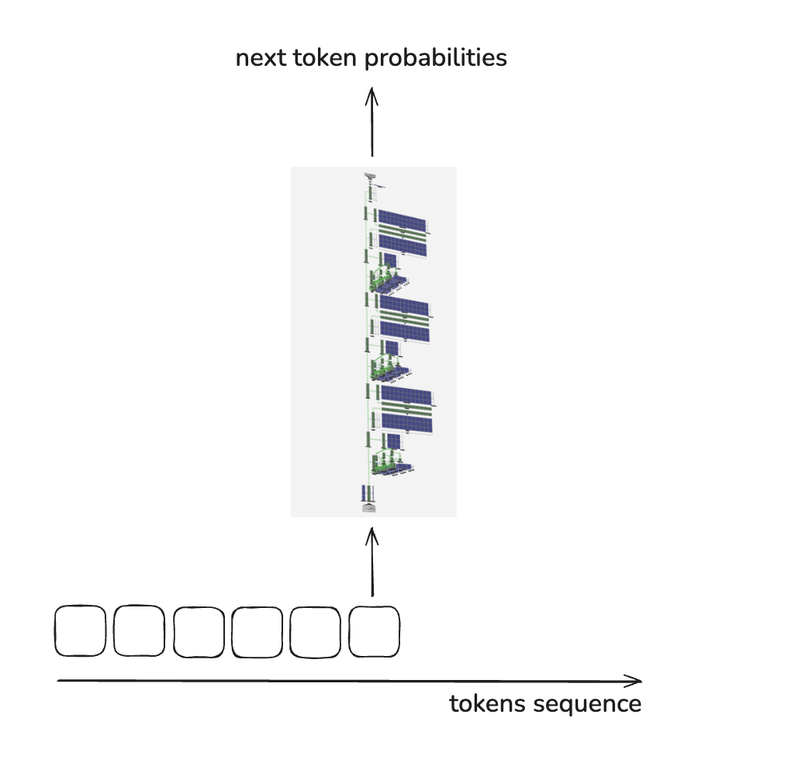
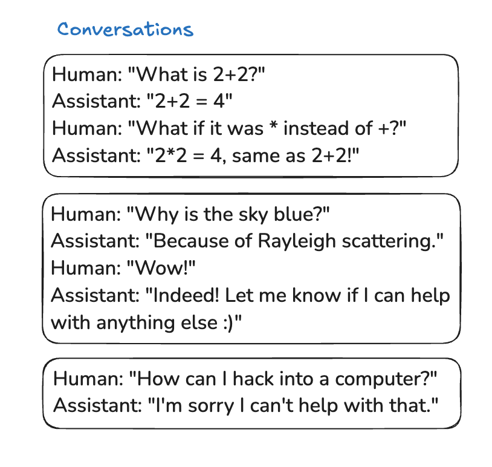
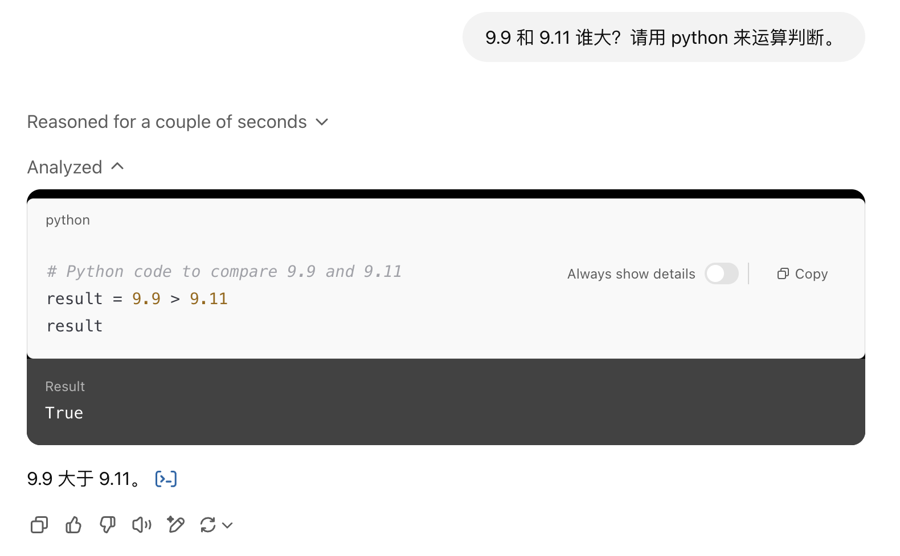
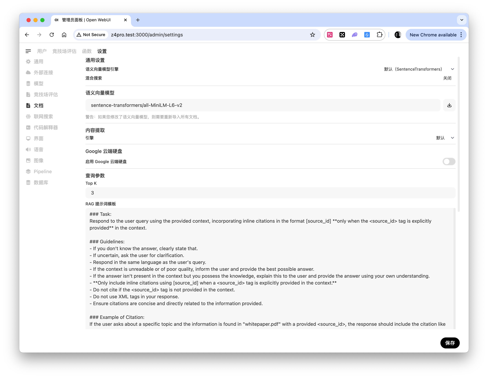

## 什么是 LLM

LLM 是 Large Language Model 的缩写, 中文翻译为大语言模型。它通常是基于 Transformer 架构的神经网络模型。相比传统的模型（比如 RNN），Transformer 能够更高效地处理长距离依赖，并且在并行计算方面表现出色。因此，许多现代的 LLM，如 GPT、Grok、Gemini、DeepSeek 等，都是基于 Transformer 架构设计的。

之前用过 CNN 的卷积和卷积核来识别照片中的人物，能够有效识别物体的边缘特征，适合抠图等图像处理功能。而 Transformer 则是主要用于处理自然语言任务。Transformer 最重要的是自注意力机制，能够有效捕捉长距离依赖，比如这样的一句话: `The cat sat on the mat`，Transformer 会将这些单词转换为词嵌入向量，计算 Query, Key, Value 的简单线性矩阵，然后计算注意力得分，最后加权求和。通过这个过程，自注意力机制可以让模型在处理“cat”时，考虑到“mat”的重要性，从而更好地理解句子中的语义关系。

对于像 ChatGPT, DeepSeek 等 LLM 模型，它们靠海量的数据训练得出，最终想要得到用户可以交互的模型，一般需要经过以下几个过程：

- 训练
- POST-TRAINING 监督微调
- REINFORCEMENT LEARNING 基于人类反馈的强化学习（RLHF）

#### LLM 的训练过程

将大量的数据下载下来，然后进行处理，因为下载到的数据大部分像是 html 标签的内容，需要去掉这些一些没用的信息，将有效内容提取出来。然后将文本内容转换为 token, 可以使用[这个链接](https://tiktokenizer.vercel.app/)进行测试，可以看到每一个词都会被转换成一个唯一的数字（token可以是一个词、一个子词或者一个字符，这取决于所使用的分词方法），这个数字就代表 token，大模型只认识 token。然后就是训练的过程，训练的过程是将 token 转换向量，这就是嵌入（Embedding）过程。每个token通过嵌入层（Embedding Layer）被映射到一个高维空间中的向量。大模型训练的过程是漫长的，而且需要消耗大量的 GPU 计算资源。训练的过程是在重复的运算巨大的数学表达式，输入是 token（一个字或者一句话），参数是百万级亿万级的，最终运算出来一个个结果，然后将结果转换为概率，慢慢地调整这些亿万级的参数。最终得出一个 base model，需要知道，大模型不是一个单纯的数学方程，它不是纯函数，纯函数是给定一个输入，会得出一个唯一的输出。而大模型是一个概率系统（基于概率分布的语言生成系统），给定一个输入，会得出一个概率分布，然后根据这个概率分布，选择一个最可能的输出。(前向计算本质是确定性的矩阵运算，随机性仅来源于采样策略，如top-p/temperature)

得出的 base model，仅仅是一个巨大的文档模拟器，模型的参数就像是一个巨大的文档索引，模型就是由参数构成，就像对整个互联网文档的一次有损压缩，这些参数可以理解为对于脑海中的数据**模糊记忆**。有趣的是，你从 Wikipedia 中复制一大段文字出来喂给它，它会接着这段文字继续生成 Wikipedia 上的完整内容，因为这一大段文字得出 Wikipedia 上下一个字的概率是很大的，所以它会正确写出 Wikipedia 上的内容。

但是，base model 是无法正常沟通使用的，没办法做一个 assistant 或者 chatbot，还需要进行下面的监督微调过程。

#### LLM 的监督微调过程

如果不进行监督微调, 那么你问它一句话，它不会给你回复，而是会接着你说的内容继续生成一堆随机内容。所以就需要再将大量的人类对话数据喂给 base model，当然对于上面训练来讲，这个数据是很小的，这个 fine-tuning 过程也不需要消耗太多的资源。这个训练需要尽量涵盖人类自然学科的所有内容，这样各行各业的问答都会得到恰当的回复。




##### LLM的局限性

###### 1. 幻觉 Hallucinations

对于已知的问题，模型可以给出答案，但对于它不知道的问题，它也可以给出答案，因为它是一个随机系统(stochastic systems)，总会产生下一个 token。这就是大模型的幻觉，你问它一个没有的东西，也会给你胡编乱造。这就需要用户自己判断，不要太相信它给的答案，或者你可以使用 web tools 来让模型调查一翻再回复。

> 补充：幻觉不光是随机系统问题，也源于训练数据覆盖不足、注意力权重分配偏差、以及解码策略的探索性。

###### 2. 9.11 和 9.9 谁大，Strawberry 有几个 r

很多模型（即使是刚发布的 Grok3）都会对这两个问题犯错，即使它可以做奥林匹克数学竞赛题，但它算不对 9.11 和 9.9 谁大。因为大模型是有分词的，不一定 9.11 和 9.9 分成了什么样，而且 strawberry 也是一个完整单词，对于大模型它不知道怎么拼，它只认识 token。对于这样的问题，可以使用 Python 解释器这种工具来解决。现在很多大模型都直接支持 Python 解释器。

> 更正：现代分词器（如 GPT-4 的 tiktoken）会将完整单词映射为单一token，实际测试"strawberry"在 cl100k_base 分词器中为 token 24678，不存在拼写错误问题。



另外，问大模型“你是谁”这种问题，它可以给出正确答案，大概率是因为它们将这种问题硬编码了，很多 9.11 和草莓这种问题，现在的模型也会硬编码进去。

#### LLM 的强化学习过程

经过上一个过程的训练，它已经是一个可以正常和人对话的小助手了，这样的一个 SFT(Supervised fine-tuning) 模型已经可以拿出来使用了。但还是不够，因为就像人类一样，学习一个知识之后，需要进行大量的练习才可以真正掌握这个知识。大模型也是如此，它需要经过强化学习(Reinforcement Learning)，才能达到最佳的状态。我们需要对模型进行有损模拟，比如让一个模型回答一个问题100遍之后，筛选出哪些是正确的答案，在正确的答案中再评选出哪一个回复更佳“恰当”，这里的恰当可以是格式上更好，更精炼（消耗的token少），或者解释的更全面彻底。**强化学习的本质是找到最大化奖励（reward）的策略。**，就像是得高分的考试一样。这样的模拟是有漏洞的，比如人类情感话题，让 LLM 讲一个笑话，LLM 可没有情感，不知道讲出来的笑话是否好笑，奖励模型会给所有的笑话一个评分，人类也会对这些笑话进行打分，最终每一个回复都对应一个得分。但是大量的模拟之后，LLM 会找到“捷径”或者说是漏洞，比如它会给一些完全没有意义的词语，这样的词语会在奖励模型中得高分，而不是达成我们真正想要的目标。

开源的 DeepSeek R1 有一个思考的过程，这个思考的过程让大模型更上一层楼。大模型学会了用拟人化的语气重新思考，这对我们来说也是一个**[aha moment](https://arxiv.org/pdf/2501.12948)**，让我们见证了强化学习的强大和美丽。对于 ChatGPT 这种闭源的 o1 或者 o3 thinking 模型，它们给出的 thinking 内容是总结之后的，我们并没有真正看到 o1 的 thinking 步骤。但现在，我们人人都可以部署一个开源的 DeepSeek R1。

## Ollama 运行 LLM

[Ollama](https://ollama.com/) 可以让你在本地运行大模型，直接使用 `ollama run llama3.2` 即可让设备下载并运行这个 llama3.2 大模型。在 linux 上，如果不是用 Docker 跑的，那么安装后，默认是用 systemctl 启动的，它会监听 localhost，如果你跑一个大模型给局域网内设备使用，需要将它监听在 `0.0.0.0` 上，另外，运行大模型是从硬盘加载到显存中，如果长时间不使用（大概5分钟？），会自动释放显存里的大模型。可以使用 `OLLAMA_KEEP_ALIVE=1h` 来控制它在显存中占用的时长。下面是我修改后的 Ollama 环境配置, 它会监听 0.0.0.0，并且默认在显存中保留1小时的大模型占用:

```
# /etc/systemd/system/ollama.service
[Unit]
Description=Ollama Service
After=network-online.target

[Service]
ExecStart=/usr/local/bin/ollama serve
User=ollama
Group=ollama
Restart=always
RestartSec=3
Environment="PATH=/usr/local/sbin:/usr/local/bin:/usr/sbin:/usr/bin:/sbin:/bin"
Environment="OLLAMA_HOST=0.0.0.0"
Environment="OLLAMA_KEEP_ALIVE=1h"

[Install]
WantedBy=default.target
```

修改完配置后执行 `systemctl daemon-reload` 和 `systemctl restart ollama` 重启即可。

这样就可以在局域网内通过 API 调用它了，它适配 OpenAI 的 API。

```bash
$ curl http://100.64.0.5:11434/api/generate -d '{
  "model": "deepseek-coder-v2:16b",
  "prompt": "你好"
}'
{"model":"deepseek-coder-v2:16b","created_at":"2025-02-20T05:20:17.762862886Z","response":" ","done":false}
{"model":"deepseek-coder-v2:16b","created_at":"2025-02-20T05:20:17.776096431Z","response":"你好","done":false}
{"model":"deepseek-coder-v2:16b","created_at":"2025-02-20T05:20:17.788236524Z","response":"！","done":false}
{"model":"deepseek-coder-v2:16b","created_at":"2025-02-20T05:20:17.802539796Z","response":"有什么","done":false}
{"model":"deepseek-coder-v2:16b","created_at":"2025-02-20T05:20:17.819210473Z","response":"可以","done":false}
{"model":"deepseek-coder-v2:16b","created_at":"2025-02-20T05:20:17.831635404Z","response":"帮","done":false}
{"model":"deepseek-coder-v2:16b","created_at":"2025-02-20T05:20:17.843981997Z","response":"你的","done":false}
{"model":"deepseek-coder-v2:16b","created_at":"2025-02-20T05:20:17.856465305Z","response":"吗","done":false}
{"model":"deepseek-coder-v2:16b","created_at":"2025-02-20T05:20:17.868954652Z","response":"？","done":false}
{"model":"deepseek-coder-v2:16b","created_at":"2025-02-20T05:20:17.881285652Z","response":"","done":true,"done_reason":"stop","context":[100000,5726,25,207,84313,185,185,77398,25,207,84313,2160,19330,1876,5811,6507,7328,2224],"total_duration":3446624798,"load_duration":3069658133,"prompt_eval_count":10,"prompt_eval_duration":255000000,"eval_count":10,"eval_duration":120000000}
```

`deepseek-coder-v2:16b` 这个模型参数是 16 billion, 使用 4 bit 量化，相对于 FP16 来讲，差不多 1/4 的占用。具体能运行哪一个大模型，需要看显存大小，需要的`显存大小 ≈ (参数 × 精度(Bytes)) * 1.2`。对于 16b + 4bit 量化这个模型，跑起来之后，显存占用大概在 11G 左右。7B FP16 的模型大概是 `(7B × 2 Bytes) * 1.2` 大概需 17G 显存。

模型文件(比如GGUF)主要包含的是参数集合（神经网络权重），16b 就代表有 160 亿个参数。Ollama 运行大模型的时候，会将硬盘中的模型文件加载到显存中，根据 GGUF 的一些架构配置，调用底层库（比如 llama.cpp）来启动计算，llama.cpp 会调用 CUDA 计算核心来执行 Transformer 数学运算。这些模型参数是配置 Transformer 各层的数据。用户的输入会经过分词器（Tokenizer）转换成 Token ID 序列，然后每个 Token ID 再通过 Embedding 矩阵转换为向量。然后到 Transfomer 的每一层处理。可以类比一下，参数是预先存储好的常数，框架代码(由 llama.cpp 实现的 Transformer)相当于数学公式, Token 是用户的输入数据，输出则是公式计算得出的下一个 token。

## RAG 的原理 (Retrieval-Augmented Generation)



通用的大模型没办法定制化回复，当然也是有办法的，比如对于模型的微调，或者直接上传一本书等，但这样的手段往往会消耗更多的 token，而且隐私性也不太好。于是很多公司喜欢玩 RAG，将公司的一些隐私数据喂给一个 [Embedding 模型](https://ollama.com/search?c=embedding)，然后将向量存储下来，使用的时候将问题先丢给 embedding 模型，让它先检索增强再生成一个合适的 prompt，最后再将其传入下一个 chat 模型。比较典型的应用场景是客服机器人和法律咨询。使用小模型 Embedding 后可以降低成本并且能有效缓解大模型的幻觉问题。

下面是一个 RAG 流程的实例:

#### 1. 知识库预处理（提前完成）

小模型A（Embedding模型）将知识库的所有文本转换为向量并存储，构建索引。也就是用户上传书籍等文本内容。

#### 2. 用户提问 & Embedding生成

用户输入问题（如“如何缓解失眠？”），使用Embedding模型（如text-embedding-3-small）将问题转换为向量。在知识库中搜索与问题向量最相似的Top-3文本片段:

```
知识库条目1：失眠建议：保持规律作息，睡前避免咖啡因。
知识库条目2：研究表明，冥想和轻度运动有助于改善睡眠质量。
知识库条目3：褪黑素补充剂可短期使用，但需咨询医生。
```

#### 3. 构造 Prompt

将检索到的文本直接拼接为上下文，与用户问题一起输入 Chat 模型, Prompt 示例:

```
参考以下信息回答问题：
1. 失眠建议：保持规律作息，睡前避免咖啡因。
2. 研究表明，冥想和轻度运动有助于改善睡眠质量。
3. 褪黑素补充剂可短期使用，但需咨询医生。

问题：如何缓解失眠？
```

如果检索到的文本过长，可用摘要模型压缩内容：`参考信息：规律作息、避免咖啡因；冥想和运动有效；褪黑素需遵医嘱。 问题：如何缓解失眠？`。

#### 4. Chat 模型生成回答

Chat 模型根据 Prompt 中的原始文本或压缩文本生成回答

###  下面是一段 RAG 的伪代码

```
// ===== 向量数据库中存储的数据结构 =====
VectorDB = [
  {
    id: "doc_1",
    vector: [0.12, -0.33, 1.05, ...],
    text: "员工请病假需提供医院证明。",
    metadata: { source: "员工手册", section: "病假制度" }
  },
  {
    id: "doc_2",
    vector: [0.10, -0.30, 1.01, ...],
    text: "病假需在 OA 系统中提交申请。",
    metadata: { source: "OA 使用说明", section: "请假流程" }
  },
  {
    id: "doc_3",
    vector: [-0.88, 0.22, -0.14, ...],
    text: "VPN 用于远程访问公司内网。",
    metadata: { source: "IT 指南", section: "网络" }
  }
]

// ===== 用户提问 =====
userQuestion = "请病假需要走什么流程？"

// 1. 用户问题向量化
queryVector = embedding(userQuestion)

// 2. 向量数据库相似度搜索
top3 = vectorDB.search(queryVector, topK = 3)

// 假设返回结果（已按相似度排序）
top3 = [
  {
    score: 0.86,
    text: "员工请病假需提供医院证明。",
    metadata: { source: "员工手册" }
  },
  {
    score: 0.82,
    text: "病假需在 OA 系统中提交申请。",
    metadata: { source: "OA 使用说明" }
  },
  {
    score: 0.41,
    text: "VPN 用于远程访问公司内网。",
    metadata: { source: "IT 指南" }
  }
]

// 3. 系统层判断（阈值过滤）
usableContext = top3.filter(item => item.score > 0.75)

// 4. 构造 prompt + 调用 LLM
```

## References

- [Deep Dive into LLMs like ChatGPT](https://youtu.be/7xTGNNLPyMI?si=xlowBhqKmK2yMPNo)
- [LLM Visualization](https://bbycroft.net/llm)
- [Chain-of-Thought Reasoning Without Prompting](https://arxiv.org/abs/2501.12948)
