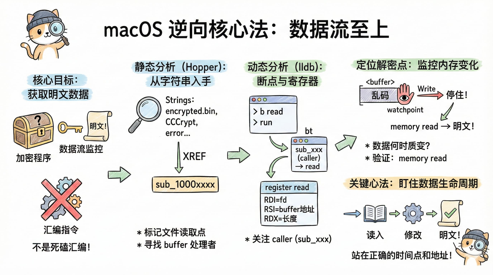

在 macOS 下逆向一个第三方签名的二进制程序时，核心目标通常不是搞清楚算法细节，而是拿到程序内部已经解密完成的明文数据。因此，逆向的重点应该放在“数据流”上，而不是死磕汇编指令。




## 一、上帝视角：如果我有源代码

在深入逆向工具之前，我们先写一段 C 语言代码来模拟这个过程。假设程序的源码是这样的：

```c
// 假设这是核心解密逻辑
void process_secure_config() {
    char buffer[1024];

    // 1. 读取加密文件
    // 逆向视角：这里对应 _read / _fopen 系统调用
    int fd = open("encrypted.bin", O_RDONLY);
    read(fd, buffer, 1024); 
    close(fd);

    // 此时 buffer 里的内存全是乱码
    
    // ... 可能会有一些校验逻辑 ...

    // 2. 解密函数（关键点！）
    // 逆向视角：这就是我们要找的 sub_xxxx
    decrypt_secret_algorithm(buffer, 1024);

    // 3. 此时 buffer 已经是明文了
    printf("Config: %s\n", buffer);
}
```

逆向的目标非常明确：
1. 你的起点是 `read`（你能轻易断在这个系统函数上）。
2. 你的终点是 `decrypt_secret_algorithm` 执行完毕的那一瞬间。
3. 你的手段是监控 `buffer` 的内存变化——谁修改了它，谁就是解密者。

理解了这个模型，后面的操作就顺理成章了。

## 二、Hopper：静态分析阶段要做什么

使用 Hopper Disassembler 时，第一步不要直接看汇编，而是从「字符串」入手。
通过 Strings 视图可以快速发现：

- 本地文件路径（如 data.bin）
- 错误提示（如 decrypt failed）
- 加密相关关键字（AES、CCCrypt 等）

当你找到文件名或路径字符串后，查看它的 XREF（交叉引用），就能定位到程序中“读取该文件”的函数位置。通常你会看到 `_open` / `_read` / `_fopen` / `_fread` 等系统调用。

这些系统函数本身没有业务意义，但调用它们的上层函数（Hopper 中显示为 `sub_1000xxxx`）才是程序逻辑所在。
`sub_1000xxxx` 只是工具给“无符号函数”起的名字，本质就是程序自己的函数。

在静态分析阶段，你需要做的不是“看懂解密算法”，而是标记几个关键点：

1. 文件在哪里被读入内存
2. 读完之后，数据传给了哪个 `sub_xxx`
3. 哪些函数看起来在“处理一整块 buffer”（循环、位运算、memcpy）

## 三、lldb：动态分析阶段的核心概念

使用 lldb 启动程序后，最常见的做法是在系统函数上下断点：

```bash
b read
b open
run
```

程序在 `read` 停住时，使用：

```bash
bt
```

查看调用栈。
这里的 frame 可以理解为一层函数调用关系：

- frame #0：当前正在执行的函数（如 read）
- frame #1：调用 read 的程序函数（如 `sub_100010ABC`）
- frame #2：更上层的调用者

逆向真正关心的是 `read` 上面的那一层 `sub_xxx`，因为逻辑都在那里。

## 四、register read：为什么这么重要

在 macOS x86_64 平台，函数参数通过寄存器传递，而不是压栈。

以 `read(fd, buf, size)` 为例：

- RDI：fd
- RSI：buffer 地址
- RDX：读取长度

因此在 `read` 停住后执行：

```bash
register read
```

你就能直接知道：文件被读进了哪一块内存

此时用：

```bash
memory read <buffer>
```

看到的内容，一定是加密数据，因为 `read` 只负责 IO，不会解密。这一点必须明确。

## 五、如何判断哪个 sub_xxx 是解密函数

判断解密函数，最稳妥的方法不是看汇编“像不像算法”，而是观察数据什么时候发生质变。

最实用的一招是 watchpoint（写断点）：

```bash
watchpoint set expression -w write -- <buffer>
continue
```

只要这块内存被写，程序就会停住。
一旦停住，立刻查看：

```bash
bt
```

当前的 `sub_xxx`，就是第一个修改加密数据的函数，它极大概率就是解密或解码函数。

随后再次：

```bash
memory read <buffer>
```

如果你看到可读字符串、JSON、plist 等结构化内容，就说明你已经站在了“解密完成点”。

## 六、辅助判断方法

- 如果程序调用了 `_CCCrypt`、`_CCCryptorUpdate` 等 CommonCrypto 接口，几乎可以直接确认是在做加解密。
- 如果某个函数内部存在大量循环、xor / rol / ror 等位运算，也很可能是在处理加密数据。
- 在 `memcpy` / `memmove` 上打断点，观察源地址和目标地址，有时能直接捕获“解密后数据被复制”的瞬间。

## 七、关键心法总结

逆向分析中最重要的一点是：

> 不要执着于看懂算法，而是盯住数据的生命周期

真正有价值的是：

- 数据从哪读进来
- 在哪被修改
- 在哪第一次变成明文

只要你能在正确的时间点，站在正确的内存地址旁边，逆向任务就已经完成了大半。
