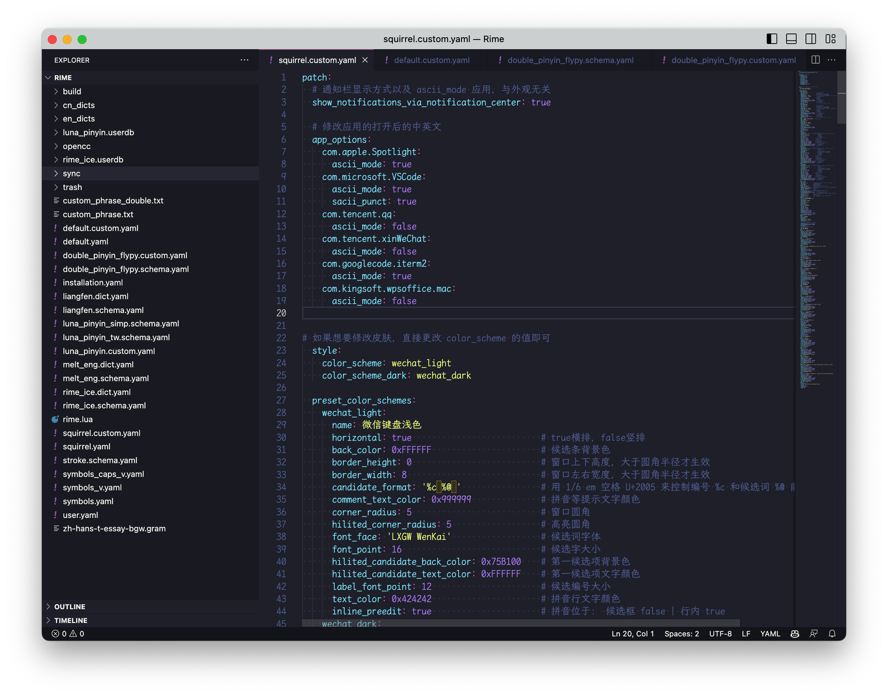

Rime 是一款功能强大的输入法, 每个人的习惯不同, 它可以根据不同的习惯来调整方案. 之前使用的系统双拼输入法, 没有词库功能, 想打的字词经常排在后面, 所以体验了一下 Rime, 没想到这么舒畅, 并且使用 **WeChat 主题 + 霞鹜文楷** 非常漂亮. 它需要一点折腾, 比较适合程序员, 自己掌控输入法的各种管理与配置.


下面就是我的折腾历程.

# 安装工作

## 1. 安装 Rime

使用 brew 安装 㞢(https://rime.im/download/)

```bash
brew install --cask squirrel
```

## 2. 安装配置管理工具

使用东方破 plum 来管理配置(https://github.com/rime/plum)

```bash
cd ~/Projects/GitHub
git clone --depth=1 https://github.com/rime/plum
```

## 3. 安装雾凇拼音

雾凇拼音是一个长期维护的简体词库(https://github.com/iDvel/rime-ice)

```bash
cd plum
bash rime-install iDvel/rime-ice:others/recipes/full
```

## 4. 安装霞鹜文楷字体

```bash
brew install font-lxgw-wenkai
```

# 配置工作

以上安装工作完成后, 就可以开始配置了.

首先需要知道, Rime 的配置文件目录在 `~/Library/Rime` 下



配置使用了 YAML 格式, 一些默认配置尽量不要调整, 比如 `default.yaml, dobule_pinyin_flypy.schema.yaml, squirrel.yaml`, 这几个配置文件想要调整则需要对应的 custom 文件: `default.custom.yaml, dobule_pinyin_flypy.custom.yaml, squirrel.custom.yaml`.

任何配置文件的修改, 都需要重新部署才能生效, 点击右上角的输入法, 再点击部署, 或者使用脚本应该这么写:

```bash
/Library/Input\ Methods/Squirrel.app/Contents/MacOS/Squirrel --reload
```

好的, 接下来开始折腾吧.


## 1. 主题更新

使用 wechat 主题, 并使用霞鹜文楷

```yaml
# squirrel.custom.yaml
patch:
  # 通知栏显示方式以及 ascii_mode 应用，与外观无关
  show_notifications_via_notification_center: true

  # 以下软件默认英文模式
  app_options:
    com.apple.Spotlight:
      ascii_mode: true
    com.googlecode.iterm2:
      ascii_mode: true

# 如果想要修改皮肤，直接更改 color_scheme 的值即可
  style:
    color_scheme: macos_light
    color_scheme_dark: macos_dark

    macos_light:
      name: "MacOS 浅色/MacOS Light"
      author: 小码哥
      font_face: "LXGW WenKai"          # 字体及大小
      font_point: 16
      label_font_face: "LXGW WenKai"    # 序号字体及大小
      label_font_point: 12
      comment_font_face: "LXGW WenKai"  # 注字体及大小
      comment_font_point: 16
      candidate_format: "%c\u2005%@\u2005" # 编号 %c 和候选词 %@ 前后的空间
      candidate_list_layout: linear   # 候选排布：层叠 stacked | 行 linear
      text_orientation: horizontal    # 行文向： 横 horizontal | 纵 vertical
      inline_preedit: true            # 拼音位于： 候选框 false | 行内 true
      translucency: false             # 磨砂： false | true
      mutual_exclusive: false         # 色不叠加： false | true
      border_height: 1                # 外边框 高
      border_width: 1                 # 外边框 宽
      corner_radius: 5                # 外边框 圆角半径
      hilited_corner_radius: 5       # 选中框 圆角半径
      surrounding_extra_expansion: 0 # 候选项背景相对大小？
      shadow_size: 0                 # 阴影大小
      line_spacing: 5                # 行间距
      base_offset: 0                 # 字基高
      alpha: 1                       # 透明度，0~1
      spacing: 10                    # 拼音与候选项之间的距离 （inline_preedit: false）
      color_space: srgb                       # 色彩空间： srgb | display_p3
      back_color: 0xFFFFFF                    # 底色
      hilited_candidate_back_color: 0xD75A00  # 选中底色
      label_color: 0x999999                   # 序号颜色
      hilited_candidate_label_color: 0xFFFFFF # 选中序号颜色
      candidate_text_color: 0x3c3c3c          # 文字颜色
      hilited_candidate_text_color: 0xFFFFFF  # 选中文字颜色
      comment_text_color: 0x999999            # 注颜色
      hilited_comment_text_color: 0xFFFFFF    # 选中注颜色
      text_color: 0x424242                    # 拼音颜色 （inline_preedit: false）
      hilited_text_color: 0xFFFFFF            # 选中拼音颜色 （inline_preedit: false）
      candidate_back_color: 0xFFFFFF          # 候选项底色
      # preedit_back_color:                   # 拼音底色 （inline_preedit: false）
      hilited_back_color: 0xD75A00            # 选中拼音底色 （inline_preedit: false）
      border_color: 0xFFFFFF                  # 外边框颜色
  
    macos_dark:
      name: "MacOS 深色/MacOS Dark"
      author: 小码哥
      font_face: "LXGW WenKai"          # 字体及大小
      font_point: 16
      label_font_face: "LXGW WenKai"    # 序号字体及大小
      label_font_point: 12
      comment_font_face: "LXGW WenKai"  # 注字体及大小
      comment_font_point: 16
      candidate_format: "%c\u2005%@\u2005" # 编号 %c 和候选词 %@ 前后的空间
      candidate_list_layout: linear   # 候选排布：层叠 stacked | 行 linear
      text_orientation: horizontal    # 行文向： 横 horizontal | 纵 vertical
      inline_preedit: true            # 拼音位于： 候选框 false | 行内 true
      translucency: false             # 磨砂： false | true
      mutual_exclusive: false         # 色不叠加： false | true
      border_height: 1                # 外边框 高
      border_width: 1                 # 外边框 宽
      corner_radius: 5                # 外边框 圆角半径
      hilited_corner_radius: 5       # 选中框 圆角半径
      surrounding_extra_expansion: 0 # 候选项背景相对大小？
      shadow_size: 0                 # 阴影大小
      line_spacing: 5                # 行间距
      base_offset: 0                 # 字基高
      alpha: 1                       # 透明度，0~1
      spacing: 10                    # 拼音与候选项之间的距离 （inline_preedit: false）
      color_space: srgb                       # 色彩空间： srgb | display_p3
      back_color: 0x1f1e2d                  # 底色
      hilited_candidate_back_color: 0xD75A00  # 选中底色
      label_color: 0x999999                   # 序号颜色
      hilited_candidate_label_color: 0xFFFFFF # 选中序号颜色
      candidate_text_color: 0xe9e9ea          # 文字颜色
      hilited_candidate_text_color: 0xFFFFFF  # 选中文字颜色
      comment_text_color: 0x999999            # 注颜色
      hilited_comment_text_color: 0x999999    # 选中注颜色
      text_color: 0x808080                    # 拼音颜色 （inline_preedit: false）
      hilited_text_color: 0xFFFFFF            # 选中拼音颜色 （inline_preedit: false）
      candidate_back_color: 0x1f1e2d          # 候选项底色
      # preedit_back_color:                   # 拼音底色 （inline_preedit: false）
      hilited_back_color: 0xD75A00            # 选中拼音底色 （inline_preedit: false）
      border_color: 0x050505                  # 外边框颜色

```

当然这里面也设置了应用打开后的默认中英文, 比如我们在 Spotlight 搜索时候一般是用来打开应用, 应用大多都是英文, 所以默认使用英文; 再比如打开 VSCode 大部分是要键入代码, 所以默认也是英文, 并且要使用半角符号.

## 2. 使用 CapsLock 切换中英文

```yaml
# default.custom.yaml
patch:
  "menu/page_size": 9   # 每頁候選數
  "punctuator/import_preset": symbols
  "ascii_composer/good_old_caps_lock": false
```

需要在系统设置中将 `使用大写锁定键切换“ABC”输入法` 关闭, 因为系统的设置优先级最高.

## 3. 设置默认使用英文标点

关于这条, 很多人不喜欢中文下用英文标点符号, 请忽略, 我个人还是习惯这种, 打一个标点再打一个空格.

```yaml
# double_pinyin_flypy.custom.yaml
patch:
  switches:
    - name: ascii_mode
      states: [ 中, A ]
      reset: 0
    - name: ascii_punct # 中英标点
      states: [ ¥, $ ]
      reset: 1
    - name: traditionalization
      states: [ 简, 繁 ]
      reset: 0
    - name: emoji
      states: [ 💀, 😄 ]
      reset: 1
    - name: full_shape
      states: [ 半角, 全角 ]
      reset: 0
```

要说一下半角和全角, 英文标点也是有半角和全角之分的, 所以要使用中英标点来区分.

## 4. 设置常用自定义文本

```yaml
# custom_phrase_double.txt
175xxxx0565	sj
37xxxxxxxxxxxxxxxx	sfz
faxxxxxxxh@gmail.com	yx
山东省青岛市xxxxxxxxxxxxxxx	dz
```

这样就和系统自带的 `Text Replacement` 功能一样了. 因为我用双拼, 需要在 `custom_phrase_double.txt` 里面创建, 而不是默认的 `custom_phrase.txt`.


## 5. 自动更新词库与部署

虽然说 Rime 是一款功能齐全的输入法, 但如果没有词库, 还不如直接使用系统的输入法, 没有了词库便没有了灵魂, 搜狗输入法这种联网的会担心隐私问题, 所以 Rime + 词库能解决, 需要将词库下载到本地库中, 当然还有一些表情符号等.

输入法也有同步功能, 点一下同步, 会自动将配置文件全部同步到 `sync/YOUR_INSTALLATION_ID` 下面.

当然我们希望它能够自动更新, 所以可以使用下面这段脚本:

```bash
#!/bin/bash

LOGFILE=~/Library/Logs/update_rime_and_deploy.log
mkdir -p ~/Library/Logs

log() {
    level=$1
    shift
    msg="$@"
    date=$(date "+%Y-%m-%d %H:%M:%S")
    echo "[$date] [$level] $msg" >> "$LOGFILE"
}

{
    set -e

    cd ~/Projects/GitHub/plum

    log "INFO" "Updating 㞢..."

    bash rime-install iDvel/rime-ice:others/recipes/all_dicts
    bash rime-install iDvel/rime-ice:others/recipes/opencc

    sleep 3

    log "INFO" "Syncing 㞢..."
    /Library/Input\ Methods/Squirrel.app/Contents/MacOS/Squirrel --sync

    log "INFO" "Deploying 㞢..."
    /Library/Input\ Methods/Squirrel.app/Contents/MacOS/Squirrel --reload

    osascript -e 'display notification "Rime deployment succeeded 🍻" with title "Plum Update"'

    log "INFO" "Rime deployment succeeded"
} 2>&1
```

这段脚本保存在 `~/bin/update_rime_and_deploy.sh` 中, 然后新建一个 `~/Library/LaunchAgents/com.faichou.rime.plist`:

```
<?xml version="1.0" encoding="UTF-8"?>
<!DOCTYPE plist PUBLIC "-//Apple//DTD PLIST 1.0//EN"
        "http://www.apple.com/DTDs/PropertyList-1.0.dtd">
<plist version="1.0">
<dict>
  <key>Label</key>
  <string>com.faichou.rime</string>
  <key>ProgramArguments</key>
  <array>
    <string>/bin/sh</string>
    <string>/Users/FaiChou/bin/update_rime_and_deploy.sh</string>
  </array>
  <key>StartCalendarInterval</key>
  <dict>
    <key>Hour</key>
    <integer>12</integer>
    <key>Minute</key>
    <integer>0</integer>
  </dict>
</dict>
</plist>
```

命令执行:

```bash
chmod +x ~/bin/update_rime_and_deploy.sh
launchctl load /Library/LaunchDaemons/com.faichou.rime.plist
```

这样, 每天中午12点就会自动更新词库, 并自动同步配置, 自动部署.


## Refs

- [Rime 配置：雾凇拼音](https://dvel.me/posts/rime-ice/#%e5%9f%ba%e6%9c%ac%e5%a5%97%e8%b7%af)
- [Schema.yaml 詳解](https://github.com/LEOYoon-Tsaw/Rime_collections/blob/master/Rime_description.md)
- [鼠须管输入法配置](https://www.hawu.me/others/2666)
- [Rime Squirrel 鼠须管输入法配置详解](https://ssnhd.com/2022/01/06/rime/)
