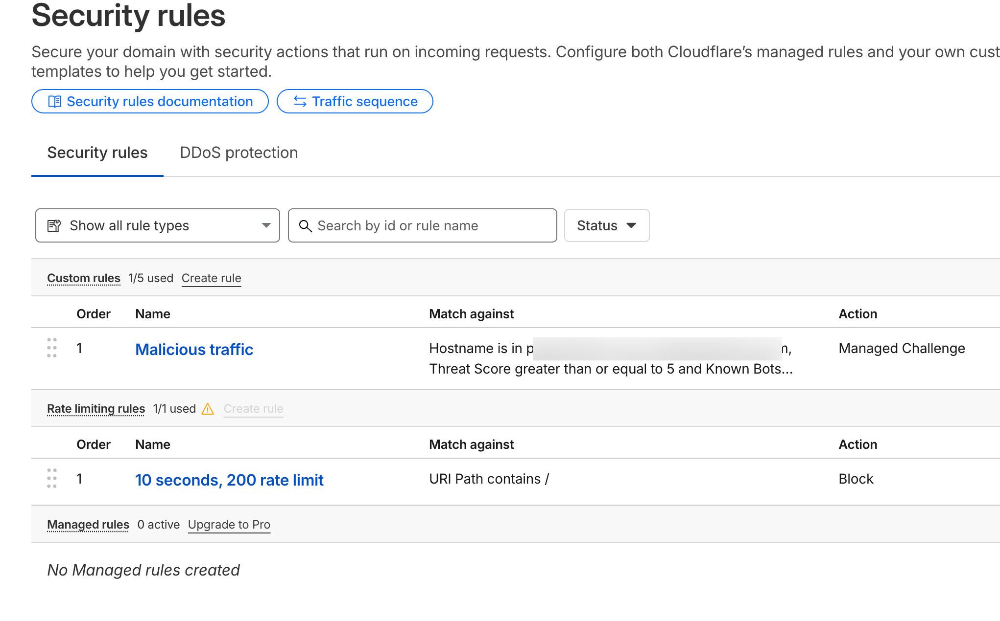

我的服务器上使用 nginx 反代了几个服务，并且使用 cloudflare 将域名解析到此服务器上，开启了橙色云朵，也就是通过 cf 的 cdn 加速。

## 1. Cloudflare WAF

为了保护我的服务器，先在 cf 中配置了 WAF 规则，新版的 cf 入口是 Security -> Security rules。



我配置了两条规则:

### Malicious traffic

```
(http.host in {"subdomain1.faichou.com" "subdomain2.faichou.com"}) 
and 
(
    (cf.threat_score ge 5 and not cf.client.bot)
    or (not http.request.version in {"HTTP/2" "HTTP/3"})
    or (not ip.geoip.country in {"AU" "CA" "FR" "DE" "HK" "IR" "JP" "KR" "MY" "SG" "TW" "GB" "US" "CN"})
)
```

如果匹配到恶意流量，则会触发 cf 的盾。具体规则解释是: 针对 subdomain1 和 subdomain2 的请求，如果威胁分数大于 5 并且不是 cf bot 的请求，或者请求版本不是 HTTP/2 或 HTTP/3，或者请求的 IP 地址不是上述几个国家地区则触发。

### 10 seconds, 200 rate limit

```
(http.request.uri.path contains "/")
```

10 秒内如果有 200 次请求，则 block 此 ip 10 秒。

---

如果发现你的服务器正在遭受大量攻击，也可以在 cf 的后台开启 I am under attact 模式，这样任何 ip 首次访问都会先触发 cf 5 秒盾。

## 2. fail2ban

上面的 WAF 防护仅仅是针对域名请求，服务器本身也是开了 80/443 端口的。如果恶意流量直接攻击服务器 ip，那么还是可以绕开这个 waf 的。所以还需要针对服务器再做一层防护。

查看 nginx 的日志 `/var/log/nginx/access.log`:


```
54.165.75.96 - - [28/Nov/2025:00:08:01 +0800] "GET /iam/login HTTP/1.1" 404 7720 "-" "Mozilla/5.0 (Windows NT 10.0; Win64; x64) AppleWebKit/537.36 (KHTML, like Gecko) Chrome/60.0.3112.113 Safari/537.36 Assetnote/1.0.0 (ExposureScan)"
54.165.75.96 - - [28/Nov/2025:00:08:01 +0800] "GET /dompdf.php?input_file=dompdf.php HTTP/1.1" 404 7779 "-" "Mozilla/5.0 (Windows NT 10.0; Win64; x64) AppleWebKit/537.36 (KHTML, like Gecko) Chrome/60.0.3112.113 Safari/537.36 Assetnote/1.0.0 (ExposureScan)"
54.165.75.96 - - [28/Nov/2025:00:08:01 +0800] "GET /?q=php://filter/zlib.deflate/convert.base64-encode/resource=/etc/passwd&s=php://filter/zlib.deflate/convert.base64-encode/resource=/etc/passwd&search=php://filter/zlib.deflate/convert.base64-encode/resource=/etc/passwd&id=php://filter/zlib.deflate/convert.base64-encode/resource=/etc/passwd&action=php://filter/zlib.deflate/convert.base64-encode/resource=/etc/passwd&keyword=php://filter/zlib.deflate/convert.base64-encode/resource=/etc/passwd&query=php://filter/zlib.deflate/convert.base64-encode/resource=/etc/passwd&page=php://filter/zlib.deflate/convert.base64-encode/resource=/etc/passwd&keywords=php://filter/zlib.deflate/convert.base64-encode/resource=/etc/passwd&url=php://filter/zlib.deflate/convert.base64-encode/resource=/etc/passwd&view=php://filter/zlib.deflate/convert.base64-encode/resource=/etc/passwd&cat=php://filter/zlib.deflate/convert.base64-encode/resource=/etc/passwd&name=php://filter/zlib.deflate/convert.base64-encode/resource=/etc/passwd&key=php://filter/zlib.deflate/convert.base64-encode/resource=/etc/passwd&p=php://filter/zlib.deflate/convert.base64-encode/resource=/etc/passwd HTTP/1.1" 200 10277 "-" "Mozilla/5.0 (Windows NT 10.0; Win64; x64) AppleWebKit/537.36 (KHTML, like Gecko) Chrome/60.0.3112.113 Safari/537.36 Assetnote/1.0.0 (ExposureScan)"
54.165.75.96 - - [28/Nov/2025:00:08:01 +0800] "GET / HTTP/1.1" 200 10277 "-" "Mozilla/5.0 (Windows NT 10.0; Win64; x64) AppleWebKit/537.36 (KHTML, like Gecko) Chrome/60.0.3112.113 Safari/537.36 Assetnote/1.0.0 (ExposureScan)"
54.165.75.96 - - [28/Nov/2025:00:08:01 +0800] "GET /?title=%27%3E%22%3Csvg%2Fonload=confirm%28%27xss-title%27%29%3E&view=%27%3E%22%3Csvg%2Fonload=confirm%28%27xss-view%27%29%3E&context=%27%3E%22%3Csvg%2Fonload=confirm%28%27xss-context%27%29%3E&passwd=%27%3E%22%3Csvg%2Fonload=confirm%28%27xss-passwd%27%29%3E&count=%27%3E%22%3Csvg%2Fonload=confirm%28%27xss-count%27%29%3E&delete=%27%3E%22%3Csvg%2Fonload=confirm%28%27xss-delete%27%29%3E&test=%27%3E%22%3Csvg%2Fonload=confirm%28%27xss-test%27%29%3E&hash=%27%3E%22%3Csvg%2Fonload=confirm%28%27xss-hash%27%29%3E&csrf_token=%27%3E%22%3Csvg%2Fonload=confirm%28%27xss-csrf_token%27%29%3E&o=%27%3E%22%3Csvg%2Fonload=confirm%28%27xss-o%27%29%3E&activate=%27%3E%22%3Csvg%2Fonload=confirm%28%27xss-activate%27%29%3E&edit=%27%3E%22%3Csvg%2Fonload=confirm%28%27xss-edit%27%29%3E&ip=%27%3E%22%3Csvg%2Fonload=confirm%28%27xss-ip%27%29%3E&r=%27%3E%22%3Csvg%2Fonload=confirm%28%27xss-r%27%29%3E HTTP/1.1" 200 10277 "-" "Mozilla/5.0 (Windows NT 10.0; Win64; x64) AppleWebKit/537.36 (KHTML, like Gecko) Chrome/60.0.3112.113 Safari/537.36 Assetnote/1.0.0 (ExposureScan)"
54.165.75.96 - - [28/Nov/2025:00:08:04 +0800] "GET /developer/env HTTP/1.1" 404 7724 "-" "Mozilla/5.0 (Windows NT 10.0; Win64; x64) AppleWebKit/537.36 (KHTML, like Gecko) Chrome/60.0.3112.113 Safari/537.36 Assetnote/1.0.0 (ExposureScan)"
54.165.75.96 - - [28/Nov/2025:00:08:04 +0800] "GET /wp-admin/admin.php?page=rsvp-admin-export HTTP/1.1" 404 7793 "-" "Mozilla/5.0 (Windows NT 10.0; Win64; x64) AppleWebKit/537.36 (KHTML, like Gecko) Chrome/60.0.3112.113 Safari/537.36 Assetnote/1.0.0 (ExposureScan)"
54.165.75.96 - - [28/Nov/2025:00:08:04 +0800] "GET /composer.lock HTTP/1.1" 404 7720 "-" "Mozilla/5.0 (Windows NT 10.0; Win64; x64) AppleWebKit/537.36 (KHTML, like Gecko) Chrome/60.0.3112.113 Safari/537.36 Assetnote/1.0.0 (ExposureScan)"
54.165.75.96 - - [28/Nov/2025:00:08:04 +0800] "GET /metrics/v1/mbeans HTTP/1.1" 404 7732 "-" "Mozilla/5.0 (Windows NT 10.0; Win64; x64) AppleWebKit/537.36 (KHTML, like Gecko) Chrome/60.0.3112.113 Safari/537.36 Assetnote/1.0.0 (ExposureScan)"
54.165.75.96 - - [28/Nov/2025:00:08:04 +0800] "GET /SupportPortlet/faces/javax.faces.resource./WEB-INF/web.xml.jsf?ln=.. HTTP/1.1" 404 7815 "-" "Mozilla/5.0 (Windows NT 10.0; Win64; x64) AppleWebKit/537.36 (KHTML, like Gecko) Chrome/60.0.3112.113 Safari/537.36 Assetnote/1.0.0 (ExposureScan)"
54.165.75.96 - - [28/Nov/2025:00:08:04 +0800] "GET /wp-admin/admin-post.php?swp_debug=load_options&swp_url=https://ssrfcanary.com/ HTTP/1.1" 404 7895 "-" "Mozilla/5.0 (Windows NT 10.0; Win64; x64) AppleWebKit/537.36 (KHTML, like Gecko) Chrome/60.0.3112.113 Safari/537.36 Assetnote/1.0.0 (ExposureScan)"
54.165.75.96 - - [28/Nov/2025:00:08:04 +0800] "GET /main/install/index.php HTTP/1.1" 404 7737 "-" "Mozilla/5.0 (Windows NT 10.0; Win64; x64) AppleWebKit/537.36 (KHTML, like Gecko) Chrome/60.0.3112.113 Safari/537.36 Assetnote/1.0.0 (ExposureScan)"
54.165.75.96 - - [28/Nov/2025:00:08:04 +0800] "POST /support/sfsites/aura HTTP/1.1" 404 7735 "-" "Mozilla/5.0 (Windows NT 10.0; Win64; x64) AppleWebKit/537.36 (KHTML, like Gecko) Chrome/60.0.3112.113 Safari/537.36 Assetnote/1.0.0 (ExposureScan)"
54.165.75.96 - - [28/Nov/2025:00:08:04 +0800] "GET /modules/fieldpopupnewsletter/ajax.php?callback=%3Cscript%3Ealert(document.domain)%3C/script%3E HTTP/1.1" 404 7900 "-" "Mozilla/5.0 (Windows NT 10.0; Win64; x64) AppleWebKit/537.36 (KHTML, like Gecko) Chrome/60.0.3112.113 Safari/537.36 Assetnote/1.0.0 (ExposureScan)"
54.165.75.96 - - [28/Nov/2025:00:08:04 +0800] "GET /npm-debug.log HTTP/1.1" 404 7720 "-" "Mozilla/5.0 (Windows NT 10.0; Win64; x64) AppleWebKit/537.36 (KHTML, like Gecko) Chrome/60.0.3112.113 Safari/537.36 Assetnote/1.0.0 (ExposureScan)"
35.168.63.24 - - [28/Nov/2025:00:08:04 +0800] "GET http://127.0.0.1:25/ HTTP/1.1" 200 10277 "-" "Mozilla/5.0 (Windows NT 10.0; Win64; x64) AppleWebKit/537.36 (KHTML, like Gecko) Chrome/60.0.3112.113 Safari/537.36 Assetnote/1.0.0 (ExposureScan)"
54.165.75.96 - - [28/Nov/2025:00:08:04 +0800] "GET /103.150.8.120-9a3e209ba07c8495ac1f7037218a90b2.jsp?pwd=j HTTP/1.1" 404 7787 "-" "Mozilla/5.0 (Windows NT 10.0; Win64; x64) AppleWebKit/537.36 (KHTML, like Gecko) Chrome/60.0.3112.113 Safari/537.36 Assetnote/1.0.0 (ExposureScan)"
54.165.75.96 - - [28/Nov/2025:00:08:04 +0800] "GET /nifi-api/controller/config HTTP/1.1" 404 7741 "-" "Mozilla/5.0 (Windows NT 10.0; Win64; x64) AppleWebKit/537.36 (KHTML, like Gecko) Chrome/60.0.3112.113 Safari/537.36 Assetnote/1.0.0 (ExposureScan)"
54.165.75.96 - - [28/Nov/2025:00:08:04 +0800] "GET /.bash_history HTTP/1.1" 404 7720 "-" "Mozilla/5.0 (Windows NT 10.0; Win64; x64) AppleWebKit/537.36 (KHTML, like Gecko) Chrome/60.0.3112.113 Safari/537.36 Assetnote/1.0.0 (ExposureScan)"
54.165.75.96 - - [28/Nov/2025:00:08:04 +0800] "GET /webjars/swagger-ui/3.0.19/index.html HTTP/1.1" 404 7755 "-" "Mozilla/5.0 (Windows NT 10.0; Win64; x64) AppleWebKit/537.36 (KHTML, like Gecko) Chrome/60.0.3112.113 Safari/537.36 Assetnote/1.0.0 (ExposureScan)"
54.165.75.96 - - [28/Nov/2025:00:08:04 +0800] "GET /webjars/swagger-ui/4.2.0/index.html HTTP/1.1" 404 7754 "-" "Mozilla/5.0 (Windows NT 10.0; Win64; x64) AppleWebKit/537.36 (KHTML, like Gecko) Chrome/60.0.3112.113 Safari/537.36 Assetnote/1.0.0 (ExposureScan)"
54.165.75.96 - - [28/Nov/2025:00:08:04 +0800] "GET /webjars/swagger-ui/3.35.2/index.html HTTP/1.1" 404 7755 "-" "Mozilla/5.0 (Windows NT 10.0; Win64; x64) AppleWebKit/537.36 (KHTML, like Gecko) Chrome/60.0.3112.113 Safari/537.36 Assetnote/1.0.0 (ExposureScan)"
```

可以发现大量的恶意请求，有的是探测你的私密文件，比如 .env 或者 .bash_history，有的是进行 xss 攻击。稍微做一下防护还是有必要的，说不定哪天就有漏洞呢。

可以使用 fail2ban 来做防护，之前已经使用它给 ssh 做过防护。发现它还可以对 nginx 做保护，毕竟它的原理就是: 日志监控 + 正则匹配 + 时间窗口 + 阈值判断 + 封禁动作。

核心思路是：如果一个 ip 在短时间内大量访问 404，那么久临时封禁它。

在 `/etc/fail2ban/jail.d/nginx-404.conf` 配置以下:

```
[nginx-404]
enabled = true
logpath = /var/log/nginx/access.log
filter = nginx-404
maxretry = 20
findtime = 60
bantime = 10m
```

在 `/etc/fail2ban/filter.d/nginx-404.conf` 配置以下内容:

```
[Definition]
failregex = <HOST> - .* "(GET|POST).*" 404
```

执行流程是：fail2ban 监控 `/var/log/nginx/access.log` 日志文件，并且通过正则匹配符合 `<HOST> - .* "(GET|POST).*" 404` 的日志，匹配到后，如果符合 maxretry 阈值(20 次/60 秒)，则封禁该 ip 10 分钟。

## 3. 警惕坏人

当一个用户通过域名访问的时候，用户的 ip 是 1.2.3.4，你的域名是 subdomain.faichou.com，那么访问的是 cf 的 cdn 服务器，cdn 服务器 ip 是 162.58.x.x，你的服务器 ip 是 4.3.2.1，那么你 nginx 是怎么拿到用户真实 ip 的呢？如下图所示:

```
用户(1.2.3.4)
     ↓ HTTP
Cloudflare 节点(162.158.x.x)
     ↓ 加上 header: X-Forwarded-For: 1.2.3.4
你的 VPS(访问来源=162.158.x.x)
     ↓ nginx real_ip_header
Nginx 解析后 remote_addr=1.2.3.4
```

也就是说，cf 在转发请求到你服务器上的时候，会加上 `X-Forwarded-For: 1.2.3.4` 这个 header，然后 nginx 可以通过 `real_ip_header` 来获取到用户真实 ip。

但是，这个 header 是可以伪造的，比如用户通过 ip 访问你服务器，并且手动添加了 `X-Forwarded-For: 8.8.8.8` 这个 header，那么 nginx 就会认为用户真实 ip 是 8.8.8.8，而不是 162.158.x.x。

所以 nginx 还要给 cf 的 cdn ip 做白名单:

```
server {
    real_ip_header X-Forwarded-For;
    set_real_ip_from 173.245.48.0/20;
    set_real_ip_from 103.21.244.0/22;
    set_real_ip_from 103.22.200.0/22;
    set_real_ip_from 103.31.4.0/22;
    set_real_ip_from 141.101.64.0/18;
    set_real_ip_from 108.162.192.0/18;
    set_real_ip_from 190.93.240.0/20;
    set_real_ip_from 188.114.96.0/20;
    set_real_ip_from 197.234.240.0/22;
    set_real_ip_from 198.41.128.0/17;
    set_real_ip_from 162.158.0.0/15;
    set_real_ip_from 172.64.0.0/13;
    set_real_ip_from 131.0.72.0/22;
}
```

set_real_ip_from 的作用是告诉 nginx 哪些是可信的 ip 段。Nginx 只会接受来自这些可信地址的请求中所携带的真实 IP 信息。

所有的 cf ip 可以在这里找到: https://www.cloudflare.com/zh-cn/ips/

另外也可以通过 api 获取: https://api.cloudflare.com/client/v4/ips

除此之外，也可以使用 https://github.com/mitchellkrogza/nginx-ultimate-bad-bot-blocker 这个专业的工具来阻挡恶意流量。

## 4. 一种更彻底简单的做法

```
# 1. 监听 80 和 443 的默认 server（即没有匹配到任何 server_name 的请求）
server {
  listen 80 default_server;
  listen [::]:80 default_server;
  listen 443 default_server;
  listen [::]:443 default_server;
  ssl_certificate /etc/nginx/ssl/fake1.crt;
  ssl_certificate_key /etc/nginx/ssl/fake1.key;
  server_name _;
  return 444;
}

# 2. 正常的站点配置（必须明确写 server_name）
server {
    listen 80;
    listen 443 ssl;
    server_name subdomain1.faichou.com subdomain2.faichou.com www.faichou.com;

    # 这里是真正的反代配置
    ...
}
```

任何直接访问服务器 IP（无论 80 还是 443）的请求，都会被这个 default_server 捕获，直接 return 444，攻击者根本拿不到任何有效响应，连 404 页面都不会返回。
