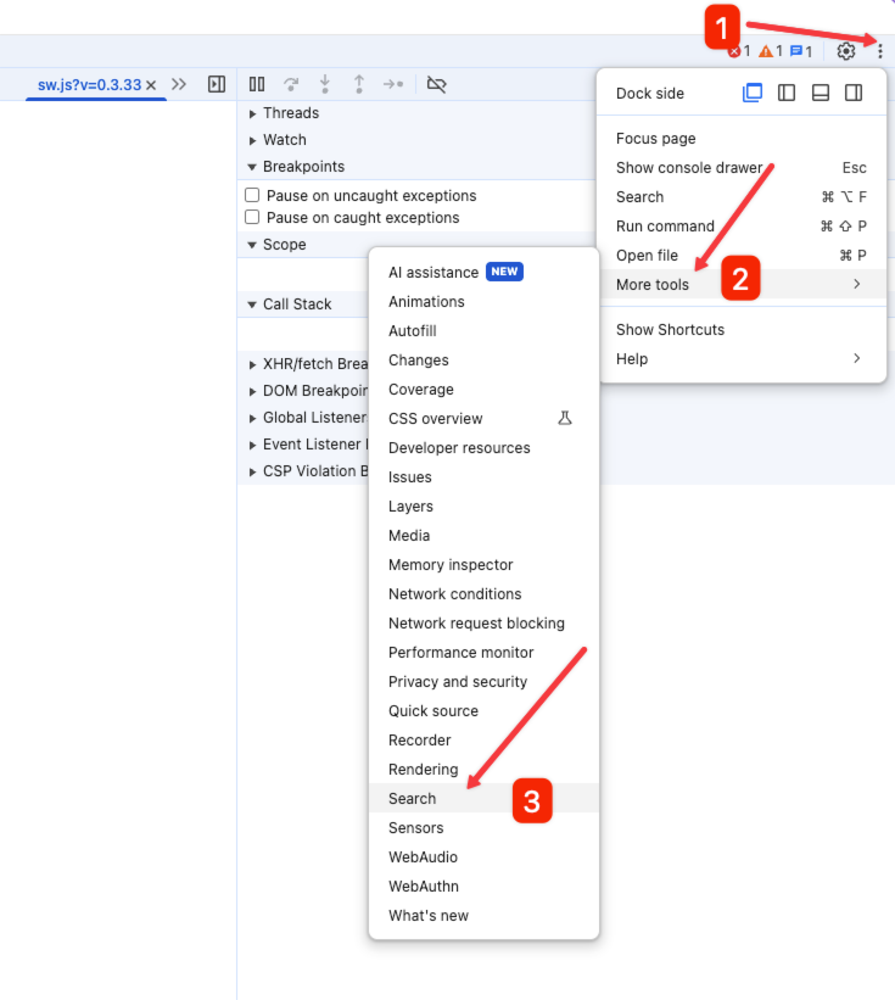

想给某个网站写一个签到脚本，接口很简单，就是一个 `example.com/api/checkin?random=true` 的 POST 请求。本以为直接用 curl 重放一下就完事了，结果请求直接返回 403。

## 从 Service Worker 说起

打开 Chrome DevTools 查看 Network，发现这个请求的 Initiator 显示的是 `sw.js`，也就是说请求是从 Service Worker 发出的。

Service Worker 是浏览器的一个独立线程，它可以拦截网页的所有网络请求。当你在页面上发起一个 fetch 请求时，Service Worker 可以通过 `addEventListener('fetch', ...)` 来捕获这个请求，然后对请求进行修改、转发或者直接返回缓存。

```javascript
// sw.js
self.addEventListener('fetch', (event) => {
  const request = event.request.clone();
  // 可以修改 request 的 headers
  // 然后 fetch(modifiedRequest)
});
```

这个网站就是利用了 Service Worker 的这个特性，在请求发出之前，给请求加上了一些特殊的 header。

## Refract-Key 和 Refract-Sign

通过 DevTools 的 Network 面板，我发现每个请求都带上了两个关键的 header：

- `refract-key`: 一个动态的 key
- `refract-sign`: 一个签名值

继续在 Sources 面板中搜索 `refract-sign`，找到了签名的生成逻辑。`refract-sign` 是通过 SHA1 算法计算的，参数是 `key + url + method + user-agent` 拼接后的字符串：

```javascript
const sign = sha1(key + url + method + userAgent);
```

而这个 key 的初始值是写死在 sw.js 里的。

## Key 的更新机制

继续翻代码发现，sw.js 会定时发送一个 ping 请求到服务器，检测当前的 key 是否过期。如果过期了，服务器会在 response header 中返回一个 `refract-key-update` 字段，sw.js 拿到这个新的 key 后，后续的请求就会使用新的 key 来计算签名。

有意思的是，我关闭网页再重新打开，发现使用的还是上次更新后的 key，而不是初始化的 key。这让我一度怀疑是不是把 key 持久化到了 localStorage、Cookie 或者 IndexedDB 中。但我把这些存储全部清空后，key 还是没有被重置。

后来经过调试发现，在 DevTools 的 Application 面板中，手动 stop 掉 Service Worker 后，key 才会被重置成初始值。这说明网页关闭后，Service Worker 在后台并没有被完全杀死，key 一直保存在 Service Worker 的内存中。

## Challenge 验证机制

还有一个问题，如果直接使用初始化的 key 去调用 ping 接口，会返回 403。同时我注意到，它还会主动调用一个 `edge-cgi/refract-challenge` 接口。

这个接口返回的是一个 Base64 编码的 RSA 数字签名。sw.js 拿到这个签名后，会将 Base64 解码成二进制，然后导入一个硬编码在代码里的 RSA 公钥，最后用这个公钥来验证签名的有效性。只有验证通过后，才会使用服务器返回的新 key。

整个流程大概是这样：

```
1. sw.js 启动，使用初始化 key
2. 发送 ping 请求，带上当前 key
3. 服务器验证 key，如果无效返回 403
4. sw.js 调用 /edge-cgi/refract-challenge 获取 challenge
5. 验证 challenge 的 RSA 签名
6. 验证通过后，获取新的 key
7. 后续请求使用新 key 计算 refract-sign
```

## Chrome 调试技巧

在分析这个网站的过程中，用到了几个 Chrome DevTools 的调试技巧：

### 1. 断点调试查看变量值

在 DevTools 的 Sources 面板中，找到对应的 js 文件，在想要查看的行号上点击设置断点。当代码执行到断点时会暂停，此时可以在 Scope 面板中查看当前作用域内所有变量的值，也可以在 Console 中直接输入变量名查看。

### 2. Network 全局搜索

在 Network 面板中，使用 `Cmd+F` 可以调出全局搜索框。这个搜索会遍历所有请求的 URL、Header、Body 等内容，只要包含搜索关键字就会被匹配到。对于查找某个特定 header 或参数非常有用。

### 3. Sources 全局搜索

在 Sources 面板中，点击右上角的三个点，选择 More Tools -> Search，可以对网站加载的所有资源进行全局搜索，包括 js、html、css、Service Worker 以及第三方插件的代码。这对于查找某个关键字的定义或使用位置非常方便。



### 4. Network 下面的小齿轮请求

在 Network 面板中，每条请求旁边如果带有一个小齿轮图标，说明这是由 Service Worker 代理转发（fetch/intercept）出来的请求。如果此请求也被 Service Worker 捕获并处理，那么你在 Network 里只会看到一条带小齿轮的记录。

具体观察方法： **出现两条请求（一个带小齿轮，一个普通）**：说明你的页面代码发起了一个 fetch 请求，这个请求首先被 Service Worker 拦截、转发为一个新的网络请求（带小齿轮），但页面侧同时有一个原始请求（不带小齿轮）。这时：  
  - 带小齿轮的请求能看到完整的请求 header，但通常看不到 response body。
  - 不带小齿轮的请求，一般只能看到部分请求 header（例如某些自定义 header 被 Service Worker 屏蔽），但这个请求可以直接看到 response body。

通过观察 Network 面板里小齿轮图标的分布，可以判断请求是否经过了 Service Worker，以及哪些内容在 devtools 里能看到。这对于调试页面和分析请求流程很有帮助。并且可以在 Network 下面的过滤条件中使用 `is:service-worker-intercepted` 或者 `-is:service-worker-intercepted` 来过滤出只（不）包含 Service Worker 拦截的请求。

## 为什么要做这么复杂

这套 refract 签名验证机制，本质上是为了防止 curl 这种脚本请求。通过 Service Worker 拦截所有请求并加上动态签名，可以有效增加脚本攻击的成本。因为攻击者需要：

1. 理解 Service Worker 的工作机制
2. 分析签名算法和参数
3. 实现 key 的更新逻辑
4. 处理 RSA 签名验证

这比简单的 token 验证要复杂得多，可以有效防止一般的脚本攻击和伪客户端。如果再加上使用 wasm 来执行签名算法，那么即使是专业的攻击者，也很难绕过这种签名验证。


## TLS 指纹问题

最后，我用 Node.js 写了一个脚本来测试，把签名算法和 key 更新逻辑都实现了一遍。结果发现请求还是 403。

对比了一下浏览器里的 Copy as fetch，参数、header、body 完全一致，但就是不行。

后来想到可能是 Cloudflare 的 Bot 检测在作怪。Cloudflare 可以通过 TLS 指纹来识别请求是否来自真实浏览器。不同的客户端（Chrome、Firefox、curl、Node.js）在 TLS 握手时，Client Hello 的参数组合是不同的，比如支持的 cipher suites 顺序、支持的 TLS 扩展等。Cloudflare 维护了一个 TLS 指纹库，可以判断请求是否来自真实浏览器。

所以即使你的 HTTP 层面完全模拟了浏览器的行为，在 TLS 层面还是会被识别出来。这也是为什么很多爬虫会使用 Playwright 或 Puppeteer 这种真实浏览器来发请求，而不是直接用 HTTP 库。
