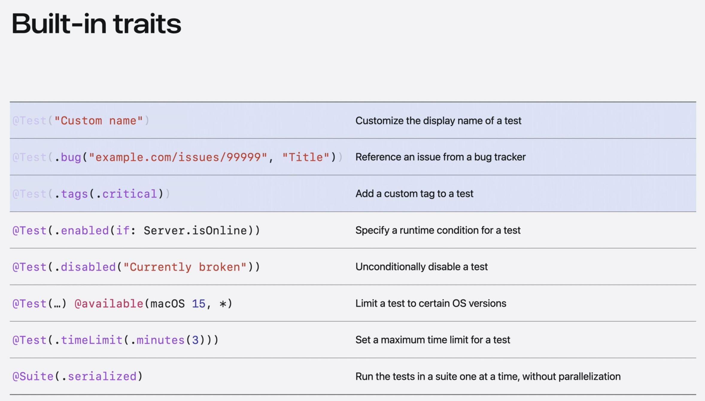

## Swift Package Manager

Swift 包组织了一组可重用的 Swift, OC, C 代码。普通的 Swift 项目中，代码的默认访问权限是 internal，但项目中的所有代码都是可以被访问的。如果开发一个库，那么就需要将一组代码组织成一个包。

```swift
// swift-tools-version:5.3
import PackageDescription

let package = Package(
    name: "MyLibrary",
    platforms: [
        .macOS(.v10_14), .iOS(.v13), .tvOS(.v13)
    ],
    products: [
        // Products define the executables and libraries a package produces, and make them visible to other packages.
        .library(
            name: "MyLibrary",
            targets: ["MyLibrary", "SomeRemoteBinaryPackage", "SomeLocalBinaryPackage"])
    ],
    dependencies: [
        // Dependencies declare other packages that this package depends on.
    ],
    targets: [
        // Targets are the basic building blocks of a package. A target can define a module or a test suite.
        // Targets can depend on other targets in this package, and on products in packages this package depends on.
        .target(
            name: "MyLibrary",
            exclude: ["instructions.md"],
            resources: [
                .process("text.txt"),
                .process("example.png"),
                .copy("settings.plist")
            ]
        ),
        .binaryTarget(
            name: "SomeRemoteBinaryPackage",
            url: "https://url/to/some/remote/binary/package.zip",
            checksum: "The checksum of the XCFramework inside the ZIP archive."
        ),
        .binaryTarget(
            name: "SomeLocalBinaryPackage",
            path: "path/to/some.xcframework"
        )
        .testTarget(
            name: "MyLibraryTests",
            dependencies: ["MyLibrary"]),
    ]
)
```

在上面的 Package.swift 文件中，`name` 是包的名称，这个名称用的比较少，会出现在 Xcode 中，或者别人指定依赖的时候可以这样指定 `.package(name: "LibraryName", url: "...", from: "1.0.0")   `, 但依赖的 name 是可以忽略的。

`platforms` 定义了包支持的平台和最低版本。

`products` 定义了包的产物，一个包可以有多个产物，这个产物是别人可以 import 的对象。比如项目中指定了依赖:

```swift
dependencies: [
    .package(url: "https://github.com/apple/swift-atomics.git", .upToNextMajor(from: "1.2.0")),
],
```

在 targets 中使用这个依赖:

```swift
.target(
    name: "AMSMB2",
    dependencies: [
        "AMSMB",
        .product(name: "Atomics", package: "swift-atomics"),
    ],
    path: "AMSMB2Tests"
)
```

其中 `package: "swift-atomics"` 是依赖的名称，`name: "Atomics"` 是这个依赖对应产物名称，可以在 swift-atomics 的 Package.swift 中看到:

```swift
let package = Package(
  name: "swift-atomics",
  products: [
    .library(
      name: "Atomics",
      targets: ["Atomics"]),
  ],
  /// ...
)
```

targets 是包的构建目标，普通的 target 会组织一组代码，默认在 `Sources/<targetName>` 下的代码都会被添加到这个 target 中，或者是用 path 指定一个目录，这里指定的目录是相对包的根目录。另外还有 binaryTarget 和 testTarget，binaryTarget 必须包含一个 url 或者 path，它用于指定一个二进制包；testTarget 用于指定一个测试目标，它依赖于其他 target。

## Swift Testing

新款的 Swift 测试框架，直接 `import Testing` 就可以使用。在 func 前面加上 `@Test` 就可以测试这个函数。需要使用 `@testable import XXX` 来引入需要测试的包。在测试函数内直接使用 `#except()` 宏进行测试。



```swift
import Testing
@testable import IntraPaste

@Test(.disabled("Due to that .iso8601 not support fractional seconds in the date string."),
      .bug("https://stackoverflow.com/questions/50847139/error-decoding-date-with-swift", "Error Decoding Date with Swift"))
func testJsonParse() throws {
    let jsonData = """
    [{"id":7,"content":"Hello","createdAt":"2025-01-08T04:02:43.760Z","expiresAt":"2025-01-08T05:02:43.759Z"},{"id":6,"content":"22","createdAt":"2025-01-08T04:02:37.086Z","expiresAt":"2025-01-08T05:02:37.084Z"}]
    """.data(using: .utf8)!
    let decoder = JSONDecoder()
    decoder.dateDecodingStrategy = .iso8601
    let cards = try decoder.decode([Card].self, from: jsonData)
    #expect(cards.count == 2)
}
```

使用 `try #require()` 进行测试，如果测试失败，则后面的测试不会执行。也就是括号内是 false 或者 nil 的时候，后面的测试不会执行。

```swift
try #require(session.isValid)
session.invalidate() // not executed if session.isValid is false

let method = try #require(paymentMethods.first) // will unwrap the optional
#except(method.isDefault) // not executed if paymentMethods is empty
```

我们可以使用 struct 将多个函数组合起来，这样 struct 左边就可以直接点击测试所有函数了。

```swift
import Testing
@testable import MyVideo

struct MyTests {
    let video = Video(fileName: "video.mp4")
    @Test func test1() {
        let expectedMetadata = Metadata(duration: .seconds(10))
        #expect(video.metadata == expectedMetadata)
    }
    @Test func test2() {
        #expect(video.contentRating == "G")
    }
}
```

参数可以通过 `@Test(argumetns:)` 进行传递，比如:

```swift
@Test("Number of menthioned continents", arguments: [
    "A beach",
    "By the lake",
    "Camping in the woods"
])
func mentionedContinentCounts(videoName: String) async throws {
    let videoLibrary = try await VideoLibrary()
    let video = try #require(videoLibrary.video(named: videoName))
    #expect(!video.mentionedContinents.isEmpty)
    #expect(video.mentionedContinents.count <= 3)
}
```

这样就会有三个测试，分别是:

- `testMentionedContinentCounts(videoName: "A beach")`
- `testMentionedContinentCounts(videoName: "By the lake")`
- `testMentionedContinentCounts(videoName: "Camping in the woods")`

这样通过参数化测试，比使用 for...in loop 测试更简介，而且每一个测试是独立的，比较容易调试。并且它们是并发测试。

Swift Testing 比之前的 XCTest 更简单，XCTest 有很多不同的 XCAssert 方法，而 Swift Testing 只需要 `#expect` 即可。Swift Testing 不需要使用 test 前缀来命名测试函数。

## 参考

- [Creating a standalone Swift package with Xcode](https://developer.apple.com/documentation/xcode/creating-a-standalone-swift-package-with-xcode)
- [Meet Swift Testing - wwdc2024](https://developer.apple.com/videos/play/wwdc2024/10179/)
