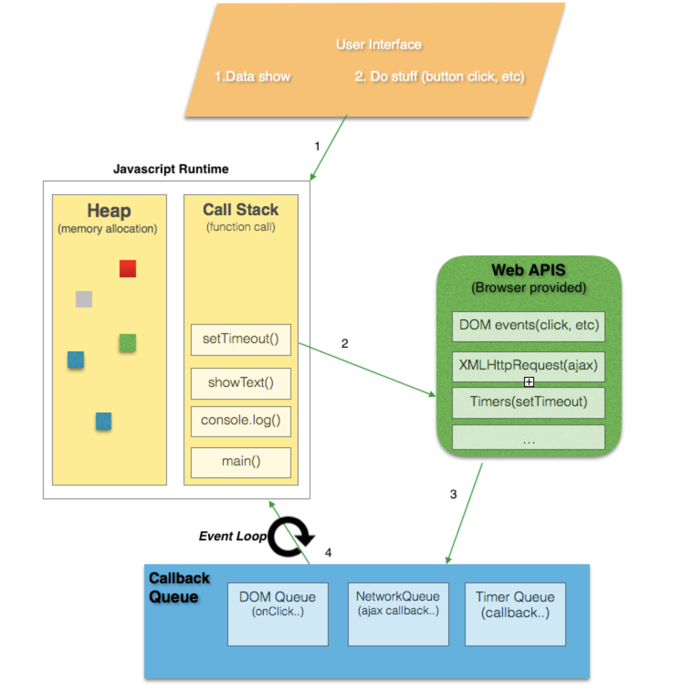
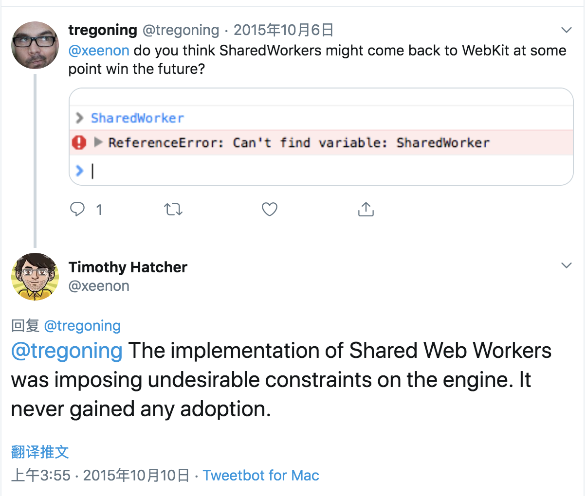

设想一个场景, 在一个非 SPA 页面里, 如何做到 B 页面被释放后仍可执行一段代码?

public.js:

```javascript
var a = 1

// refresh A page `a` count
function refresh() {
  // <p id="count"></p>
  count.innerText = a
}

function foo() {
  a += 1
  refresh()
}

// called in PageB
function goBackA() {
  setTimeout(foo, 1000)
  history.back()
}
```

在 B 页面有一个按钮, 点击触发 `goBackA` 方法, 这个方法会起一个定时器, 在1秒钟后去执行 `foo`, 下一行是页面回退, 使用了 `history.back()`.

很显然在 B 页面被杀死后, B 页面的内存被释放, 定时器也不复存在, 所以 A 页面不会刷新.

那么是否有其他的方法可以实现 B 页面杀死后可以执行一段代码呢?

## 堆栈, 队列, EventLoop

众所周知, JS 是单线程, 移动端或网页端需要进行页面绘制, 只有在主线程才允许操作UI, 故当初就把 JS 设计为单线程的语言. 在单线程的语言下, JS 是如何工作的呢?

#### 调用栈

存放着函数调用的数据格式, 当一个函数被调用它会被放入栈顶, 当函数返回, 它会被移除栈.

#### 堆

变量和对象存放在这里.

#### 队列

JS 运行时包含了一个**消息队列**, 它包含了一系列将要被执行的消息, 消息有相对象的函数调用.
当栈为空时候, 运行时就会从消息队列中取出一条消息, 并处理执行相关的函数.


#### EventLoop

```javascript
while (queue.waitForMessage()) {
  queue.processNextMessage();
}
```

事件循环顾名思义, 如果当前没有消息, 它会同步地等待下一消息的来临.



> JS 本身不实现 Queue，Queue 是 runtime 的概念，runtime 负责把 Queue 里的任务丢给JS的执行栈

#### 异步

下载任务, 网络请求等是如何在 JS 单线程里实现的呢?

```javascript
fetch('//baidu.com').then(res => console.log(res))
console.log('run before response')
```

执行可以发现第二条是在第一条之前打印, 是因为当 JS 在主线程发起异步请求操作时候, 它会继续执行下面代码, 网络请求是交给了其他线程来处理, 当网络请求线程收到结果之后, 它会将返回封装成为一个对象, 构造成为一条 `message`, 插入到消息队列当中, 等待 runtime 执行.

## Web Workers

开启一个浏览器 Tab 就会开启一个线程, JS 代码将在主线程里执行.
在 H5 里开放了另一 API: `Worker`, Worker 是 JS 手动开启新线程的方法, 但是此线程功能有限, 不能操作 DOM.
主线程与 worker 线程使用 `postMessage` 进行交流.

Worker 线程可以手动杀死: `myWorker.terminate()`, 它也可以随着页面杀死自动被杀死.

所以 web workers 也解决不了一开始的问题, 但 workers 里有一个 `SharedWorker`, SharedWorker 是可以被多个页面/窗口/iframe/甚至 worker 共同调用.

我建了这么一个例子([Demo地址](https://github.com/FaiChou/SharedWorkerDemo)):

public.js:

```javascript
function refresh(a) {
  // <p id="count"></p>
  if (count) {
    count.innerText = a || 1
  }
}
var myWorker = new SharedWorker("worker.js");
myWorker.port.onmessage = function(e) {
  refresh(e.data)
}

function add() {
  myWorker.port.postMessage('add');
}
```

worker.js:

```javascript
var a = 1
onconnect = function(e) {
  var port = e.ports[0];

  port.onmessage = function(e) {
    a += 1
    if (e.data === 'add') {
      port.postMessage(a)
    } else {
      setTimeout(() => {
        port.postMessage(a)
      }, 800);
    }
  }
}
```

有俩个页面, 都使用 worker 里的变量 `a`, 页面都有一个增加的按钮, 点击按钮可以使 `a` 加一, 可以看到在任意页面加一都可以反应在另一页面(需要手动刷新下,这里没有做监听事件).

#### 关于如何 debug

在浏览器 devtools 下是无法找到 worker 线程的, 所以需要使用花哨的方法来调试:

方法一: `throw JSON.stringify({data:data})`, 将要调试的内容 throw 出来
方法二: 打开**chrome://inspect/#workers**

#### webkit 不支持

当我在 Safari 里测试时候, 发现 SharedWorker 压根不支持, 搜索才发现, 我去, 苹果因为安全性把它给弃用了:




## 总结

结论就是**不可能**, 页面被杀死, 所有的内存数据都会被清理, 包括 timer, 包括 workers, 所以不用想尝试了, 使用 SPA + pushState 吧!

## Refs

- [Understanding Javascript Function Executions — Call Stack, Event Loop , Tasks & more](https://medium.com/@gaurav.pandvia/understanding-javascript-function-executions-tasks-event-loop-call-stack-more-part-1-5683dea1f5ec)
- [Parallel programming in JavaScript using Web Workers](https://itnext.io/achieving-parallelism-in-javascript-using-web-workers-8f921f2d26db)
- [Concurrency model and Event Loop](https://developer.mozilla.org/en-US/docs/Web/JavaScript/EventLoop)
- [How to debug web workers](https://stackoverflow.com/questions/2323778/how-to-debug-web-workers)
