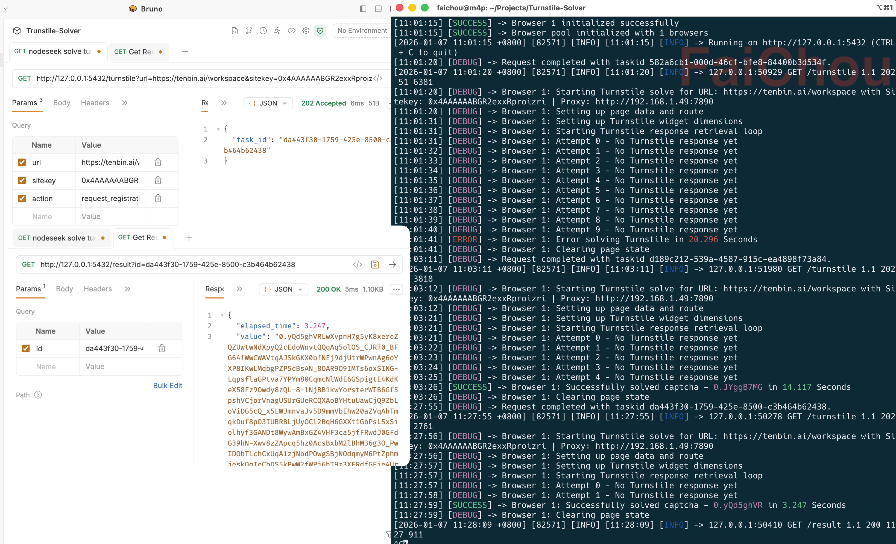

## Turnstile

Turnstile 是 Cloudflare 提供的替代 CAPTCHAs 的工具，它是一种更安全的验证方式，并且可以做到对真实用户完全无感知，同时可以防止机器人。但是，真能防住吗？

可以先阅读这两篇文章理解下它的原理，如何配置到网站，以及有哪些配置项:

- [Embed the widget](https://developers.cloudflare.com/turnstile/get-started/client-side-rendering/)
- [Widget configurations](https://developers.cloudflare.com/turnstile/get-started/client-side-rendering/widget-configurations/)

我这里简单讲一下网站使用 Turnstile 流程:

1. 在 cf 后台申请 Turnstile 的 sitekey 和 secretkey
2. 在网页上嵌入 Turnstile 的 js 代码，有两种方式:
    - 显式渲染: `<div class="cf-turnstile" data-sitekey="<YOUR-SITE-KEY>"></div>`
    - 隐式渲染: `<div id="turnstile-container"></div>` 和 `turnstile.render("#turnstile-container", ...)`
3. 通过 js 代码获取到 Turnstile 的 token
4. 跟随表单一起提交到后台
5. 后台先将 token 发送到 cf 去验证有效性，再进行业务逻辑处理

同时 Turnstile 还支持[自定义数据](https://developers.cloudflare.com/turnstile/get-started/client-side-rendering/widget-configurations/#custom-data)，这样 cf 在验证的时候会拿到这些数据，一并传递给后台，后台根据自定义数据来判断场景。比如:

- 行为追踪：区分登录、注册、联系表单等
- 访客上下文：传递访客ID、会话信息或其他上下文数据
- 欺诈检测：为风险评估提供额外背景信息

Turnstile 通过一系列操作来验证是否是浏览器环境的真人操作，如果验证有异常，可以让用户手动 click 一下验证。

那我们就找个[这个网站](https://oshiete.ai/login)实际操作一下，打开这个网站之前，先开启 Devtools，然后输入用户名和密码再点击登录。

此时就触发了 Turnstile 的验证，页面上可能无法看到任何验证元素，它悄悄的在后台验证。

另外通过 html 内容搜索可以发现，它用的并不是显式方式，大多数网站都会隐式调用 Turnstile。

进入到 Network 栏，搜索 `/cdn-cgi/challenge-platform/`，找到 POST 的请求，这就是验证成功后，将 sitekey/action 等信息传递给 cf 后台的请求，但是你可以发现请求体中全部是加密的数据，没办法判断发送的是什么内容。

即使你在 Source 中找到了 `turnsitle/v0/api.js` 的代码，也没办法知道它如何加密的，因为加密逻辑不在这里，而是它会构建一个 iframe, 然后通过 postMessage 与 iframe 通信，接收 iframe 返回的 token。

所以你想拿到它的 sitekey/action 等信息，还有什么办法？我教 3 招:

### 1. 抓包

直接使用 Proxyman 这种工具抓包来分析，具体方法就不展开了，这是最麻烦的。

### 2. 使用 hooks 拦截

页面加载完成后直接在 Console 里执行下面代码:

```javascript
const orig = window.turnstile.render;
window.turnstile.render = function(container, options) {
    console.log('🔍 Turnstile render 参数:', options);
    console.log('📌 action:', options.action);
    return orig.apply(this, arguments);
};
```

这个方法会劫持原先的 render 方法，并且打印出相应的信息，当你点击登录时候，就可以看到:

```
{
    "sitekey": "0x4AAAAAABGR2exxRproizri",
    "theme": "light",
    "size": "invisible",
    "action": "login"
}
```

### 3. 断点调试

在 Source 中找到页面相关的 js 代码，锁定在 login-xxx.js 文件中，然后搜索 `turnstile.render` 关键字，可以找到:

```javascript
            r.useRef)(!1)
              , x = (n, r, o) => {
                window.turnstile && t.current && (l(!0),
                window.turnstile.render(t.current, {
                    sitekey: "0x4AAAAAABGR2exxRproizri",
                    callback: e => {
                        (o !== a.Never || !d.current) && (i( () => e),
                        l(!1),
                        r && r(e))
                    }
                    ,
                    theme: e.theme || "light",
                    size: e.size || "invisible",
                    action: n,
                    "expired-callback": () => {
                        o === a.Never && (d.current = !0,
                        i(null),
                        l(!1))
                    }
                }))
```

这里就可以看到 sitekey 是什么，但没办法知道 action 是什么，所以直接在 `window.turnstile.render` 行设置一个断点，点击登录按钮，就可以看到 n 是 "login"。

## Solver

偶然在 github 发现 [Turnstile-Solver](https://github.com/Theyka/Turnstile-Solver) 这个项目，然后研究了一下，通过它果然可以过 Turnstile，但是对于普通用户来讲，完全没用，这项目是给自动化程序使用的（比如爬虫/注册机）。

Turnstile 的验证没有办法和用户绑定，所以只要是有一台设备过了验证，拿到 token 后，那么就可以使用这个 token 调用网站的后台接口，毕竟后台没有办法知道用户是否真正通过此设备登录。

python 运行这项目之后，会提供俩接口，一个是 `GET /turnstile?url=https://example.com&sitekey=0x4AAAAAAA` 用来将需要验证的网站 url/sitekey 等信息发给程序，程序收到后会返回一个 task_id，并且按照配置（不同的浏览器/是否设置代理）来启动浏览器，访问目标网站，然后加载 Turnstile 验证；另一个接口是 `GET /result?id=XXX` 用来获取验证结果。

