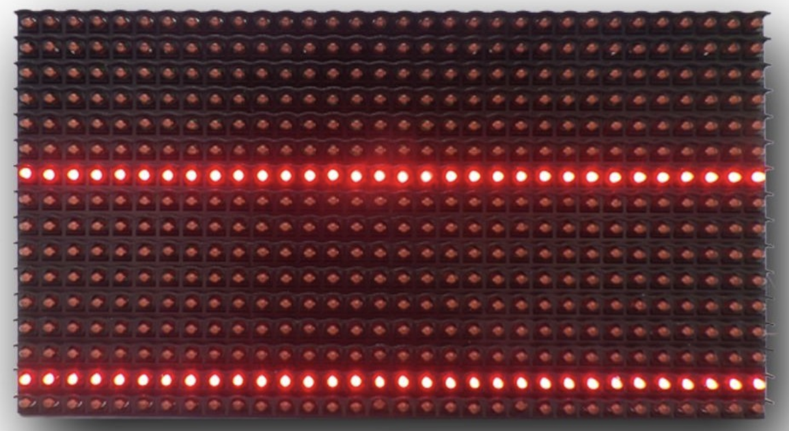
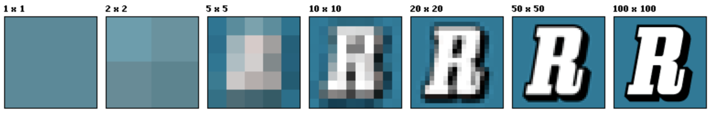
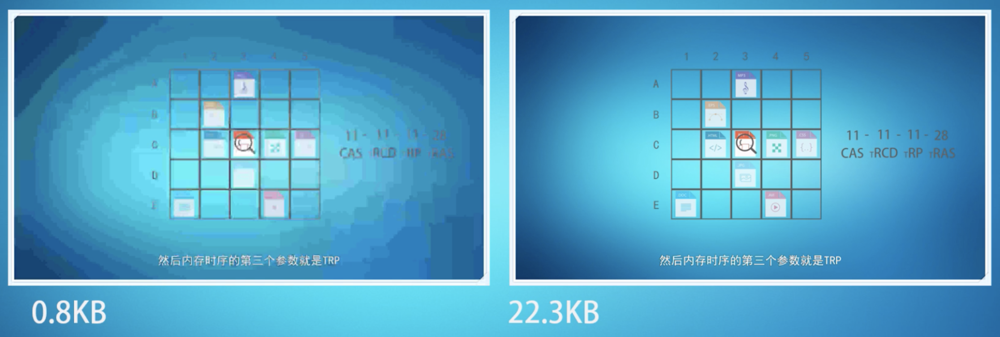
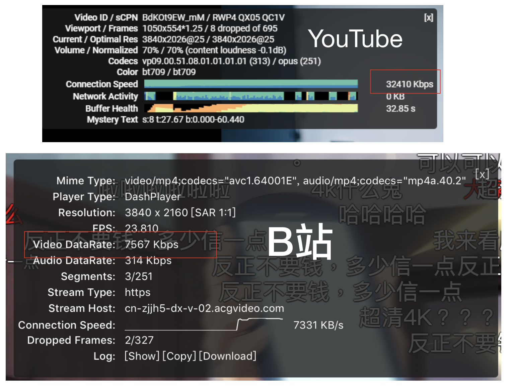
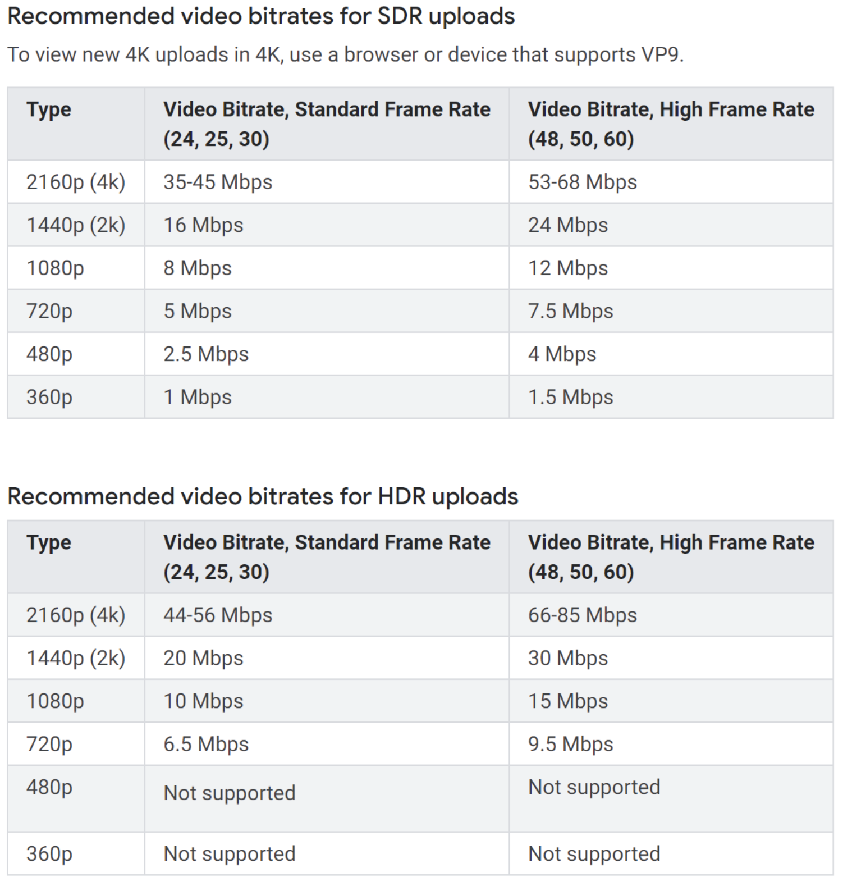

今天逛v站发现一个热帖: [b 站出 4k 清晰度了](https://www.v2ex.com/t/580696?p=1). 之前对分辨率/像素/码率/帧率等概念不是很清楚, 只有一个大概的认知, 同样1080p的视频为啥有些1个G,而有些能够到4个G呢? 次帖子里出现了许多名次概念: **码率**, **比特率**, **动画的码率跟电影不一样**, **HEVC**, **二压**,**vp9**等.

## 像素

英文 pixel, 画面中最小的单位, 代表一个点. 但是并没有固定长度点限制, 不同设备上单位像素大小可能不一样.
下图代表最粗糙的像素, 同样是一像素, 下图的一像素是那么一大个, 而我们手机/电脑上的一像素用肉眼难以看清.



## 分辨率

#### 屏幕分辨率

屏幕中像素点个数, 比如 1024x768 代表水平方向有 1024 个像素点, 垂直方向上有 768 个像素点.

两个设备单独拿分辨率来比较是不能判断哪一个更清楚, 因为同样分辨率, 如果体积不一样, 那么像素点数的大小就不是一样的.

比如上图中粗糙显示屏分辨率是 32*16, 但它的长宽是 50cmx25cm, 如果相同分辨率下, 一个 4cmx2cm 的屏幕, 那么这个小的屏幕肯定比较清楚的.

相同体积下的两块屏, 分辨率越大代表像素点数越多, 画面就越细致, 单个色块大小更小.

#### 影像分辨率

一张图片分辨率是 500x200，说明这张图片在屏幕上按1:1放大时，水平方向有500个像素点（色块），垂直方向有200个像素点（色块）.



正如上图所表现出来, 将不同分辨率的图片在同一设备放到同样大小, 那么分辨率越高的图片就越清晰.

同样的, 不同分辨率大小的图片, 使用设备 1:1 预览时候, 分辨率越大图片面积越大.

虽然不同设备上像素块大小会不一样，但是同一台硬件设备上的屏幕分辨率、像素块大小是不变的.
PC电脑上之所以可以调整屏幕分辨率，是通过算法转换的操作.


#### 图片大小

在二进制的世界里:

```
1 KB(KiloBytes) = 1024 bytes = 1024*8 bits

1 Kb(Kilobits) = 1024/8 bytes = 128 bytes
```

> Kibibyte is the unit of digital information with *IEC prefix kibi (2<sup>10</sup>).
> 1 Kibibyte is equal to 2<sup>10</sup> bytes = 1024 bytes. Kibibyte unit symbol is KiB.

> Kilobyte is the unit of digital information with prefix kilo (10<sup>3</sup>). 1 Kilobyte is equal to 10<sup>3</sup> > bytes = 1000 bytes in decimal (SI). 1 Kilobyte is equal to 2<sup>10</sup> bytes = 1024 bytes in binary.

严格的讲, KiB 才是 1024 bytes, 而 1KB 则代表 1000 bytes.

在屏幕上截一张 100x100 大小的图片, 由于是 2x 的屏幕, 所以这张图片的分辨率是 200x200, 图片大小为 4KB, 是怎么得到的呢:

```
200 x 200 = 40000 pixel
40000 x 3(rgb) = 120000 bytes
120000 / 1024 = 117.187 KiB
```

诶? 我的图片不是这么大的呀? 因为大部分图片格式都是压缩格式, 如果不经过压缩存储会特别占用磁盘空间, 所以图片都要经过压缩算法压缩再存储, 可以节省大量的磁盘空间.

## 2x 3x retina显示屏

Retina 是一种显示技术, 与 1080/4K 等不是一种概念, 具体可以参考这里: [视网膜显示屏](https://zh.m.wikipedia.org/wiki/Retina%E6%98%BE%E7%A4%BA%E5%B1%8F).

1pt (屏幕物理尺寸) 下代表 2px 的是 2x 图, 代表 3px 的是 3x 图. 比如 iPhone8 与 iPhone8P.

再比如在 MacBook 上截一张 100x100 pt 的图片, 分辨率就会是 200x200 px.


## 帧率

帧率是视频里的概念. 即每秒刷新的次数.

> 帧率(Frame rate) 是用于测量显示帧数的量度. 所谓的测量单位为每秒显示帧数(Frames per Second，简称：FPS) 或"赫兹" (Hz)。此词多用于影视制作和电子游戏.

如果帧率大于24, 人类就会以为此视频是连贯的. 网络上的视频比如b站YouTube等视频帧率一般是30.

对于游戏来说, 高帧率肯定是有必要的, 如果小于30FPS, 那么就会显得「卡」, 打过CS或者LOL就可以知道.


## 码率

码率是一个非常重要的概念. 又称比特率, 英文 **bit rate**, 单位是 bps (bits per second).
通俗点理解就是对每一帧图片对取样率, 值越高代表的越接近源文件, 越清晰. 因为如果保存每一帧图片为视频, 那么会特别占用磁盘空间和带宽, 所以就有一些视频编码格式比如 HEVC / VP9 等.

视频的清晰度是由码率决定的.



上图是两个分辨率相同的视频中一帧画面, 左侧是低码率的, 大小只有0.8KB, 右侧是高码率的, 大小有22.3KB.

可以算出码率:

```
0.8KB x 30fps = 24KB/s = 192kbps
22.3KB x 30fps = 669KB = 5354kbps
```

网上流传的视频同样时长同样分辨率却有不同的体积大小, 原因就是他们的码率不同, 码率高的体积大, 所以会更清晰.

在 B站/YouTube 视频右键可以看到视频信息统计, 其中就有码率:



下图是YouTube推荐的视频码率:




在码率相同情况下, 分辨率越高, 画质越渣. 码率直接和网速相关, 网速如果够快, 那么码率越高, 能带动的分辨率越高, 画面越清晰.


## Refs

- [分辨率](https://zh.wikipedia.org/wiki/%E5%88%86%E8%BE%A8%E7%8E%87)
- [Average bitrate](https://en.wikipedia.org/wiki/Average_bitrate)
- [分辨率和像素是什么关系](https://www.zhihu.com/question/21149600)
- [码率，分辨率，帧率 ...](https://www.jianshu.com/p/028196b8ca14)
- [Image Size and Resolution](https://developer.apple.com/design/human-interface-guidelines/ios/icons-and-images/image-size-and-resolution/)
- [视频的码率、帧率、分辨率都有什么区别？码率越高越好吗？](https://youtu.be/gaRwG10elNQ)
- [视频的清晰度是不是由码率决定，播放视频屏幕分辨率跟清晰度有何关系](https://www.zhihu.com/question/21982478)
